**I-BOB.** [**Mobil ilovalar xavfsizligi**](#mobil-ilovalar-xavfsizligi)

[Smartfonlarni bozoridagi ulushi](#_Toc214979318)

[Android operatsion tizimi](#android-operatsion-tizimi)

[iOS operatsion tizimi](#ios-operatsion-tizimi)

[Mobil ilovalarning turlari](#mobil-ilovalarning-turlari)

[Native ilovalar](#native-ilovalar)

[Mobil web ilovalar](#mobil-web-ilovalar)

[Gibrid ilovalar](#gibrid-ilovalar)

[Ommaviy Android va iOS zaifliklari](#ommaviy-android-va-ios-zaifliklari)

[OWASP Mobil Top 10](#owasp-mobil-top-10)

[Mobil ilovalarni buzish va teskari muhandislik](#mobil-ilovalarni-buzish-va-teskari-muhandislik)

[Android va iOS ilovalardagi zaifliklari](#android-va-ios-ilovalardagi-zaifliklari)

**II-BOB.** [**Android va iOS arxitekturasi**](#android-va-ios-arxitekturasi)

[*Android arxitekturasi*](#_Toc214979330)

[Linux kernel](#linux-kernel)

[Hardware Abstraction Layer](#hardware-abstraction-layer)

[Android Runtime (Dalvik va ART)](#android-runtime-dalvik-va-art)

[Application Framework](#application-framework)

[Applications (Ilovalar)](#applications-ilovalar)

[Java virtual mashina](#java-virtual-mashina)

[Dalvik virtual mashina](#dalvik-virtual-mashina)

[Android ruxsatlari](#android-ruxsatlari)

[iOS arxitekturasi](#ios-arxitekturasi)

[Cocoa Touch](#cocoa-touch)

[Media](#media)

[Core services](#core-services)

[Core Os](#core-os)

[iOS SDK va Xcode](#ios-sdk-va-xcode)

[iOS ruxsatlari](#ios-ruxsatlari)

**III-BOB.** [**Mobil ilovalar pentestingi**](#mobil-ilovalar-pentestingi)

[Android Studio va SDK](#android-studio-va-sdk)

[Emulator, simulatorlar, va real qurulmalar](#emulator-simulatorlar-va-real-qurulmalar)

[Emulatorlar](#emulatorlar)

[Simulatorlar](#simulatorlar)

[Real qurulmalar](#real-qurulmalar)

**IV-BOB.** [**Mobil Pentesting Vositalari**](#mobil-pentesting-vositalari)

[Android xavfsizlik vositalari](#_Toc214979353)

[Android Debug Bridge](#android-debug-bridge)

[Adbni o‘rnatish](#adbni-ornatish)

[Qurulmaga ulanish](#qurulmaga-ulanish)

[Qurilmaga ilova o‘rnatish](#qurilmaga-ilova-ornatish)

[Qurilmadan fayllarni olish](#qurilmadan-fayllarni-olish)

[Fayllarni qurilmaga saqlash](#fayllarni-qurilmaga-saqlash)

[Log ma’lumotlarini ko‘rish](#log-malumotlarini-korish)

[Adb buyruqlari](#adb-buyruqlari)

[APKAnalyser](#apkanalyser)

[APKTool](#apktool)

[Androguard](#androguard)

[MobSF](#mobsf)

[APKleaks](#apkleaks)

[Frida](#frida)

[MAVS](#mavs)

[APKHunt](#apkhunt)

[Tapjacker](#tapjacker)

[Logcat](#logcat)

[APKDeepLens](#apkdeeplens)

[Reqable](#reqable)

[Objection](#objection)

[HTTP Toolkit](#http-toolkit)

[Burpsuite](#burpsuite)

[Drozer](#drozer)

[Genymotion](#genymotion)

[Nmap](#nmap)

[Dirb / Dirbuster / FFUF](#dirb-dirbuster-ffuf)

[WAFW00F](#wafw00f)

[Janus Vulnerability Tester](#janus-vulnerability-tester)

[iOS xavfsizlik vositalari](#ios-xavfsizlik-vositalari)

[oTool](#otool)

[SSL Kill Switch](#ssl-kill-switch)

[Keychain dumper](#keychain-dumper)

[LLDB](#lldb)

[Clutch](#clutch)

[Class-dump-z](#class-dump-z)

[radare2](#radare2)

[objdump](#objdump)

[Cycript](#cycript)

**V-BOB.** [**Mobil Ilovalar Pentesting Bosqichlari**](#mobil-ilovalar-pentesting-bosqichlari)

[Statik tahlil](#statik-tahlil)

[Ilovani virustotal orqali tekshirish](#ilovani-virustotal-orqali-tekshirish)

[Ilovani dekompilyatsiya qilish (apktool, jadx-gui)](#ilovani-dekompilyatsiya-qilish-apktool-jadx-gui)

[Obfusikatsiya](#obfusikatsiya)

[Ilova imzosini tekshirish.](#ilova-imzosini-tekshirish.)

[Ilova kodini tahlil qilish va o‘zgartirish](#ilova-kodini-tahlil-qilish-va-ozgartirish)

[Eskirgan va zaif kutubxonalarni aniqlash](#eskirgan-va-zaif-kutubxonalarni-aniqlash)

[AndroidManifest.xml faylini tahlil qilish](#androidmanifest.xml-faylini-tahlil-qilish)

[Hard kod qilib yozilgan malumotlar](#hard-kod-qilib-yozilgan-malumotlar)

[Resurs fayllarni ko‘rish (res/, assets/)](#resurs-fayllarni-korish-res-assets)

[Log malumotlarni tekshirish](#log-malumotlarni-tekshirish)

[Debug modni tekshirish](#debug-modni-tekshirish)

[Zaif WebViewdan foydalanish](#zaif-webviewdan-foydalanish)

[Zaif hashlash va shifrlash algorithmlari](#zaif-hashlash-va-shifrlash-algorithmlari)

[Backup olishga ruxsat berish oqibatida](#backup-olishga-ruxsat-berish-oqibatida)

[Statik zaifliklar](#statik-zaifliklar)

[Dinamik tahlil](#dinamik-tahlil)

[Ilovani qurilmaga yoki emulyatorda o‘rnatish](#ilovani-qurilmaga-yoki-emulyatorda-ornatish)

[Tarmoq trafikni kuzatish (burp suite, mitmproxy)](#tarmoq-trafikni-kuzatish-burp-suite-mitmproxy)

[Xavfsizlik cheklovlarini sinash (root, emulator, vpn, zararli kod
deteksiya, SSL pinning)](#xavfsizlik-cheklovlarini-sinash-root-emulator-vpn-zararli-kod-deteksiya-ssl-pinning)

[Faoliyatlarni sinash (Activity, Service, BroadcastReceiver)](#faoliyatlarni-sinash-activity-service-broadcastreceiver)

[Ma’lumotlar oqimini kuzatish (runtime debugging)](#malumotlar-oqimini-kuzatish-runtime-debugging)

[Umumiy xotira malumotlarini ko‘rish](#umumiy-xotira-malumotlarini-korish)

[API so‘rovlarini kuzatish](#api-sorovlarini-kuzatish)

[Tapjacking hujumiga tekshirish](#tapjacking-hujumiga-tekshirish)

[Dinamik zaifliklar](#dinamik-zaifliklar)

**VI-BOB.** [**Hisobot shakllantirish**](#hisobot-shakllantirish)

[Android](#android)

[iOS](#ios)

[API](#api)

# **I-BOB. Mobil ilovalar xavfsizligi** 

## **Smartfonlarni bozoridagi ulushi**

Bozor ulushini tushunish orqali biz kiber jinoyatchilarning nimalarni
nishonga olayotganini va potentsial himoya nuqtalarini bilib olamiz.
Mobil ilova ishlab chiquvchilari o‘z ilovasini Play market yoki App
Storega joylashtirib, sotishdan tushgan daromadning bir qismi bilan
mukofotlanishadi. Juda keng tarqalgan operatsion tizimlar esa
jinoyatchilarning e’tiborini tortadi, chunki ular ko‘proq qurbon va
daromad imkoniyati mavjud bo‘lgan auditoriyani o‘z ichiga oladi.

designveloper.com saytidagi ma’lumotlarga qaraganda smartfonlar,
operatsion tizimiga qarab quydagicha mintaqalarda tarqalgan.

###  **Android operatsion tizimi**

Android bu mobil qurilmalar (smartfonlar va planshetlar) uchun
yaratilgan Linux asosidagi ochiq manbali operatsion tizimdir. U Google
hamda boshqa kompaniyalar rahbarligidagi Open Handset Alliance tomonidan
ishlab chiqilgan. Android OS Linuxga asoslangan bo‘lib, C/C++ tilida
dasturlash mumkin, ammo ilova yaratishda asosan Java ishlatiladi. Java
orqali C kutubxonalariga JNI (Java Native Interface) yordamida murojaat
qilinadi. Android smartfonlar, planshetlar, elektron kitoblar, raqamli
pleerlar, qo‘l soatlari, fitnes brasletlar, o‘yin pristavkalari,
noutbuklar, netbuklar, smartbuklar, Google Glass ko‘zoynaklari,
televizorlar, proyektorlar va boshqa qurilmalar uchun mo‘ljallangan
operatsion tizim (2015-yilda avtomobilning ko‘ngilochar tizimlari va
maishiy robotlar uchun ham qo‘llab-quvvatlash paydo bo‘lgan). Android
Linux yadrosi asosida yaratilgan va Google tomonidan ishlab chiqilgan
Java virtual mashinasi asosidagi texnologiyalardan foydalanadi.
Keyinchalik Google Open Handset Alliance ochiq platformani
qo‘llab-quvvatlovchi va rivojlantiruvchi alyansni tashkil etdi.
2014-yilning ikkinchi choragida dunyo bo‘yicha sotilgan smartfonlarning
86 foizida Android operatsion tizimi o‘rnatilgan edi. 2017-yil may oyida
bo‘lib o‘tgan ishlab chiquvchilar konferensiyasida Google Android
tizimida ishga tushirilgan qurilmalar soni 2 milliarddan oshganini e’lon
qilgan. StatCounter platformasi ma’lumotlariga ko‘ra, 2024-yil noyabr
oyida Androidning global smartfon bozoridagi ulushi 72% ni tashkil
qilgan.

###  **iOS operatsion tizimi**

iOS (avval iPhone OS deb atalgan) bu Apple tomonidan o‘zining mobil
qurilmalari uchun maxsus ishlab chiqilgan mobil operatsion tizimdir. U
ilk bor 2007-yil yanvar oyida birinchi avlod iPhone uchun e’lon qilingan
va 2007-yil iyun oyida ishga tushirilgan. iPhonedan tashqari, iOS Apple
tomonidan ishlab chiqilgan yana uchta operatsion tizimning asosi
hisoblanadi: iPadOS, tvOS va watchOS. iOS ilgari iPadlarni ham
boshqarardi, biroq 2019-yilda iPadOS taqdim etilgach, bu vazifani iPadOS
o‘z zimmasiga oldi. Shuningdek, iPod Touch qurilmalari ham iOS asosida
ishlagan, biroq ular ishlab chiqarishdan to‘xtatilgan. iOS dunyodagi
ikkinchi eng keng tarqalgan mobil operatsion tizim bo‘lib, Androiddan
keyin turadi. 2023-yil dekabr holatiga ko‘ra, Applening App Store
do‘konida 3,8 milliondan ortiq iOS ilovalari mavjud. iOS macOS tizimiga
asoslangan. Bu Unixga o‘xshash operatsion tizim hisoblanadi. iOSning
ayrim qismlari Apple Public Source License va boshqa litsenziyalar
asosida ochiq manba sifatida taqdim etilgan bo‘lsada, iOSning o‘zi
xususiy (proprietary) dasturiy ta’minot hisoblanadi. iOS Applening mobil
qurilmalar (iPhone, iPad, iPod Touch) uchun ishlab chiqilgan Unixga
yaqin operatsion tizimidir. U XNU yadrosi (Darwin) asosida qurilgan. iOS
1.0 2007-yilgi birinchi iPhone bilan chiqib, dastlab faqat o‘z ichki
ilovalari (Safari, Mail, Photos) va ko‘p tegizishli interfeysni
ta’minladi. Keyingi yillar davomida har bir yirik yangilanish yangi
funksiyalar bilan birga xavfsizlik kuchayishlarini ham olib keldi.
Masalan, iOS 2.0 (2008) App Store, push xabarnoma va ma’lumotlarni
to‘liq shifrlashni joriy etdi. iOS 4 (2010) multitasking va batafsil
sandbox qoidalari, iOS 5 (2011) ob-havo va iCloud integratsiyasini
kiritdi. iOS 7 (2013) interfeysni yangiladi, 64-bit arxitektura va
manzil fazosini tasodifiylashtirish qo‘llab-quvvatlashni boshladi.
So‘nggi versiyalarda xavfsizlikni mustahkamlashga e’tibor qaratilib,
masalan, iOS 9 da App Transport Security (ATS) standarti joriy etilib,
barcha tarmoq aloqalari uchun kamida TLS 1.2 talab qilindi. iOS 12–15 da
xotirani himoya qilish, Secure Enclave (maxfiy ma’lumotlarni ushlab
turuvchi maxsus protsessor) va ikki faktorli autentifikatsiya kabi
texnologiyalar ishlab chiqildi.

## **Mobil ilovalarning turlari**

Hozirda turli ehtiyojlar uchun minglab ilovalar mavjud: chat,
videokonferensiyalar, o‘yinlar, sog‘liqni tekshirish, qimor o‘yinlari,
ijtimoiy tarmoqlar, savdo va moliyaviy xizmatlar va boshqalar.

Kelajakdagi qiziqarli texnologiyalardan biri iOS va Android
qurilmalarida ishlovchi ilovalar bo‘lib, ular atrofdagi beaconlardan
signal qabul qilib, unga mos javob beradi. Bunday ilovalar iBeacon deb
ataladi. Ilovalar quyidagi turlarga ajratiladi:

- Native ilovalar – har bir platformaga mos yozilgan dasturlar

- Mobil veb-ilovalar – brauzerda ishlaydigan saytlarga o‘xshashlar

- Gibrid ilovalar – veb va native texnologiyalarni birlashtirganlar

### **Native ilovalar**

Native ilovalar mobil operatsion tizim ichida o‘rnatiladi va tegishli
ilova do‘konlari orqali (App Store, Google Play) tarqatiladi. Bunday
ilovalar odatda platformaga mos rivojlantirish vositalari va dasturlash
tillarida yaratiladi masalan, iOS ilovalari uchun Xcode + Objective‑C
yoki Swift, Android ilovalari uchun esa Android Studio + Java yoki
Kotlin ishlatiladi. Ular aynan shu platforma uchun mo‘ljallangan bo‘lib,
qurilmadagi barcha imkoniyatlardan kamera, GPS, telefon kontaktlari va
boshqa funktsiyalardan to‘liq foydalana oladi.

### **Mobil web ilovalar**

Mobil veb-ilovalar bu *native* (ya’ni qurilmaga o‘rnatiladigan haqiqiy
mobil ilova) bo‘lmagan ilovalardir. Ularning aksariyati HTML5,
JavaScript va CSS texnologiyalari asosida yaratilgan bo‘lib,
foydalanuvchiga mobil ilovalardagidek ko‘rinish va ishlash uslubini
taqdim etadi. Foydalanuvchilar bu ilovalarga oddiy veb-sahifaga
kirgandek tashrif buyurishadi, ya’ni ular brauzer orqali ochiladi. Ular
aynan mobil qurilmalar uchun moslashtirilgan veb-sahifalardir. Bu
turdagi ilovalar HTML5 paydo bo‘lgach ommalasha boshladi, chunki shu
orqali odamlar brauzer orqali oddiy *native* ilovalardagidek
funksiyalarni ishlata olishdi. Ularni ishlab chiqish va test qilish
oson, chunki ular uchun ko‘plab ishlab chiqish vositalari mavjud.

### **Gibrid ilovalar**

Gibrid ilovalar deganda ikki xil ma’no tushuniladi. Birinchidan, bu
veb-kontent va qurilmadagi *native* (ya’ni o‘rnatilgan) komponentlarning
birlashmasidan tashkil topgan ilovalardir. Ular mobil qurilmaning
xizmatlaridan, ayniqsa, ma’lumotlarni saqlash (storage) imkoniyatidan
foydalanadi. Ikkinchidan, bu mijoz-server (client-server)
arxitekturasiga asoslangan mobil ilovalardir. Masalan, korxona uchun
mo‘ljallangan mobil ilovalar (enterprise apps) bunga kiradi. Gibrid
ilovalar aslida veb-texnologiyalar (HTML5, CSS, JavaScript) asosida
yaratilgan bo‘lib, ular *native* mobil ilova shakliga o‘raladi va barcha
platformalarda ishlay oladigan xususiyatga ega bo‘ladi. Ya’ni, bu
ilovalar veb ilovalarning moslashuvchanligi va *native* ilovalarning
kuchli jihatlarini birlashtiradi. Masalan, quyidagi rasmda mashhur
yangiliklar ilovasining ekrandan olingan tasviri berilgan bo‘lib, bu
aynan gibrid ilovaga misol bo‘ladi.

## **Ommaviy Android va iOS zaifliklari**

Android va iOSdagi turli xil zaifliklarni ko‘rib chiqishdan oldin, ushbu
bo‘lim sizni Android va iOSni operatsion tizim sifatida tanishtiradi va
mobil ilovalar xavfsizligi bo‘yicha tajriba orttirish uchun tushunilishi
kerak bo‘lgan turli fundamental tushunchalarni qamrab oladi.


| **Yil**   | **Android**                      | **Android API** | **iOS**      |
|-----------|----------------------------------|-----------------|--------------|
| 2007/2008 | 1.0                              | 1               | iPhone OS 1  |
|           |                                  |                 | iPhone OS 2  |
| 2009      | 1.1                              | 2               | iPhone OS 3  |
|           | 1.5(Cupcake)                     | 3               |              |
|           | 1.6(Donut)                       | 4               |              |
|           | 2.0(Eclair)                      | 5               |              |
|           | 2.0.1(Eclair)                    | 6               |              |
| 2010      | 2.1(Eclair)                      | 7               | iOS 4        |
|           | 2.2(Froyo)                       | 8               |              |
|           | 2.3-2.3.2(Gingerbread)           | 9               |              |
| 2011      | 2.3.4-2.3.7 (Gingerbread)        | 10              | iOS 5        |
|           | 3.0 (HoneyComb)                  | 11              |              |
|           | 3.1 (HoneyComb)                  | 12              |              |
|           | 3.2 (HoneyComb)                  | 13              |              |
|           | 4.0-4.0.2 (Ice Cream Sandwich)   | 14              |              |
|           | 4.0.3-4.0.4 (Ice Cream Sandwich) | 15              |              |
| 2012      | 4.1 (Jelly Bean)                 | 16              | iOS 6        |
|           | 4.2 (Jelly Bean)                 | 17              |              |
| 2013      | 4.3 (Jelly bean)                 | 18              | iOS 7        |
|           | 4.4 (KitKat)                     | 19-20           |              |
| 2014      | 5.0 (Lollipop)                   | 21              | iOS 8        |
|           | 5.1 (Lollipop)                   | 22              |              |
| 2015      | 6.0 (Marshmallow)                | 23              | iOS 9 (beta) |
| 2016      | 7.0 (Nougat)                     | 24-25           | iOS 10       |
| 2017      | 8.0 (Oreo)                       | 26-27           | iOS 11       |
| 2018      | 9.0 (Pie)                        | 28              | iOS 12       |
| 2019      | 10                               | 29              | iOS 13       |
| 2020      | 11                               | 30              | iOS 14       |
| 2021      | 12                               | 31-32           | iOS 15       |
| 2022      | 13                               | 33              | iOS 16       |
| 2023      | 14                               | 34              | iOS 17       |
| 2024      | 15                               | 35              | iOS 18       |
| 2025      | 16(beta)                         | 36              | iOS 26(beta) |


Hewlett Packard (HP) tomonidan olib borilgan qiziqarli tadqiqotda bu
yirik dasturiy ta’minot kompaniyasi 600 dan ortiq kompaniyalarga
tegishli 2000 dan ortiq mobil ilovani sinovdan o‘tkazgan quyidagi
statistika aniqlangan.

- Sinovdan o‘tgan ilovalarning 97% i hech bo‘lmaganda bitta shaxsiy
  ma’lumot manbaiga murojaat qiladi.

- 86% ilovalar zamonaviy hujumlarga qarshi oddiy *binary hardening*
  (binar xavfsizlik mustahkamlash) himoya vositalaridan foydalanmagan.

- 75% ilovalar mobil qurilmada ma’lumot saqlayotganda to‘g‘ri shifrlash
  usullaridan foydalanmagan.

- Aniqlangan zaifliklarning 71% i veb-serverlarda joylashgan.

- 18% ilovalar foydalanuvchi nomi va parollarni HTTP orqali yuborgan,
  yana 18% esa SSL/HTTPSni noto‘g‘ri joriy qilgan.

Shunday qilib, mobil ilovalarda uchraydigan asosiy zaifliklar
quyidagilardan kelib chiqadi: xavfsizlik bo‘yicha yetarli tushunchaning
yo‘qligi, ishlab chiquvchilarning foydalanish qulayligi bilan xavfsizlik
o‘rtasidagi muvozanatni topa olmasligi, ilovalarning ortiqcha ruxsatlar
talab qilishi va shaxsiy hayotga bo‘lgan e’tiborsizlik. Bunga qo‘shimcha
ravishda, ilovalarga oid hujjatlarning yetarli emasligi natijasida
ishlab chiquvchilar ushbu zaifliklardan bexabar bo‘lib qolishadi.

## **OWASP Mobil Top 10**

*OWASP Mobile Top 10 ̶* bu mobil ilovalardagi eng xavfli va keng
tarqalgan xavfsizlik xatoliklari ro‘yxati bo‘lib, uni OWASP (Open
Worldwide Application Security Project) tashkiloti tomonidan tuziladi.
OWASP Mobile Top 10 2024 autentifikatsiyadan tortib xavfsiz
ma’lumotlarni saqlashgacha bo‘lgan 10 ta zaiflikni o‘z ichiga oladi va
mobil xavfsizlik stsenariysi haqida umumiy ma’lumot beradi. Ushbu
ro‘yxat:

- mobil ilova ishlab chiquvchilarga,

- test qiluvchilarga

- xavfsizlik mutaxassislariga

mobil xavfsizlik bo‘yicha yo‘l-yo‘riq beradi va eng muhim zaifliklarga
qarshi qanday choralar ko‘rish kerakligini ko‘rsatadi.

OWASPning soʻnggi hisobotida eng xavfli va keng tarqalgan 10 ta
zaifliklar roʻyxati keltirilgan.

1.  Improper Credential Usage **-  **Login ma’lumotlaridan noto‘g‘ri
    foydalanish.

2.  Inadequate Supply Chain Security – Ta’minot zanjiri xavfsizligining
    yetarli emasligi.

3.  Insecure Authentication/Authorization – Xavfsiz bo‘lmagan
    autentifikatsiya va avtorizatsiya.

4.  Insufficient Input/Output Validation - Kiritilayotgan/yuborilayotgan
    ma’lumotlar yetarlicha tekshirilmasligi.

5.  Insecure Communication – Xavfsiz bo‘lmagan aloqa.

6.  Inadequate Privacy Controls - Maxfiylik nazorati yetarli emasligi.

7.  Insufficient Binary Protections - Ikkilik (binary) fayl himoyasi
    yetarli emasligi.

8.  Security Misconfiguration - Noto‘g‘ri xavfsizlik konfiguratsiyasi.

9.  Insecure Data Storage – Xavfsiz bo‘lmagan ma’lumot saqlanishi.

10. Insufficient Cryptography – Kriptografiya himoyasi yetarli emasligi.


<div align="center">
  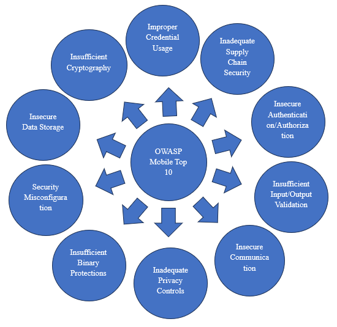
</div>
<div align="center">
1-rasm. OWASP Mobile Top 10
</div>

**Improper Credential Usage (**Login ma’lumotlaridan noto‘g‘ri
foydalanish.**)** – Aksariyat mobil ilovalar hali ham hisob
ma’lumotlaridan noto‘g‘ri foydalanish xavfiga duch kelishadi. Ushbu
zaiflik ilovalar foydalanuvchi hisob ma’lumotlarini to‘g‘ri
ishlatilmaganligi yoki xavfsiz bo‘lmagan joylarda saqlanmaganligi orqali
paydo bo‘ladi. Hisob ma’lumotlarini xavfsiz saqlamaganligi tufayli yomon
niyatli foydalanuvchilarni ruxsatsiz kirishi va foydalanuvchi hisoblari
va maxfiy ma’lumotlardan noto‘g‘ri maqsadlarda foydalanishga olib
kelishi mumkin.


<div align="center">
  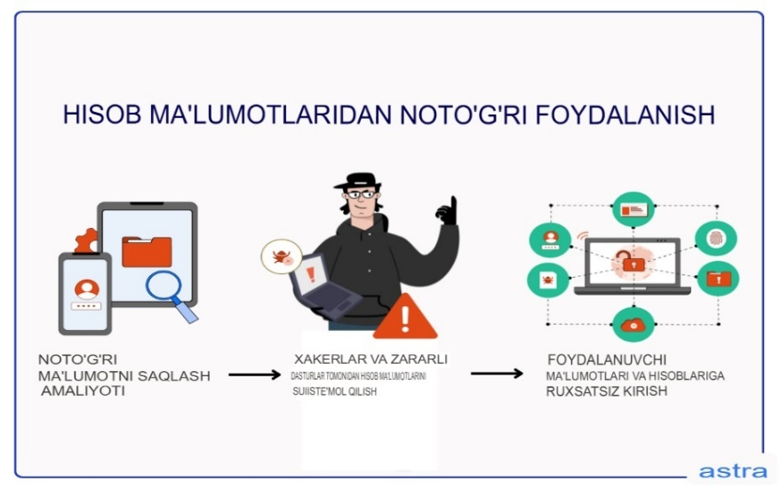
</div>

Hisob ma’lumotlari ya’ni foydalanuvchi login va parollarini noto‘g‘ri
ishlatilishi ilovaning xavfsizligini jiddiy zaiflashtiradi. Agar hisob
ma’lumotlari to‘g‘ri himoyalanmasa yoki noto‘g‘ri saqlansa, hujumchilar
ularni osongina qo‘lga kiritib, ilova yoki uning serveriga ruxsatsiz
kira oladi.

**Inadequate Supply Chain Security(**Ta’minot zanjiri xavfsizligining
yetarli emasligi**)** – Ishlab chiquvchilar mobil ilovalarni yaratishda
ko‘pincha boshqa kompaniyalar yoki ochiq manbali jamoalar tomonidan
yaratilgan kodlar, kutubxonalar yoki vositalardan foydalanadilar. Bu
ularga ilovalarni tezroq yaratishga va noldan boshlamasdan funksiyalar
qo‘shishga yordam beradi. Biroq, agar ushbu uchinchi tomon
komponentlaridan birortasi eskirgan yoki zaif bo’lsa, ular ilovaga
jiddiy zaifliklarni kiritishi mumkin.


<div align="center">
  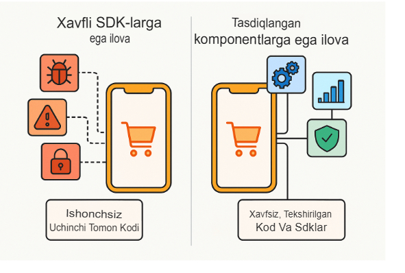
</div>

Zaif ta’minot zanjiri bu uchinchi tomon komponentlari va kutubxonalar
orqali tarqaladigan zaifliklarning mavjudligi, mobil ilovalarni
yaratishda ruxsat etilgan joylarda (kamroq vaqt ichida) ishlab
chiqaruvchilar foydalanadilar.

**Insecure Authentication and Authorization(**Xavfsiz bo‘lmagan
autentifikatsiya va avtorizatsiya**)** – Yana bir keng tarqalgan OWASP
Mobile Top 10 zaifligi mobil ilovalarda autentifikatsiya
avtorizatsiyaning zaifligi bo‘lib, muhim funksiyalar va maxfiy
ma’lumotlarga ruxsatsiz kirishga ruxsat berishi mumkin. Bu shuni
anglatadiki, hujumchilar foydalanuvchi identifikatorlarini
tekshirishning dastlabki bosqichini chetlab o‘tishlari mumkin (masalan:
bitta login ostida bir nechta odam autentifikatsiya qilinganda). 


<div align="center">
 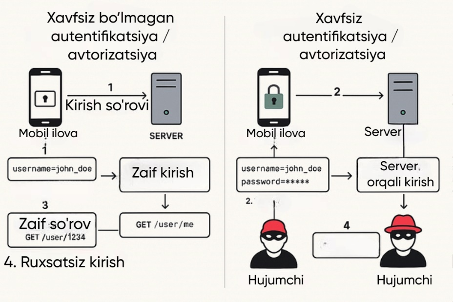
</div>

Zaif parol siyosati, seansni noto‘g‘ri boshqarish, kirishni noto‘g‘ri
boshqarish va ko‘p faktorli autentifikatsiyaning yo‘qligi ba’zi bir keng
tarqalgan muammolarning bir nechta misolidir. Buzg‘unchilar bunday
zaifliklardan autentifikatsiyani chetlab o‘tish, o‘z imtiyozlarini
oshirish yoki haqiqiy foydalanuvchi nomini o‘zgartirish uchun
foydalanishi mumkin (IDOR va imtiyozlarni kuchaytirish).

**Insufficient Input/Output Validation**(Kiritilayotgan va
yuborilayotgan ma’lumotlar yetarlicha tekshirilmasligi) – Mobil ilovada
foydalanuvchi tomonidan kiritilgan maʼlumotlari yetarli darajada
tekshirilmaganligi va sanitarizatsiya qilinmaganligi jiddiy xavfsizlik
muammolarini keltirib chiqarishi mumkin. Bunday ma’lumotlarni to’g’ri
tekshira olmaydigan va zararsizlantira olmaydigan mobil ilovalar mobil
muhitlarga xos hujumlar, jumladan SQL in’ektsiyasi, buyruqlarni kiritish
va saytlararo skript (XSS) hujumlari tufayli foydalanish xavfi ortadi.
Ushbu zaifliklar zararli oqibatlarga olib kelishi mumkin, jumladan,
maxfiy ma’lumotlarga ruxsatsiz kirish, ilova funksiyalarini
manipulyatsiya qilish va butun mobil tizimning potentsial buzilishi.

**Insecure Communication(**Xavfsiz bo‘lmagan aloqa**)** – Ko‘pgina
zamonaviy mobil ilovalar bir yoki bir nechta uzoq serverlar bilan
ma’lumot almashadi. Ma’lumot uzatish sodir bo‘lganda, u odatda mobil
qurilmaning tashuvchisi tarmog’i va internet orqali o‘tadi, simni
tinglayotgan tahdid agenti, agar u ochiq matnda yoki eskirgan shifrlash
protokoli yordamida uzatilgan bo‘lsa, ma’lumotlarni ushlab turushi va
o‘zgartirishi mumkin. Tahdid agentlari nozik ma’lumotlarni o‘g’irlash,
josuslik qilish, shaxsni o‘g’irlash va boshqalar kabi turli maqsadlarga
ega bo’lishi mumkin.

**Inadequate Privacy Controls(**Maxfiylik nazoratini yetarli
emasligi**)** – Ilovalar foydalanuvchi manzili, yoshi yoki kredit karta
maʼlumotlari kabi shaxsiy maʼlumotlarni toʻplaganda va maʼlumotlarni
xavfsiz saqlamasa, bunday muammolarga duch kelishi mumkin. Asosiy
to’siqlar ma’lumotlarni haddan tashqari saqlash, foydalanuvchi
roziligini ta’minlash imkoniyatlarini yo‘qotish va samarasiz himoya
choralaridir. Buzg’unchilar shaxsiy ma’lumotlarga kirish yoki hatto
ma’lumotlarni himoya qilish qonunlarini buzish uchun ushbu zaifliklardan
foydalanishlari mumkin. 

Ishlab chiquvchilar ushbu xavfni shaxsiy hayotga yangi yovuzlik sifatida
qarash, ma’lumotlar yig‘ishni minimallashtirish va Dizayn bo‘yicha
maxfiylik tamoyilini qabul qilish orqali tuzatishi mumkin. Ular barcha
maxfiy shaxsiy ma’lumotlarni kuchli shifrlash bilan saqlashi va
foydalanuvchi boshqaruvini ta’minlashi, foydalanuvchilar o‘z almashish
yoki o‘chirishni nazorat qilishlarini ta’minlashi kerak.

**Insufficient Binary Protections(**Ikkilik (binary) fayl himoyasi
yetarli emasligi**)** – Ilovadagi binary fayllarni nishonga olgan
tajovuzkorlar turli sabablarga ko‘ra turtki bo‘ladi. Binary faylda
tajovuzkor noto‘g‘ri foydalanishi mumkin bo’lgan tijorat API kalitlari
yoki qattiq kodlangan kriptografik sirlar kabi qimmatli sirlar bo’lishi
mumkin. Bunga qo’shimcha ravishda, ikkilik kod o’z-o’zidan qimmatli
bo’lishi mumkin, masalan, u muhim biznes mantig’ini yoki oldindan
o’rgatilgan AI modellarini o‘z ichiga oladi. Ba’zi yomon niyatli
foydalanuvchilar ilovaning o’ziga ham mo‘ljallanmagan bo’lishi mumkin,
lekin undan hujumga tayyorgarlik ko’rish uchun tegishli backendning
potentsial zaif tomonlarini o’rganish uchun foydalanishi mumkin.

**Security Misconfiguration(**Noto‘g‘ri xavfsizlik konfiguratsiyasi**)**
– Mobil ilovalardagi xavfsizlik noto’g’ri konfiguratsiyasi zaifliklar va
ruxsatsiz kirishga olib kelishi mumkin bo‘lgan xavfsizlik sozlamalari,
ruxsatlar va boshqaruv elementlarining noto‘g‘ri konfiguratsiyasini
bildiradi. Xavfsizlik noto‘g‘ri konfiguratsiyasidan foydalanishi mumkin
bo‘lgan tahdid manbalarilari maxfiy ma’lumotlarga ruxsatsiz kirishni
yoki zararli harakatlarni amalga oshirishni maqsad qilgan
foydalanuvchilardir. Tahdid manbalari qurilmaga jismoniy kirish huquqiga
ega bo’lgan hujumchi bo‘lishi mumkin, bu qurilmadagi zararli dastur
bo‘lib, u zaif dastur kontekstida ruxsatsiz harakatlarni amalga oshirish
uchun xavfsizlik noto‘g‘ri konfiguratsiyasidan foydalanadi.

**Insecure Data Storage(**Xavfsiz bo‘lmagan ma’lumot saqlanishi**)** –
Mobil qurilmada ma’lumotlarni saqlash uchun bizga SQLite ma’lumotlar
bazasi kerak, bu mobil ilovada tez-tez ishlatiladigan saqlash turi.
Foydalanish juda oson. Ushbu turdagi bizda zaiflik xavfi bor, chunki
ishlab chiquvchi ma’lumotlarni keshlash yoki ikkinchi marta ishlatish
uchun saqlaydi, bu umuman yaxshi amaliyot emas. Ushbu maʼlumotlar
bazasida foydalanuvchi nomi, parol, debet karta raqami va hokazolarni
saqlash shart emas. Biz ilovalardan birida zaiflikni topdik, lekin ular
foydalanuvchi nomi va parolni saqlagan ilova nomini ayta olmaymiz.
Telefon root qilingan bo’lsa, SQLite DB dan ma’lumotlarni olish oson.

**Insufficient Cryptography(**Kriptografiya himoyasi yetarli
emasligi**)** – Mobil ilovalarda xavfsiz kriptografiyadan foydalanadigan
tahdid manbalari maxfiy ma’lumotlarning maxfiyligi, yaxlitligi va
haqiqiyligini buzishi mumkin. Ushbu tahdid agentlari sirli maʼlumotlar
shifrini ochish uchun kriptografik algoritmlar yoki ilovalarni nishonga
olgan tajovuzkorlar, kriptografik jarayonlarni manipulyatsiya qiluvchi
yoki shifrlash kalitlarini sizib tashlaydigan zararli insayderlar,
razvedka maqsadlarida kriptotahlil bilan shugʻullanuvchi davlat
tomonidan homiylik qilinadigan hakerlar, zaif shifrlashdan
foydalanadigan kiberjinoyatchilar, moliyaviy maʼlumotlarni oʻgʻirlash
yoki oʻgʻirlash uchun hujum qiluvchi kiberjinoyatchilarni oʻz ichiga
oladi. kriptografik protokollar yoki kutubxonalardagi zaifliklar.

### **Mobil ilovalarni buzish va teskari muhandislik**

Teskari muhandislik va dasturiy o‘zgarishlar kiritish (patching)
usullari uzoq yillardan beri krakerlar, modifikatsiya qiluvchilar
(modderlar), zararli dasturiy ta’minot tahlilchilari va shu sohadagi
boshqa mutaxassislar faoliyatining ajralmas qismi bo‘lib kelmoqda.
Ilgari “an’anaviy” xavfsizlik tadqiqotchilari uchun teskari muhandislik
qo‘shimcha bilim va malaka sifatida qaralgan bo‘lsa, bugungi kunda bu
yondashuv mobil ilovalarni chuqur tahlil qilishda tobora muhim o‘rin
egallab bormoqda.

Zamon o‘zgarmoqda endi mobil ilovalarni “qora quti” sifatida tahlil
qilish, ya’ni ularning ichki tuzilmasi va ish faoliyatini manba kodisiz
tahlil qilish uchun ilovalarni teskari tuzish, ularga yamoq (patch)
qo‘llash, hatto jonli ishlayotgan jarayonlarni manipulyatsiya qilish
kabi murakkab usullar zarur bo‘lmoqda. Shu bilan birga, ko‘pgina mobil
ilovalar buzg‘unchilikka qarshi turli himoya mexanizmlarini joriy
qilmoqda, bu esa xavfsizlik sinovchilari ishini anchayin
murakkablashtiradi.

Umuman olganda, mobil ilovani teskari muhandislik qilish bu
kompilyatsiya qilingan (ya’ni mashina uchun tarjima qilingan) dasturiy
kod orqali uning dastlabki tuzilmasi va funksiyalarini anglash, ya’ni
asl manba kodi haqida xulosa chiqarish jarayonidir. Teskari
muhandislikning asosiy maqsadi kodni tushunish, uning qanday ishlashini
anglab yetishdir.

Buzg‘unchilik (tampering) esa bu jarayonga yanada faol aralashuvni
anglatadi: bu ilovaning o‘zini yoki uning ishlash muhitini o‘zgartirish
orqali dastur xatti-harakatiga ta’sir o‘tkazishdir. Masalan, ilova ildiz
(root) huquqiga ega bo‘lgan qurilmada ishlashdan bosh tortsa, sinovchi
uning bu xatti-harakatini chetlab o‘tish yoki o‘zgartirish ehtiyojida
qoladi. Bunday hollarda ilova ish faoliyatini sun’iy tarzda
o‘zgartirishga to‘g‘ri keladi. Mobil xavfsizlik bo‘yicha faoliyat
yurituvchi mutaxassislar teskari muhandislikning asosiy tushunchalarini
chuqur tushunmog‘i lozim. Bundan tashqari, ularga mobil qurilmalarning
texnik xususiyatlari – protsessor arxitekturasi, bajariladigan fayl
formatlari, platformaga xos dasturlash tillari va boshqa tizimli
tafsilotlar ham yaxshi tanish bo‘lishi zarur.

Shuni unutmaslik kerakki, teskari muhandislik bu nafaqat texnika, balki
san’atdir. Uning har bir jihatini to‘liq tushuntirish uchun butun bir
kutubxona yozish mumkin. Bu sohada ishlovchi mutaxassislar ba’zan yillar
davomida faqat bitta aniq, izolyatsiyalangan texnik muammoni yechishga
harakat qilishadi – bu zararli kodni avtomatlashtirilgan tarzda tahlil
qilish yoki obfuskatsiya (murakkablashtirish) orqali yashirilgan
funksiyalarni ochib berish kabi murakkab vazifalar bo‘lishi mumkin.
Aksincha, xavfsizlik sinovchilari esa strategik yondashuvga ega
generallardir: ular tahlil qilish zarur bo‘lgan katta hajmdagi texnik
ma’lumotlarni ajratib olish, baholash va amaliy xulosalar chiqarishda
samarali bo‘lishi kerak.

### **Android va iOS ilovalardagi zaifliklari**

Mobil ilovalarda ko‘p uchraydigan zaifliklar quydagilar. Ilovada
parollar, tokenlar yoki kriptografiya kalitlari kabi maxfiy
ma’lumotlarni kod ichiga qattiq kod qilib yozib qo‘yish keng tarqalgan
zaiflik hisoblanadi. Bunday holatda hujumchi oddiygina APK faylini
dekompilyatsiya qilib, ichidan maxfiy ma’lumotlarni topib olishi mumkin.
Android Developer sahifasida ta’kidlanishicha, dasturchilar ko‘pincha
aniq paket fayllarda yoki strings.xml kabi resurslarda maxfiy
ma’lumotlarni matn yoki bayt massiv ko‘rinishida saqlaydi. Bu Kerchoff
prinsipiga zid bo‘lib, ilovaning xavfsizlik modelini tubdan buzadi.
JADX-GUIni ochish uchun siz shunchaki jadx-guiterminalga kirishingiz
mumkin. Ushbu vosita bizga APKdan ma’lumot olish va dekompilyatsiya
qilingan kodni ko‘rish imkonini beradi.

*Maxfiy ma’lumotlarning shifrlanmagan holda ilova ichki xotirasiga
saqlash*

Android mobil ilovada kritik ma'lumotlarni ochiq holatda saqlash — bu
xavfsizlik zaifligi hisoblanadi. Mazkur turdagi zaiflik *“MASWE-0006”*
(inglizcha. *Sensitive Data Stored Unencrypted in Private Storage
Locations* – *Maxfiy ma’lumotlarning shifrlanmagan holda ilova ichki
xotirasiga saqlash* ) identifikator raqamiga ega kategoriyaga mansub.
Shuningdek, “Open Web Application Security Project” (Veb-ilovalarning
xavfsizligini ta’minlashning ochiq loyihasi)ning *OWASP Mobile Top 10
2024* reytingida *9-o‘rinda* (inglizcha. *Insecure Data Storage* –
*Ma’lumotlarni xavfsiz saqlamaslik*) zaiflik turiga kiritilgan.

*Ekspluatatsiya oqibatida* kritik ma’lumotlarni qo'lga kiritiladi.

*Tavsiya:* Kritik ma’lumotlarni shifrlangan holatda saqlash

*Xavfsiz bo‘lmagan sertifikat tekshiruvi*

Ekpertiza davrida mobil ilova va server o‘rtasida uchinchi tomonning
aralashuvi bilan tarmoqdagi trafikni qo‘lga olish va ta’sir o‘tkazish
imkoniyati mavjud ekanligi aniqlandi va mazkur imkoniyat “Man-in-the
middle” (MITM) hujumiga asoslangan.

Joriy holat bo‘yicha mobil ilovani o‘rganish davrida uning tarmoqda
ma’lumotlarini MITM hujumi orqali qo‘lga kiritish imkoniyati yuzaga
keltirishi aniqlandi.

Mazkur turdagi zaiflik *“MASWE-0052”* (inglizcha*. Insecure Certificate
Validation* - *Xavfsiz bo‘lmagan sertifikat tekshiruvi*) identifikator
raqamiga ega kategoriyaga mansub. Shuningdek *OWASP Mobile Top 10 2024*
reytingida 5-o‘rinda (inglizcha. *Insecure Communication* – *Ishonchsiz
aloqa* ) zaiflik turiga kiritilgan.

*Ekspluatatsiya oqibatida* ma’lumotlarni uzatish jarayonida ularni sizib
chiqish holatiga olib kelishi mumkin.

*Tavsiya:* Ma’lumotlarni uzatish jarayonini “SSL pinning”
texnologiyasidan foydalanish.

*Ilova so‘nggi platforma talqiniga moslashtirilmaganligi*

Mobil ilova android operatsion tizimining 5 versiyasi uchun xavfsizlik
yangilanishlari to‘xtatilgan bo‘lib, mobil ilovani joriy muhitda ishga
tushirilishi oqidatida, operatsion tizimda aniqlangan mavjud zaifliklar
ta’siriga tushish ehtimoli mavjud. Maskur turdagi zaiflik *“MASWE-0078”*
(inglizcha. *Latest Platform Version Not Targeted* – Ilova so‘nggi
platforma talqiniga moslashtirilmaganligi) identifikator raqamiga ega
kategoriyaga mansub. Shuningdek, “Open Web Application Security Project”
(Veb-ilovalarning xavfsizligini ta’minlashning ochiq loyihasi)ning
*OWASP Mobile Top 10 2024* reytingida *8-o‘rinda* (inglizcha. *Security
Misconfiguration* – *Noto‘g‘ri xavfsizlik konfiguratsiyasi*) zaiflik
turiga kiritilgan.

*Ekspluatatsiya oqibatida* maxsus dasturiy vositalar yordamida ilova
o‘rnatilgan muhitning xavfsizlik talablarini chetlab o‘tilishiga hamda
ilovaning tashqi ta’sirlarga uchrashiga olib keladi.

*Tavsiya:* Mobil ilovani ishlab chiqish jarayonida minimal “SDK”
talqinini axborot xavfsizligi yangilanishlari amal qiluvchisini
o‘rnatish. Mobil ilova ish jarayonida, ilova o‘rnatilgan muhitning
xavfsiz ekanligini tekshiruvchi metod va funksiyalardan foydalanish
orqali ma’lumotlar xavfsizligni ta’minlashni joriy etish.

*Maxfiy ma’lumotlar jurnalga yozilishi*

Mobil ilovada muhim turdagi ma’lumotlarni jurnallarga yozish xavfsizlik
xavfini tug‘diradi. Mazkur turdagi zaiflik *“MASWE-0001”* (inglizcha.
*Insertion of Sensitive Data into Logs* – Maxfiy ma’lumotlar jurnalga
yozilishi ) identifikator raqamiga ega kategoriyaga mansub. Shuningdek,
“Open Web Application Security Project” (Veb-ilovalarning xavfsizligini
ta’minlashning ochiq loyihasi)ning *OWASP Mobile Top 10 2024* reytingida
*9-o‘rinda* (inglizcha. *Insecure Data Storage* – *Ma’lumotlarni xavfsiz
saqlamaslik*) zaiflik turiga kiritilgan.

*Ekspluatatsiya oqibatida* Loglar dasturchilar tomonidan ishlov berish
jarayonida foydali bo‘lishi mumkin, ammo ushbu jurnallarda muhim
ma’lumotlarni (masalan, foydalanuvchi ismlari, parollar, tokenlar,
kredit karta ma’lumotlari va boshqalar) saqlash ilova xavfsizligini
zaiflashtirishi mumkin.

*Tavsiya:* Jurnal faqat tizimni kuzatish va xatoliklarni diagnostika
qilish uchun foydalanilishi kerak. Ilova foydalanuvchilarga
foydalanishga chiqarilganda jurnalni olib tashlash talab etiladi.

*Xavfsiz bo‘lmagan havolalar*

Ilovadagi URL manzillar teskari muhandislik usulini ishlatgan holda
oxirgi nuqtalar va kutubxonalar haqida maʼlumotlarni olish imkoniyatini
beradi. Ushbu ma'lumotlardan uchinchi tomon ruxsatsiz ilovalar yoki
skriptlar yozish uchun foydalanishi mumkin.

Bundan tashqari, agar shifrlash to‘g‘ri sozlanmagan bo‘lsa, tarmoqdagi
tajovuzkor barcha aloqalarni ko‘rishi va tarkibni o‘zboshimchalik bilan
o‘zgartirishi mumkin. Agar ma’lumotlar ilovaning nozik joylarida
ishlatilsa yoki ma’lumotlar ijroga ta’sir qilsa, bu ilovada jiddiy
oqibatlarga olib kelishi mumkin.

Maskur turdagi zaiflik *“MASWE-0058”* (inglizcha. *Insecure Deep Links*
– Xavfsiz bo‘lmagan havolalar) identifikator raqamiga ega kategoriyaga
mansub. Shuningdek, *OWASP Mobile Top 10 2024* reytingida *8-o‘rinda*
(inglizcha. *Security Misconfiguration* – *Noto‘g‘ri xavfsizlik
konfiguratsiyasi*) zaiflik turiga kiritilgan.

*Ekspluatatsiya oqibatida* ochiq havolalar to‘g‘risida ma’lumotlarni
qo‘lga kiritish holatiga olib kelishi mumkin.

*Tavsiya:* Ilovada foydalanilayotgan tashqi va ichki resurs havolalarini
ochiq matn shaklida saqlamaslik.

*Xeshlash jarayoni noto‘g‘ri bajarilishi*

Mobil ilovada *SHA-1, MD5* kabi zaif xeshlash algoritmlaridan
foydalanilgan*. SHA-1* hozirda zaif hisoblanadi va bir xil xesh
qiymatiga ega bo‘lgan har xil kirish ma’lumotlarini yaratishga imkon
beruvchi xesh kolliziyalari mavjudligi sababli tavsiya etilmaydi.

Maskur turdagi zaiflik *“MASWE-0021”* (inglizcha. Improper Hashing –
Xeshlash jarayoni noto‘g‘ri bajarilishi) identifikator raqamiga ega
kategoriyaga mansub. Shuningdek, *OWASP Mobile Top 10 2024* reytingida
*5-o‘rinda* (inglizcha. *Insufficient Cryptography* – *Yetarlicha
bo‘lmagan kriptografiya*) zaiflik turiga kiritilgan.

*Ekspluatatsiya oqibatida* xesh algoritmlarida o‘zgartirilgan
ma’lumotlarni asl qiymatiga ega bo‘lish holatiga, shuningdek xesh
kolliziyasi, ya’ni ikki xil ma’lumot bir xil xesh qoymatini hosil
qiladigan holatlarga olib kelishi mumkin.

*Tavsiya:* Zaif bo‘lmagan *SHA256 , SHA512 , SHA3* kabi algoritmlardan
foydalanish.

*Root/Jailbreak tekshiruvi joriy etilmaganligi*

Ekspertiza davrida mobil ilovada qurilma muhiti rootlangan ekanligini
aniqlash uchun zarur xavfsizlik tekshiruvlari yetarli darajada amalga
oshirilmaganligi aniqlandi. Mazkur turdagi zaiflik *“MASWE-0097*”
(inglizcha. *Root/Jailbreak Detection Not Implemented* – Root/Jailbreak
tekshiruvi joriy etilmaganligi) identifikator raqamiga ega kategoriyaga
mansub. Shuningdek *OWASP Mobile Top 10 2024* reytingida *7-o‘rinda*
(inglizcha. *Insufficient Binary Protections* – Ikkilik himoya tizimi
yetarli darajada emasligi) zaiflik turiga kiritilgan.

*Ekspluatatsiya oqibatida* Ilovani rootlangan maxsus tahlil uchun
tayyorlangan muhitda ishga tushirish, oddiy foydalanuvchi sifatida qabul
qilish imkonsiz bo‘lgan ilova haqida ma’lumotlarga olishga imkonini
beradi.

*Tavsiya:* Ilova o‘zi o‘rnagan muhitni rootlanganligiga quyi
darajadagi(Native c++) dasturlash tillaridan foydalangan holda tekshiruv
mexanizmini joriy etish.

*Emulator tekshiruvi joriy etilmaganligi*

Ekspertiza davrida mobil ilovada qurilma muhiti emulyator ekanligini
aniqlash uchun zarur xavfsizlik tekshiruvlari yetarli darajada amalga
oshirilmaganligi aniqlandi. Mazkur turdagi zaiflik *“MASWE-0099”*
(inglizcha. *Emulator Detection Not Implemented* - Emulator tekshiruvi
joriy etilmaganligi) identifikator raqamiga ega kategoriyaga mansub.
Shuningdek *OWASP Mobile Top 10 2024* reytingida *7-o‘rinda* (inglizcha.
*Insufficient Binary Protections* – Ikkilik himoya tizimi yetarli
darajada emasligi) zaiflik turiga kiritilgan.

*Ekspluatatsiya oqibatida* Ilovani emulyatsiya qilingan maxsus tahlil
uchun tayyorlangan muhitda ishga tushirish imkonini beradi.

*Tavsiya:* Ilova o‘zi o‘rnagan muhitni emulatorligiga tekshiruv
mexanizmini quyi darajadagi(Native c++) dasturlash tillaridan
foydalangan holda joriy etish.

*Debugga tegishli belgilar o‘chirilmaganligi*

Ekspertiza davrida mobil ilovaning ommaga chiqarilgan (production)
talqinida debug rejimi yoqilganligi yoki debug-ga tegishli belgilar
(symbols) to‘liq olib tashlanmaganligi aniqlangan. Mazkur turdagi
zaiflik “MASWE-0093” (inglizcha. Debugging Symbols Not Removed -
Debug-ga tegishli belgilar o’chirilmaganligi) identifikator raqamiga ega
kategoriyaga mansub. Shuningdek *OWASP Mobile Top 10 2024* reytingida
*8-o‘rinda* (inglizcha. *Security Misconfiguration* - Noto‘g‘ri bo‘lgan
xavfsizlik konfiguratsiyasi) zaiflik turiga kiritilgan.

*Ekspluatatsiya oqibatida* Ilova kodidagi debug belgilarining
saqlanishi, ilovaning ichki ishlash prinsiplari, API kalitlari, IP
manzillar va boshqa shu kabi muhim ma’lumot toplash, shuningdek
to’plangan ma’lumotlardan uchinchi tomon ruxsatsiz ilovalar yoki
skriptlar yozish uchun foydalanishi mumkin

*Tavsiya:* Ilova kodini qayta ko'rib chiqish, debuggable flagni
o‘chirish.

*Maxfiy ma’lumotlar zaxira nusxasida saqlanishi*

Mobil ilova ekspertizasi davrida *android:allowBackup="true"* parametri
“*AndroidManifest.xml*”da mavjudligi aniqlandi. Bu android tizimiga
foydalanuvchi ilova ma’lumotlarini zaxiralashga ruxsat beradi. Zaiflik
“*MASWE-0004*” (inglizcha. Sensitive Data Not Excluded From Backup -
*Maxfiy ma’lumotlar zaxira nusxasida saqlanishi*) identifikator raqamiga
ega. Shuningdek, *OWASP Mobile Top 10* *2024* reytingida *9-o‘rinda*
(inglizcha. *Insecure Data Storage* – *Ma’lumotlarni himoyasiz
saqlanishi*) zaiflik turiga kiritilgan.

*Ekspluatatsiya oqibatida* foydalanuvchining ma’lumotlari saqlangan
zaxira faylini olish, o'g'irlash yoki qayta ishlatish mumkin.

*Tavsiya:* *android:allowBackup="false"* qilish va API orqali
foydalanuvchi ma'lumotlarini zaxiralash tizimini yaratish.

*Shifrlanmagan tarmoq trafiki*

Ilovada *\[android:usesCleartextTraffic=true\]* holatda belgilangan. Bu
esa ilovada shifrlanmagan trafikni o‘tishiga ruxsat beradi. Zaiflik
*“MASWE-0050”* (inglizcha. Cleartext Traffic - *Shifrlanmagan tarmoq
trafiki*) identifikator raqamiga ega. Shuningdek, *OWASP Mobile Top 10
2024* reytingida *5-o‘rinda* (inglizcha. *Insecure Communication* -
*Ishonchsiz aloqa*) zaiflik turiga kiritilgan.

*Ekspluatatsiya oqibatida* ilovada shifrlanmagan ma’lumotlarni uzatish
va qabul qilish holati muhim ma’lumotlarni ochiqlanishiga olib kelishi
mumkin.

*Tavsiya:* Ilovada *\[android:usesCleartextTraffic=false\]* holatda
belgilash, https va boshqa shunday himoyalangan trafikdan foydalanish
kerak.

*Shifrlanmagan tarmoq trafiki*

“App Transport Security” (ATS) muhim iOS xavfsizlik xususiyati boʻlib,
ilova va server oʻrtasidagi tarmoq ulanishlarini xavfsiz bo‘lishini va
eng yaxshi amaliyotlarga amal qilinishini ta’minlaydi. iOS muhitida
“NSURLConnection”, “NSURLSession” va “WekKit” tomonidan amalga
oshirilgan barcha tarmoq ulanishlari ishonchli sertifikatlar va
shifrlardan foydalangan holda “Transport Layer Security” (TLS) protokoli
bilan himoyalanganligini talab qiladi. Agar “ATS” o‘chirilgan bo‘lsa,
tarmoq ulanishlari sertifikatlarni tasdiqlay olmasligi, xavfsiz
bo‘lmagan shifrlardan foydalanishi yoki traffikni umuman shifrlanmasligi
mumkin. Bu uchinchi tomonga uzatilayotgan ma’lumotlarni o‘qish yoki
hatto o‘zgartirish mumkin bo‘lgan o‘rtadagi odam hujumini (MITM) amalga
oshirishga imkon beradi. Zaiflik *“MASWE-0050”* (inglizcha. Cleartext
Traffic – *Shifrlanmagan tarmoq trafiki*) identifikator raqamiga ega.
Shuningdek, *OWASP Mobile Top 10 2024* reytingida *5-o‘rinda*
(inglizcha. *Insecure Communication* – *Ishonchsiz aloqa*) zaiflik
turiga kiritilgan.

*Ekspluatatsiya oqibatida* yuqoridagi zaiflik mobil ilova va server
o‘rtasida uchinchi tomonning aralashuvi bilan ma’lum muhitlarda
tarmoqdagi trafikni qo‘lga olish va tasir o‘tkazish imkoniyatini
yaratadi. Mazkur imkoniyat “Man-in-the middle” (MITM) hujumiga
asoslangan bo‘lib mobil ilovada tarmoqdagi ma’lumotlarni ochiq holda
almashish joriy etilgan holatlarda foydalaniladi.

*Tavsiya:* Mobil ilovalarda ma’lumot uzatish xavfsizligini o‘chirish
maqsadga muvofiq emas. “Info.plist” faylida “NSAppTransportSecurity”ning
barcha qiymatlari “NO” qiymatiga o‘zgartirish.

*Android oynasi xavfsiz bo‘lmagan usulda foydalanilishi*

Mobil ilovada foydalanuvchi interfeysini shakllantirish maqsadida bir
nechta ishchi oynalar (Activity, Broadcast Receiver, Service)
qo‘llanilgan bo‘lib, ularning quyidagilariga to‘g‘ridan-to‘g‘ri murojaat
qilish orqali boshqa ilovadan o‘tish mumkin:
uz.eskishahar.app.yulovchideklaratsiyasi.MainMenu. Zaiflik CWE dasturiy
va apparat ta’minotlarning zaifliklarini kategoriyalash tizimida
*“CWE-926”* (inglizcha. *Improper Export of Android Application
Components* - *Android ilova komponentlarini noto‘g‘ri eksport qilish*)
identifikator raqamiga va *“MASWE-0060”* (inglizcha. *Insecure Use of
UIActivity* – *Android oynasi xavfsiz bo’lmagan usulda foydalanilishi*)
identifikator raqamiga ega. Shuningdek, *OWASP Mobile Top 10 2024*
reytingida 5-o‘rinda (inglizcha. *Insecure Communication* – *Ishonchsiz
aloqa*) zaiflik turiga kiritilgan.

*Ekspluatatsiya oqibatida* boshqa ilovalardan “Activity, Broadcast
Receiver, Service”larga murojaat etish va ulardan foydalanishga olib
kelishi mumkin

*Tavsiya:*\[android:exported=true\] qiymatini \[android:exported=false\]
ga o‘zgartirish, hamda dasturiy kodni qayta ko‘rib chiqish va
muqobillashtirish.


# **II-BOB. Android va iOS arxitekturasi**

## ***Android arxitekturasi***

Android operatsion tizimi o‘zining asosi sifatida Linux yadrosidan
(kernel) foydalanadi. Bu yadro Android tizimining yuragi bo‘lib xizmat
qiladi. Odatda Android qurilmalari Linuxning 4.x yoki 5.x versiyasi
asosida ishlaydi. Linux yadrosi Android tizimida quyidagi asosiy
funksiyalarni bajaradi.

Ya’ni Android mustaqil operatsion tizim bo‘lib ko‘rinsada, aslida u
Linux yadrosiga qurilgan tizimdir. Bu yadro Android ilovalari va qurilma
“qattiq qatlam” (hardware) o‘rtasidagi ko‘prik vazifasini bajaradi hamda
tizim barqarorligi va xavfsizligini ta’minlaydi. Android operatsion
tizimi qatlamli (layered) tuzilmaga ega bo‘lib, har bir qatlam o‘ziga
xos vazifani bajaradi. Ushbu tuzilma tizimni moslashuvchan, xavfsiz va
samarali qiladi. Android arxitekturasi 5 asosiy qatlamdan tashkil
topgan.

<div align="center">
  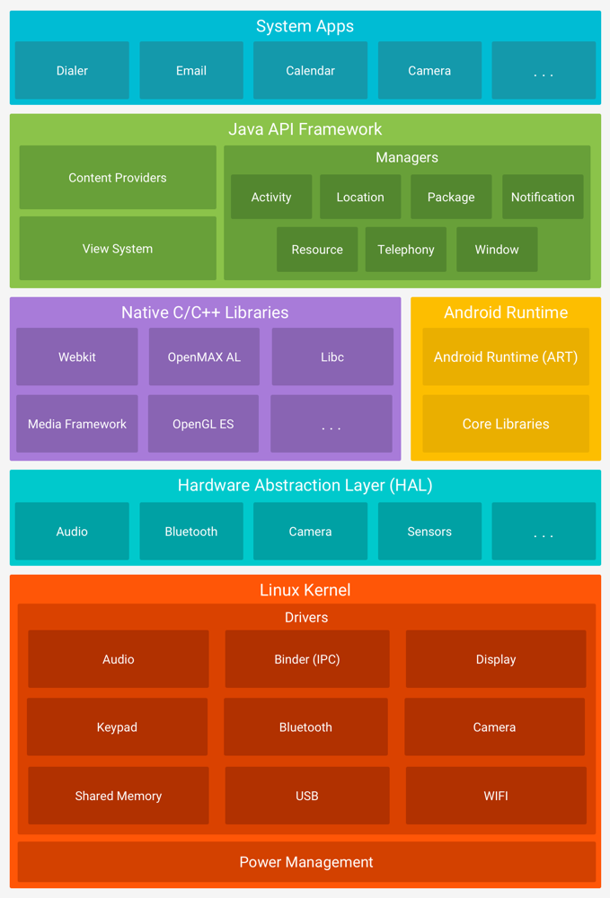
</div>

### **Linux kernel**

Linux Kernel – Android platformasining poydevori Linux yadrosi
hisoblanadi​. U apparat resurslarini boshqarish (xotira, jarayonlar),
qurilma driverlari va asosiy xavfsizlik funksiyalarini (UID asosida
izolyatsiya, SELinux) ta’minlaydi. Android uchun yadroning maxsus
kengaytmalari ya’ni wakelock(qurilmani uxlash rejimidan uyg‘otish),
ashmem(ko‘p jarayonli xotira almashish), Binder IPC(jarayonlararo
aloqalar) kabi komponentlar kiritilgan​. Bundan tashqari, Androidning C
kutubxonasi Bionic bo‘lib, u kichikroq hajm va lisenziya qulayligi
tufayli qo‘llanadi.

Linux kernel bepul va ochiq manbali, Unixga o‘xshash yadrodir va u butun
dunyo bo‘ylab ko‘plab kompyuter tizimlarida qo‘llaniladi. Yadro
1991-yilda Linus Torvalds tomonidan yaratilgan va tez orada Unix o‘rnini
bosuvchi bepul operatsion tizim bo‘lishi uchun yaratilgan GNU operatsion
tizimi uchun yadro sifatida qabul qilingan. 1990-yillarning oxiridan
beri, u ko‘plab operatsion tizim distributivlariga kiritilgan bo‘lib,
ularning ko‘pchiligi Linux deb ataladi. Shunday Linux yadrosi asosida
ishlovchi operatsion tizimlardan biri, Android bo‘lib, u ko‘plab mobil
qurilmalarda ishlatiladi.

Yadro kodining aksariyati GNU kompilyator to‘plami (GCC) tomonidan
qo‘llab-quvvatlanadigan, standart C tilidan tashqarida ba’zi
kengaytmalarni o‘z ichiga olgan C dasturlash tilida yozilgan.
Shuningdek, kodda ba’zi arxitekturaga xos funksiyalar uchun masalan,
xotira foydalanishini va vazifalarni bajarishni optimallashtirish uchun
assembly (assembler) dasturlash tili kodlari ham mavjud. Yadro modulli
dizaynga ega, ya’ni modullar alohida dasturiy komponent sifatida
birlashtirilishi, hattoki dinamik ravishda yuklab olinishi mumkin. Biroq
arxitektura nuqtayi nazaridan yadro monolitik hisoblanadi, chunki butun
operatsion tizim yadrosi kernel fazosida ishlaydi. Linux GNU Umumiy
Ommaviy Litsenziyasining 2-versiyasi (GPLv2) asosida tarqatiladi, garchi
uning tarkibida boshqa mos litsenziyalar ostida bo‘lgan fayllar ham
mavjud. Linux kernelni rasmiy manbadan quyidagi saytdan yuklab
olishingiz mumkin(*https://www.kernel.org).* Bu Linux Foundation
tomonidan boshqariladigan va doimo eng so‘nggi, barqaror versiyalar
e’lon qilinadigan rasmiy sayt.

### **Hardware Abstraction Layer**

Hardware Abstraction Layer (HAL) *–* Android arxitekturasining dastlabki
versiyalaridan beri mavjud bo‘lib, birinchi Android qurilmalaridan
boshlab ishlab chiquvchilar va apparat yetkazib beruvchilar uchun umumiy
interfeys vazifasini bajaradi. Android 8.0 bilan bu qatlam yangi modul
tuzilishga o‘tkazildi: har bir HAL uchun mustaqil AIDL/HIDL interfeys
yaratilishi talab qilina boshlandi. 2015-yildan boshlab HIDL (Hardware
Interface Definition Language), keyinchalik 2019-yildan AIDL (Android
IDL) orqali HAL interfeyslari belgilandi. Haligacha Android 8.0 gacha
eski HAL qatlami bo‘lgan, lekin 8.0 dan har bir HAL uchun standart
interfeys joriy etilgan​. HAL apparat qurilmalariga (kamera, sensorlar,
audio, Bluetooth va boshqalarga) kirish uchun yuqori qatlamda (Java API
ramkasi) mavjud bo‘lgan abstraktsiya qatlami. HAL modulalari har bir
turdagi apparat komponenti uchun alohida bo‘lib, Android tizimiga quyi
darajadagi qurilma xususiyatlarini o‘zgartirmasdan, umumiy interfeys
orqali taqdim etish imkonini beradi​. Masalan, kamera, Bluetooth, audio,
sensorlar uchun alohida HAL modullar mavjud. Ilovalar ramkasidagi
tegishli API chaqirig‘i HAL moduliga tushganda, Android u modulni
yuklaydi va uskunaga murojaat qiladi. HAL amalda C/C++ kutubxonalar
bo‘lib, ularning interfeyslari Android tomonidan aniq belgilangan.
Android 8.0 dan boshlab HAL interfeyslari AIDL/HIDL yordamida
tavsiflanadi. *Binderized HAL* tushunchasi bor bu jarayonlararo
bog‘lanish (IPC) uchun Binder qo‘llanib, har bir HAL moduli alohida
jarayonda (service) ishlaydi. Android 8.0 dan yuqori versiyada har bir
zaruriy HAL modul Android qurilmasida vendor bo‘limida (vendor
partition) yaratilishi va ro‘yxatdan o‘tishi kerak. Android 13 bilan
HIDL eskirdi va yangisi sifatida AIDL-hal interfeyslari tavsiya
etilmoqda​. Application Frameworkdagi apparatga oid API (masalan,
CameraManager, BluetoothAdapter) HAL interfeysini chaqiradi. HAL esa o‘z
navbatida Linux yadrosidagi drayver bilan bog‘lanadi. Misol uchun,
kamera suratga olish: foydalanuvchi yoki ilova camera API’ga so‘rov
yuboradi. Android tizimi Camera HAL modulini ishga tushiradi; bu modul
esa camera nomli noyob modul sifatida Linux yadrosi drayveri bilan
o‘zaro ishlaydi. Shu tariqa, yuqori qatlamlar apparatga bevosita
bog‘lanmaydi, balki HAL orqali ko‘prik vazifasini bajaradi. Ko‘p
uchraydigan misollardan biri – Bluetooth, Wi-Fi, GPS modullari bilan
ishlash. Masalan, ilova BluetoothAdapter ni yoqish uchun murojat qiladi;
ramka bu so‘rovni Bluetooth HAL moduliga uzatadi. HAL esa chipsetdagi
Bluetooth drayveri bilan aloqa o‘rnatib, qurilmani yoqadi. Yoki Sensor
API orqali tezlanish o‘lchagich (accelerometer) ma’lumotini olish uchun
Sensor HAL orqali sensor haydovchisi ishlatiladi. Har bir apparat turi
uchun shunga o‘xshash jarayon bo‘lib, HAL va Linux drayverlari o‘rtasida
HTTP muloqot sodir bo‘ladi​.

### **Android Runtime (Dalvik va ART)**

Android Runtime (Dalvik va ART) *–* Androidning dastlabki yillari
(2008–2014) Dalvik virtual mashinasi ustida ishladi (bu Java bytekodini
*just-in-time* kompilyatsiya bilan bajaradigan maxsus JVM edi).
2014-yilda Android 5.0 (Lollipop) da Dalvik o‘rnini ART (Android
Runtime) egalladi, u ilovalarni *ahead-of-time* va *just-in-time*
kompilyatsiya qilib, unumdorlikni oshirdi. Shu qatlamda asosiy C/C++
kutubxonalar ham yaratilgan: masalan, Bionic libc (Android uchun maxsus
C kutubxonasi), libm (matematik kutubxona), libz (siqish uchun), OpenSSL
(shifrlash), SQLite (ma’lumotlar bazasi) va boshqalar​. Android NDK
(Native Development Kit) esa 2009-2010-yillarda ishlab chiqilib,
dasturchilarga C/C++ kodini yozish imkonini berdi. Android runtime – bu
Androidning C/C++ da yozilgan kutubxonalari va ART/Dalvik virtual
mashinasidan iborat bo‘lib, tizim xizmatlari va yuqori qatlamlar uchun
past darajali ishlov berishni ta’minlaydi. Yuqori qatlamdagi Java
kodlarining kerakli qismlarini C/C++ ga o‘tkazib bajaradi (masalan,
grafik chizish, multimedia ishlov berish). Shu qatlam libbinder.so
orqali inter-protsess muloqotiga (Binder IPC) xizmat qiladi, va
ART/Dalvik (virtual mashina) bu yerda ishlaydi, ya’ni Java kodlarini
natijaviy mashina kodiga aylantiradi​. Shuningdek, Android Runtime (ART)
bu qatlamda joylashgan: u C++ da yozilgan bo‘lib, DEX formatidagi
bytekodni CPU arxitekturasiga mos mashina kodiga aylantirib bajaradigan
muhitdir​. ART har bir ilovaga alohida jarayon va VM instance ajratadi,
bu esa ko‘p ilova bir vaqtning o‘zida samarali ishlashini ta’minlaydi.
Yuqori qatlamdagi Java kodlari muayyan C/C++ funksiyalarini chaqirish
uchun JNI (Java Native Interface) orqali kutubxonalarga murojaat qiladi.
Masalan, UI chizishda View tizimi libhwui va libskia kabi grafik
kutubxonalardan foydalanadi. SQLite bilan ishlash uchun ContentProvider
va ActivityManagerService libsqlite orqali so‘rovlar bajaradi.
WebKit/Chromium bilan yasalgan browser yoki WebView komponenti esa C++
da yozilgan veb-dvigatelga suyanadi​. Ilova dasturchilari ba’zi hisoblash
yoki grafik ishlovlarni NDK yordamida C/C++ da yozishi mumkin. Masalan,
3D o‘yinlar OpenGL ES bilan ishlaydi. WebView browser tarkibi
WebKit/Chromium rendering dvigatelida bajariladi​. Yoki yuklab
olinayotgan faylni saqlash jarayonida SQLite kutubxonasi ishlatiladi.
Shu bilan birga, libbinder orqali yuqori qatlamlar Android sistem
xizmatlari (system_server) bilan muloqot qiladi: masalan, ilovalar va
ramka xizmatlari o‘zaro xabar almashish uchun binder driverini
qo‘llaydi.

### **Application Framework**

Application Framework *–* Androidning dastlabki versiyalarida
(2008-yildan boshlab) Java tilida yozilgan Android Framework qatlamlari
bo‘lib, ular ilovalarga bir qator xizmatlar va APIlar taqdim etadi.
Android Inc. va keyinchalik Google ishlab chiqqan ushbu ramkalar
yaratilishi 2007–2008-yillarda, birinchi Android telefon taqdim
etilganda boshlangan. Ilovalar ramkasi qatlamining asosiy vazifasi
ilovalar va yuqori qatlam komponentlariga (Activity, Service va hokazo)
tizimning past darajadagi funktsiyalariga qulay kirishni ta’minlovchi
APIlar to‘plamini taqdim etish. Ushbu qatlamda ishlab chiquvchiga qulay
yuqori darajadagi dasturiy interfeyslar (APIs) to‘plami mavjud bo‘lib,
ular qayta ishlangan modullar va xizmatlardan foydalanib, ilovalarni
tezda yaratishga yordam beradi. Masalan:

- View System *–* Interfeys elementlarini (tugmalar, matn maydonlari,
  ro‘yxatlar, grafikalar) ekranga chiqarish uchun ramka sinflari.

- Resource Manager (Resurs menejeri). Tillangan matnlar, grafikalar,
  tartib fayllari kabi resourcelarni boshqarish uchun xizmat​.

- Notification Manager (Bildirishnoma menejeri)*.* Har xil ilovalar
  uchun status panelida va bildirishnoma panelida ogohlantirishlar
  chiqarish imkonini beruvchi xizmat​.

- Activity Manager (Activity menejeri)*.* Ilovalar hayot tsiklini
  (aktiv, fon, to‘xtatilgan holatlar) boshqaradi va Back Stack (orqa
  ketma-ketlik) ni nazorat qiladi​.

- Content Provider (Kontent provayder)*.* Ilovalarga o‘z ma’lumotlarini
  boshqa ilovalar bilan bo‘lishish yoki boshqa ilovalardan ma’lumot
  olish imkonini beruvchi modul​.

Yuqoridagi ro‘yxat Android Developer tomonidan bergan asosiy ramka
komponentlari misolidir​. Bular bilan bir qatorda Window Manager,
Location Manager, Package Manager, Telephony Manager kabi boshqa menejer
va xizmatlar ham mavjud bo‘lib, ular turli funksiyalarni bajaradi
(masalan, ekran oynalarini boshqarish, geolokatsiya ma’lumotlarini
olish, o‘rnatilgan ilovalarni boshqarish va tarmoqqa ulanmagan va
telefon qo‘ng‘iroqlarini boshqarish). Android ramkasi ichida
chaqiriladigan ko‘plab xizmatlar (masalan, ActivityManagerService,
WindowManagerService va boshqalar) system_server nomli jarayon (daemon)
ichida ishlaydi. Bu system services nomli modul tizim komponentlari
bo‘lib, ular quyi darajadagi apparat va tizim resurslariga kirishish
uchun ramka APIlari bilan muloqot qiladi​. Masalan, ilovada
ActivityManager orqali ilovani ishga tushirish talab etilganida, bu
chaqiruv system_server ichidagi ActivityManagerServicega uzatiladi.
*Android* *Framework* C/C++ darajasida bajaruvchi libandroid_runtime.so,
libdvm.so kabi kutubxonalar yordamida ishlaydi, lekin tashqi ko‘rinishda
Java sinflaridan tashkil topgan. Dasturchilar Java klasslari orqali
kerakli funksiyalarni chaqiradi. Android API’lari orqali ilovalar
ramkasi binder IPC orqali pastki qatlamlardagi xizmatlar bilan ham aloqa
qilish imkoniga ega. Masalan, NotificationManager orqali bildirishnoma
jo‘natish ramka ichidagi binder so‘rovi sifatida system_serverdagi
NotificationService ga yuboriladi. *Framework* qatlami masalasi
sifatida, foydalanuvchi telefon ekranida yangi xabar kelganini
ko‘rsatuvchi bildirishnoma misol bo‘la oladi. Dasturchi ilovasi
NotificationManager APIsini chaqiradi ramka bu so‘rovni qabul qilib,
ichki xizmatlarni ishga tushiradi va tizim panelida bildirishnoma
chiqishini ta’minlaydi. Yoki, Content Provider orqali kontaktlarni
o‘qish uchun Contacts dasturini qo‘zg‘atadi va kerakli ma’lumotni oladi.
Shu tarzda, ramka qatlamidagi APIar foydalanuvchi ilovalariga qulay
interfeyslar taqdim etadi va ularni tizimning quyi qatlamlari bilan
bog‘laydi. Android platformasi ko‘plab C/C++ kutubxonalarini o‘z ichiga
oladi. Masalan, media fayllar bilan ishlash uchun Media kutubxonasi,
grafik chizish uchun SurfaceFlinger va OpenGL ES bilan bog‘liq
kutubxonalar ishlatiladi​. Ma’lumotlar bazasi uchun SQLite qo‘llanadi,
veb brauzer mexanizmi sifatida WebKit (keyinchalik Chromium) va internet
xavfsizligi uchun SSL/TLS kutubxonalari bor. Shuningdek, Android grafik
tasvirlar uchun Skia grafika dvigateli va shriftlar uchun FreeType
kutubxonalarini ham o‘z ichiga oladi. Tizimdagi asosiy komponentlarning
aksariyati nativ kodda yozilgan bo‘lib, masalan, SurfaceFlinger,
AudioFlinger kabi xizmatlar C++ da amalga oshiriladi​. Tizim
kamchiliklarini bartaraf etish uchun bu kutubxonalar Java APIlari orqali
ilovalarga ochiladi (masalan, Android Java APIlari yordamida OpenGL ES
chaqiriladi​.

### **Applications (Ilovalar)**

Applications (Ilovalar) *–* foydalanuvchiga ko‘rinarli va foydali
dasturlar (masalan, suhbat, internet-brauzer, o‘yin, foto-video
ilovalari) uchun muhit. Har bir Android ilovasi o‘z jarayonida (process)
alohida ishlaydi va unga alohida foydalanuvchi identifikatori (UID)
ajratiladi. Bu Linux yadrosi asosidagi *sandbox* xususiyati orqali
ilovalarni bir-biridan izolyatsiya qilishni (himoya qilishni)
ta’minlaydi​. Masalan, bir ilova boshqa ilovaning ma’lumotlariga
ruxsatsiz kira olmaydi yoki telefon funksiyalarini ruxsatsiz chaqira
olmaydi. Shu tariqa, Android ilovalari tabiiy o‘zaro ajratilganlikda
ishlaydi va tizim xavfsizligi kuchaytirilgan. Ilovalar odatda Java yoki
Kotlin tilida yaratiladi va Android SDK yordamida to‘g‘ridan-to‘g‘ri
*Android Runtime (ART)* ustida bajariladi. Har bir ilova
AndroidManifest.xml fayliga ega bo‘lib, u yerda ilovaning tarkibiy
qismlari (Activity, Service, ContentProvider, BroadcastReceiver) va
talab qilinadigan ruxsatlar (permissions) ko‘rsatiladi. Android
ilovalari quyidagi asosiy komponentlardan iborat bo‘ladi.

- *Activity:* foydalanuvchi interfeysini tashkil etuvchi ekranning bir
  sahifasi (masalan, menyu yoki forma).

- *Service:* orqa fonda ma’lum vazifani bajarayotgan xizmat (masalan,
  musiqa ijro etish, yuklab olish).

- *Broadcast Receiver:* tizim yoki boshqa ilovalar yuborgan *broadcast*
  xabarlarni (masalan, batareya holati yoki tarmoqqa ulanish o‘zgarishi)
  qabul qiladi.

- *Content Provider:* ilovalarga ma’lumotlarni (kontaktlar, fayllar,
  ma’lumotlar bazasi) saqlash va boshqa ilovalar bilan ulashish imkonini
  beruvchi komponent.

Ilovalar ramkasi (Application Framework) orqali taqdim etiladigan APIlar
yordamida ilovalar ushbu komponentlarni boshqaradi. Masalan,
Notification Manager yordamida status panelda bildirishnoma chiqarish,
View System orqali ekranga UI komponentlarini joylashtirish mumkin.
Dasturchi ilovalari kodi \*.java yoki \*.kt fayllardan iborat bo‘lib,
\*.apk paketiga yig‘ilib, Android Runtime (ART) tomonidan .dex formatida
ijro etiladi​. Ilovalar to‘g‘ridan-to‘g‘ri quyi qatlamdagi apparat
qurilmalariga kira olmaydi. Ilovalar istalgan yuqori darajadagi
xususiyatdan foydalanish uchun ramka APIlarini chaqiradi. Masalan,
kamera bilan ishlovchi ilova Camera API ga murojaat qilib, ramka orqali
tegishli HAL modulini ishga tushiradi. Telefon qo‘ng‘irog‘i yoki SMS
jo‘natish funksiyasi uchun esa ilova Android-ning standart Telefon yoki
SMS tizim ilovalarini chaqirishi mumkin; masalan, o‘z ilovangizdan SMS
jo‘natmoqchi bo‘lsangiz, alohida SMS jo‘natish moduli yozishga hojat
yo‘q o‘rniga tizimga o‘rnatilgan SMS ilovasini chaqirish mumkin. Bu
misolda ilova (Application qatlam) Intents orqali tizim ilovasini ishga
tushirib, SMS jo‘natadi. Oddiy real misol sifatida, foto-iltimos
qiluvchi ilovalarni olaylik. Foydalanuvchi kamerani ochish uchun ilovani
ishga tushiradi bu ilova Camera API chaqiruvini yuboradi. Android
ramkasi bu so‘rovni tegishli Camera HAL moduliga uzatadi, HAL esa Linux
yadrosidagi camera drayveri orqali haqiqiy kamera sensoridan surat
oladi. Olingan surat yana yuqoridan pastga HAL dan Frameworkga, undan
ilovaga qaytariladi va foydalanuvchiga ko‘rsatiladi. Shunday qilib,
Ilovalar qatlami foydalanuvchi funksiyalarini taqdim etib, ortida
Framework va pastki qatlamlar bilan o‘zaro aloqa qiladi​.


<div align="center">
  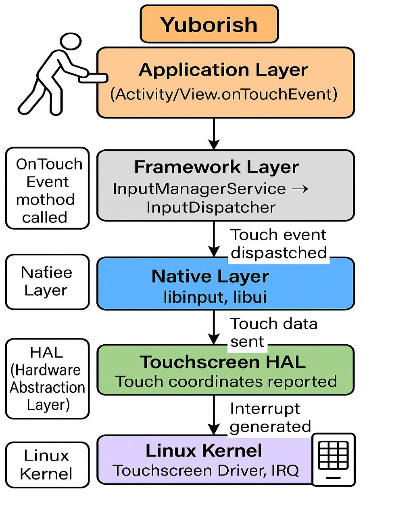
</div>

### **Java virtual mashina**

Java Virtual Mashinasi (JVM) — bu abstrakt hisoblash mashinasi bo‘lib, u
Java baytkodlarini bajaradi. JVM platformadan mustaqil bo‘lib, Java
ilovalari “Write Once Run Anywhere” tamoyili bilan har qanday Java
muhitida ishlaydi. Javadagi \*.java fayllar javac kompilyatori yordamida
sinf (class) formatidagi baytkodga (\*.class) aylantiriladi. Keyin JVM
sinf yuklovchi (Class Loader) orqali ushbu .class faylni yuklab oladi va
bajara boshlaydi. Bajarish vaqtida Execution Engine bo‘limi baytkod
yo‘riqnomalarini bajaradi. JVM dinamik tarzda ishlaydi: u baytkodni
talqin qiluvchi (interpretor) yordamida qadam-baqadam bajarishi yoki
muhim bo‘laklarni Just-In-Time (JIT) kompilyatori yordamida mashina
kodiga o‘girishi mumkin. Masalan, HotSpot VM eng ko‘p ishlatiladigan
metodlarni ish vaqtida profillab, ularni natijaviy protsessor
buyruqlariga kompilyatsiya qiladi. Shu tariqa, takroriy ishlatiladigan
kod uchun qayta talqin qilish o‘rniga tayyor natijaviy kod bajariladi,
bu samaradorlikni oshiradi.

### **Dalvik virtual mashina**

Dalvik Virtual Machine (DVM) - bu Android ilovalari uchun taqdim etilgan
maxsus dastur. U Java kodini oladi va Dalvik bajariladigan fayl sifatida
tanilgan .dex (kengaytma) bilan faylda uning optimallashtirilgan
versiyasini yaratadi. Bu format ilovalarga kamroq resurslar, ya’ni mobil
telefonlar va xotirasi past, sekinroq qurilmalarda tez ishlashiga imkon
beradi. Bu odatiy Java Virtual Mashinasidan ( JVM ) farq qiladi, chunki
u Android uchun kamroq xotira ishlatadigan va turli versiyalarda
ishlaydigan millionlab qurilmalarga mos keladigan ilovalarni ishga
tushirish uchun optimallashtirilgan.

### **Android ruxsatlari**

Android ilovalari foydalanuvchining shaxsiy ma’lumotlariga yoki
qurilmaning ayrim funksiyalariga kirish uchun *ruxsat (permission)*
so‘raydi. Bu foydalanuvchining maxfiyligini himoya qilishga yordam
beradi.

Ruxsat turlari

Xavfli (Dangerous)

Oddiy(Normal)

Oddiy(Normal) ruxsatlar qurilmaning xavfsizligiga yoki foydalanuvchi
maxfiyligiga katta xavf tug‘dirmaydi.
  
| **Permission**                                | **Vazifasi**                                         |
|-----------------------------------------------|------------------------------------------------------|
| android.permission.INTERNET                   | internetga ulanish                                   |
| android.permission.ACCESS_NETWORK_STATE       | tarmoq holatini tekshirish                           |
| android.permission.BLUETOOTH                  | Bluetoothdan foydalanish                             |
| android.permission.BLUETOOTH_ADMIN            | Bluetooth sozlamalarini boshqarish                   |
| android.permission.BLUETOOTH_CONNECT          | Bluetooth qurilmaga ulanish (Android 12+)            |
| android.permission.BLUETOOTH_SCAN             | Bluetooth qurilmalarni qidirish (Android 12+)        |
| android.permission.BLUETOOTH_ADVERTISE        | Bluetooth orqali reklamalarni yuborish (Android 12+) |
| android.permission.NFC                        | NFC (yaqin aloqa) qurilmasidan foydalanish           |
| android.permission.ACCESS_WIFI_STATE          | Wi-Fi holatini tekshirish                            |
| android.permission.CHANGE_WIFI_STATE          | Wi-Fi sozlamalarini o‘zgartirish                     |
| android.permission.VIBRATE                    | Qurilmani titratish                                  |
| android.permission.WAKE_LOCK                  | Qurilmaning uxlamasligini ta’minlash                 |
| android.permission.FOREGROUND_SERVICE         | Foreground servis ishga tushirish (Android 9+)       |
| android.permission.REQUEST_INSTALL_PACKAGES   | APK fayl o'rnatish uchun ruxsat so‘rash              |
| android.permission.RECEIVE_BOOT_COMPLETED     | Qurilma yuklanganda ishga tushish                    |
| android.permission.ACCESS_NOTIFICATION_POLICY | Bildirishnoma sozlamalariga cheklangan kirish        |
| android.permission.USE_FULL_SCREEN_INTENT     | Xabarnomalarni to‘liq ekranda ko‘rsatish             |
| android.permission.SET_WALLPAPER              | Fonga rasm o'rnatish                                 |
| android.permission.SET_WALLPAPER_HINTS        | Fonga rasm pozitsiyasini sozlash                     |
| android.permission.MODIFY_AUDIO_SETTINGS      | Ovoz sozlamalarini o'zgartirish                      |
| android.permission.BROADCAST_STICKY           | Sticky broadcast yuborish (deprecated)               |
| android.permission.CHANGE_NETWORK_STATE       | Tarmoq holatini o‘zgartirish                         |
| android.permission.DISABLE_KEYGUARD           | Lock screenni vaqtinchalik o'chirish (deprecated)    |
| android.permission.MOUNT_UNMOUNT_FILESYSTEMS  | Fayl tizimini mount/unmount qilish (deprecated)      |
| android.permission.READ_SYNC_SETTINGS         | Sync sozlamalarini o‘qish                            |
| android.permission.WRITE_SYNC_SETTINGS        | Sync sozlamalarini o‘zgartirish                      |
| android.permission.EXPAND_STATUS_BAR          | Status barni ochish yoki yopish                      |
| android.permission.GET_PACKAGE_SIZE           | Ilovaning o‘lchamini aniqlash                        |
Bu ruxsatlar avtomatik beriladi, foydalanuvchi alohida tasdiqlamaydi.

Xavfli (Dangerous) ruxsatlar – Foydalanuvchi shaxsiy ma’lumotlariga yoki
qurilma resurslariga kira oladi. Bu ruxsatlar foydalanuvchidan
so‘raladi.
| **Permission**                                        | **Vazifasi**                                                       |
|-------------------------------------------------------|--------------------------------------------------------------------|
| android.permission.RECORD_AUDIO                       | Mikrofon orqali ovoz yozish                                        |
| android.permission.CAMERA                             | Kameradan foydalanish                                              |
| android.permission.READ_CONTACTS                      | Kontaktlarni o'qish                                                |
| android.permission.WRITE_CONTACTS                     | Kontaktlarga o'zgartirish kiritish                                 |
| android.permission.GET_ACCOUNTS                       | Qurilmadagi akkauntlar ro'yxatini olish                            |
| android.permission.ACCESS_FINE_LOCATION               | Aniq GPS joylashuvini aniqlash                                     |
| android.permission.ACCESS_COARSE_LOCATION             | Taxminiy joylashuvni olish                                         |
| android.permission.READ_CALENDAR                      | Kalendar ma'lumotlarini o'qish                                     |
| android.permission.WRITE_CALENDAR                     | Kalendar ma'lumotlarini o'zgartirish va yozish                     |
| android.permission.READ_EXTERNAL_STORAGE              | Tashqi xotiradagi fayllarni o'qish                                 |
| android.permission.WRITE_EXTERNAL_STORAGE             | Tashqi xotiraga fayl yozish                                        |
| android.permission.MANAGE_EXTERNAL_STORAGE            | Tashqi xotirani to’liq boshqarish (Android 11 va yuqoriroq)        |
| android.permission.SEND_SMS                           | SMS yuborish                                                       |
| android.permission.RECEIVE_SMS                        | SMS qabul qilish                                                   |
| android.permission.READ_SMS                           | SMS xabarlarini o'qish                                             |
| android.permission.RECEIVE_MMS                        | MMS xabarlarini qabul qilish                                       |
| android.permission.RECEIVE_WAP_PUSH                   | WAP push xabarlarini qabul qilish                                  |
| android.permission.CALL_PHONE                         | Telefon orqali qo'ng'iroq qilish                                   |
| android.permission.READ_PHONE_STATE                   | Telefon holati va identifikatorlarini o'qish                       |
| android.permission.USE_SIP                            | SIP protokoli orqali qo'ng'iroqlarni amalga oshirish               |
| android.permission.PROCESS_OUTGOING_CALLS             | Chiqayotgan qo'ng'iroqlarni kuzatish yoki o'zgartirish             |
| android.permission.ANSWER_PHONE_CALLS                 | Kiruvchi qo'ng'iroqlarga javob berish (Android 8.0+)               |
| android.permission.WRITE_CALL_LOG                     | Qo'ng'iroqlar tarixini tahrirlash                                  |
| android.permission.ADD_VOICEMAIL                      | Voicemail qo‘shish                                                 |
| android.permission.BODY_SENSORS                       | Tana sensorlaridan (masalan, yurak urishi) foydalanish             |
| android.permission.ACTIVITY_RECOGNITION               | Foydalanuvchining harakatini (yurish, yugurish) aniqlash           |
| android.permission.READ_MEDIA_IMAGES                  | Rasmlarga kirish (Android 13+)                                     |
| android.permission.READ_MEDIA_VIDEO                   | Videolarga kirish (Android 13+)                                    |
| android.permission.READ_MEDIA_AUDIO                   | Audiolarga kirish (Android 13+)                                    |
| android.permission.BIND_INPUT_METHOD                  | Keyboard (input method) servisini ulash                            |
| android.permission.BIND_NOTIFICATION_LISTENER_SERVICE | Xabarnomalarni o'qish va boshqarish servisi                        |
| android.permission.USE_BIOMETRIC                      | Biometrik autentifikatsiyadan foydalanish (barmoq izi, Face ID)    |
| android.permission.USE_FINGERPRINT                    | Barmoq izidan foydalanish (Android 9 va undan past)                |
| android.permission.REBOOT                             | Qurilmani qayta yuklash (root huquqi kerak)                        |
| android.permission.GET_TASKS                          | Foydalanuvchi ishlatayotgan ilovalar ro'yxatini olish (deprecated) |
| android.permission.REORDER_TASKS                      | Ilovalar tasklarini o'zgartirish (Activity Stack)                  |
| android.permission.RESTART_PACKAGES                   | Ilovalarni to'xtatish va qayta ishga tushirish (deprecated)        |
| android.permission.DEVICE_POWER                       | Qurilmani o'chirish yoki yoqish (faqat system apps uchun)          |
## **iOS arxitekturasi**

iOS operatsion tizimining tuzilishi qatlamli (layered) asosda qurilgan.
Unda to‘g‘ridan-to‘g‘ri aloqa sodir bo‘lmaydi. Ilova qatlamidan
(Application Layer) apparat qatlamigacha (Hardware Layer) bo‘lgan
qatlamlar o‘zaro aloqa qilishda yordam beradi. Pastki darajadagi
qatlamlar barcha ilovalar tayanuvchi asosiy xizmatlarni taqdim etsa,
yuqori darajadagi qatlamlar grafik va foydalanuvchi interfeysi bilan
bog‘liq xizmatlarni taqdim etadi.iOS arxitekturasi to‘rt asosiy
qatlamdan tashkil topgan: *Cocoa Touch, Media, Core Services va Core OS
(Darwin).* Har bir qatlam yuqoridagi qatlamlarga xizmat ko‘rsatadi va
o‘ziga xos komponentlarga ega.


<div align="center">
  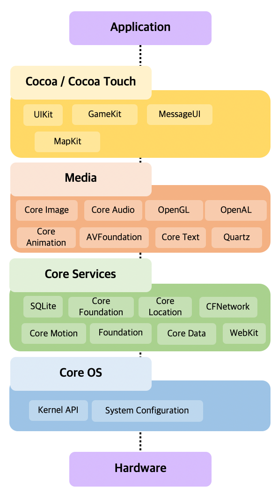
</div>

### **Cocoa Touch**

> *Cocoa Touch* – bu foydalanuvchi ilovalar interfeysi qatlamidir. Bu
> qatlamda UIKit, Foundation, Core Animation va boshqa yuqori darajadagi
> ramkalar mavjud bo‘lib, ular mobil ilovalar uchun tugmalar, oynalar,
> xabarlar va sensorli kirishni boshqaradi. Cocoa Touch qatlamida Touch
> ID va Face ID biometrik autentifikatsiyasi ham amalga oshiriladi.

### **Media**

> *Media* – audio va grafikani boshqarish qatlamidir. Bu yerga
> AVFoundation, Core Graphics, Core Animation, Metal/OpenGL, Core Audio
> kabi ramkalar kiradi. Masalan, video dekodlash va ko‘rsatish, grafik
> chizish, audio tahrirlash Media qatlamida amalga oshiriladi. Ushbu
> qatlam multimediya tarkiblarini o‘zgartirish (video, surat, o‘yin
> grafikasi) bilan bog‘liq xavfsizlik muammolariga duch kelishi mumkin
> (masalan, noto‘g‘ri faylni qayta ishlashda xatolar).

### **Core services**

> *Core Services* – pastroq darajadagi umumiy xizmatlar qatlamidir. Bu
> yerda ma’lumotlar bazasi (SQLite, Core Data), tarmoq (CFNetwork),
> joylashuv (Location Services), Core Foundation, Grand Central Dispatch
> (GCD) va boshqa tizim xizmatlari mavjud. Shuningdek, Keychain, Data
> Protection kabi komponentlar ham Core Servicesda joylashgan. Bu
> qatlamda ma’lumotlar bazasi va tarmoq protokollari orqali ma’lumot
> almashinuvi, shifrlash va saqlash amalga oshiriladi. Zaifliklar esa
> ko‘pincha bu qatlamdagi ramkalarning xotira bog‘lanishlari yoki
> noto‘g‘ri konfiguratsiyalarda yuzaga keladi.

### **Core Os**

> *Core OS (Darwin yadro)* – eng pastki, apparat va yadro qatlamidir. Bu
> Darwin (XNU) yadrosi, drayverlar, BSM audit, Apple Filing Protocol,
> CryptoKit, tizim kutubxonalari va boshqa past darajadagi
> komponentlarni o‘z ichiga oladi. Bu qatlam protsessor (ARM) ustida
> ishlaydi va qurilmaning eng asosiy resurslarini boshqaradi. Tizimni
> tiklash va yangilashlar bu qatlam yordamida amalga oshiriladi.

## **iOS SDK va Xcode**

iOS SDK (Software Development Kit) bu Apple kompaniyasi tomonidan iOS
operatsion tizimi uchun ilovalar yaratish uchun taqdim etilgan dasturiy
vositalar to‘plamidir. U dasturchilarga iPhone, iPad va iPod touch
qurilmalari uchun ilovalar ishlab chiqish imkonini beradi. SDK tarkibiga
turli xil kutubxonalar, APIlar (Application Programming Interface),
simulyatorlar va hujjatlar kiradi. iOS SDK odatda Xcode bilan birga
ishlatiladi bu Applening rasmiy dasturlash muhiti bo‘lib, unda Swift
yoki Objective-C tillarida kod yoziladi.

Xcode — bu Apple tomonidan ishlab chiqilgan rasmiy dasturlash muhiti
(IDE — Integrated Development Environment) bo‘lib, iOS, macOS, watchOS
va tvOS operatsion tizimlari uchun ilovalar yaratishda ishlatiladi.
Xcode dasturchilarga Swift va Objective-C dasturlash tillarida kod
yozish, xatoliklarni tuzatish (debug), interfeys dizayni yaratish
(Interface Builder), test qilish va App Storega ilovani yuborish
imkonini beradi. U o‘z ichiga iOS SDKni ham oladi, ya’ni Xcode orqali
to‘liq iOS ilovalarini yaratish mumkin. Xcode faqat macOS operatsion
tizimida ishlaydi.

## **iOS ruxsatlari**

Quyida iOS permission (ruxsatlar) larining asosiylari jadval
ko‘rinishida keltirilgan. Har bir permission nomi, *Info.plist* dagi
kaliti va u nima vazifani bajarishi tushuntirilgan. Bu ruxsatlar
*Info.plist* faylida majburiy ko‘rsatilishi kerak. Aks holda ilova
ruxsatni so‘ray olmaydi va to‘xtashi mumkin.
| **Permission nomi**               | **Kodda yozilishi**                                           | **Vazifasi**                                                       |
|-----------------------------------|---------------------------------------------------------------|--------------------------------------------------------------------|
| Kamera (Camera)                   | NSCameraUsageDescription                                      | Kameraga kirish uchun ruxsat so‘rash.                              |
| Mikrofon (Microphone)             | NSMicrophoneUsageDescription                                  | Mikrofon orqali audio yozish.                                      |
| Joylashuv (Location)              | NSLocationWhenInUseUsageDescription                           | Ilova ishlaganda joylashuvni aniqlash.                             |
| Joylashuv (Doimiy)                | NSLocationAlwaysUsageDescription                              | Ilova yopiq bo‘lsa ham joylashuvni kuzatish.                       |
| Kontaktlar (Contacts)             | NSContactsUsageDescription                                    | Kontaktlarga kirish, o‘qish/qo‘shish.                              |
| Suratlar (Photos)                 | NSPhotoLibraryUsageDescription                                | Suratlar kutubxonasiga kirish.                                     |
| Surat yozish                      | NSPhotoLibraryAddUsageDescription                             | Faqat surat kutubxonasiga yozish (o‘qimasdan).                     |
| Bluetooth                         | NSBluetoothAlwaysUsageDescription                             | Bluetooth qurilmalar bilan aloqa.                                  |
| Kamera rulosini saqlash           | NSAppleMusicUsageDescription                                  | Media kutubxonaga yozish (ko‘proq audio uchun).                    |
| Kalendarga kirish                 | NSCalendarsUsageDescription                                   | Kalendarga kirish, o‘qish va yozish.                               |
| Reminders (Eslatmalar)            | NSRemindersUsageDescription                                   | Eslatmalar ilovasiga kirish.                                       |
| Sog‘liq ma’lumotlari              | NSHealthShareUsageDescription, NSHealthUpdateUsageDescription | HealthKit orqali sog‘liq ma’lumotlarini o‘qish va yozish.          |
| Harakat va fitness                | NSMotionUsageDescription                                      | Qurilma harakati (accelerometer, gyroscope) haqida ma’lumot olish. |
| Foydalanuvchi kutubxonasi (Media) | NSMediaLibraryUsageDescription                                | Foydalanuvchi musiqa/media kutubxonasiga kirish.                   |
| Face ID / Touch ID                | NSFaceIDUsageDescription                                      | Biometrik autentifikatsiya ishlatish.                              |

# **III-BOB. Mobil ilovalar pentestingi**

## **Android Studio va SDK**

2013-yil 16-may kuni Google I/O konferensiyasida Katherine Chou
tomonidan Apache 2.0 litsenziyasi asosida chiqarilgan Android Studio
nomli integratsiyalashgan dasturlash muhiti (IDE) Android platformasi
uchun ilovalar yaratish maqsadida taqdim etildi. Bu IDE 2014-yilda beta
bosqichiga kirgan va 2014-yil dekabr oyida 1.0-versiyadan boshlab
birinchi barqaror (stable) versiyasi chiqarilgan. 2015-yil 15-sentabrda
Android Studio rasmiy IDE sifatida e’lon qilindi.

Android Studio va SDK (Software Development Kit) haqida batafsil
ma’lumot olish uchun quyidagi havolani ko‘ring:

👉 <http://developer.android.com/tools/studio/index.html#build-system>

Android Studio va SDK Java SE Development Kit (JDK) ga juda katta
darajada bog‘liq.  
JDK ni quyidagi manzildan yuklab olish mumkin:

👉<http://www.oracle.com/technetwork/java/javase/downloads/jdk7downloads-1880260.html>

Ba’zi dasturchilar boshqa IDElarni afzal ko‘rishadi, masalan Eclipse va
boshqalar.  
Ular uchun Google SDKning faqat o‘zini yuklab olishni ta’minlaydi:  
👉 <http://dl.google.com/android/installer_r24.4.1-windows.exe>

Android Studioni samarali ishlatish uchun minimal tizim talablari
mavjud. Quyidagi tartib Windows 10 Professional 64-bit operatsion
tizimida Android Studioni o‘rnatish jarayonini ko‘rsatadi. Bu tizim
quyidagi texnik xususiyatlarga ega:

- 4 GB RAM

- Minimum 50 GB bo‘sh xotira

- Java Development Kit 7 o‘rnatilgan bo‘lishi kerak

1.  Bu IDE Linux, Windows va Mac OS X uchun mavjud. Android Studioni
    quyidagi manzildan yuklab olish mumkin:

> 👉 <http://developer.android.com/sdk/index.html>

2.  Android Studio yuklab olingach, o‘rnatish faylini ishga tushiring.
    Odatda, quyidagidek o‘rnatish oynasi ko‘rinadi. Next (Keyingi)
    tugmasini bosing.


<div align="center">
  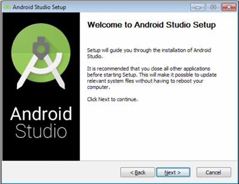
</div>

3.  Ushbu o‘rnatish jarayoni tizimning talablariga javob berishini
    avtomatik tarzda tekshiradi.

4.  Zarur bo‘lgan barcha komponentlarni tanlang va “Next” (Keyingi)
    tugmasini bosing.

5.  Litsenziya shartlarini o‘qib chiqish va qabul qilish tavsiya
    etiladi, keyin esa “Next” tugmasini bosing.

6.  Barcha vositalarni yagona joyda kuzatib borish uchun yangi papka
    yaratish tavsiya etiladi; bu dalillarni (fayllarni) boshqarishni
    osonlashtiradi.  
    Masalan, biz C diskida “Hackbox” nomli papka yaratdik bu quyidagi
    ekranda ko‘rsatilgan:

<div align="center">
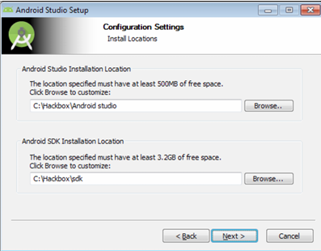
</div>


7.  Endi Android tezlashtirilgan muhit (Android-accelerated environment)
    uchun kerakli joy ajratishimiz mumkin, bu esa tezroq ishlashni
    ta’minlaydi.  
    Shuning uchun kamida 2 GB joy ajratish tavsiya etiladi.

8.  Barcha zarur fayllar C:\Hackbox\\ papkasiga ajratiladi (extract
    qilinadi).

9.  O‘rnatish tugagach, siz Android Studioni ishga tushira olasiz, bu
    quyidagi ekranda ko‘rsatilgan.

<div align="center">
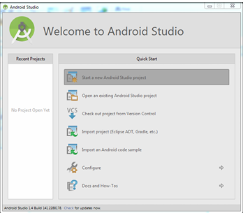
</div>

**Android SDK**

Android SDK dasturchilarga Android platformasida ishlaydigan ilovalarni
to‘liq yaratish, testdan o‘tkazish va nosozliklarini tuzatish (debug
qilish) imkonini beradi.Unda barcha kerakli dasturiy kutubxonalar
(libraries), APIlar, emulyatorlar uchun tizim tasvirlari (system
images), hujjatlar (documentation) va boshqa foydali vositalar mavjud
bo‘lib, Android ilovasini yaratishda yordam beradi. Biz Android Studioni
Android SDK bilan birga o‘rnatdik, va endi iloji boricha SDK ichidagi
vositalardan qanday foydalanishni tushunish juda muhim. Ushbu bo‘limda
biz Android ilovasiga hujum qilish (penetratsion test) vaqtida
foydalaniladigan asosiy SDK vositalari haqida umumiy ma’lumot beramiz.

## **Emulator, simulatorlar, va real qurulmalar**

Emulator, simulator va real qurilma – dasturiy ta’minotni sinashda (test
qilishda) yoki ishlab chiqishda foydalaniladigan muhim vositalar. Quyida
ularning farqlari, o‘xshashliklari va har birining afzallik va
kamchiliklari keltirilgan.

### **Emulatorlar**

Emulator bu kompyuterda ishlaydigan maxsus dastur bo‘lib, u haqiqiy
qurilmaning (telefon, planshet, konsol va boshqalar) ish faoliyatini
to‘liq taqlid qiladi. U nafaqat qurilmaning tashqi ko‘rinishini, balki
ichki tizimini operatsion tizim, protsessor, xotira, ekran va boshqa
apparat qismlarini ham o‘zida aks ettiradi. Dasturchilar yoki testchilar
emulatordan foydalanib, ilovani haqiqiy qurilmasiz sinab ko‘rishlari
mumkin. Masalan, Android dasturchilari Android Studiodagi emulyator
orqali turli telefon modellarida ilovani test qiladilar Samsung, Pixel,
Xiaomi va boshqalar.

### **Simulatorlar**

Simulator bu kompyuterda ishlaydigan dastur bo‘lib, u real qurilmaning
tashqi ko‘rinishi va ishlash muhitini taqlid qiladi, lekin qurilmaning
apparat (hardware) qismlarini aniq takrorlamaydi. U faqat qurilmaning
xulq-atvori yoki funksional tomonini ko‘rsatadi. Masalan, iOS
dasturchilari Xcodedagi iPhone Simulator yordamida iPhone ilovasini
haqiqiy iPhonesiz sinab ko‘rishlari mumkin.

### **Real qurulmalar**

Real qurilma bu siz test qilayotgan yoki dastur o‘rnatayotgan haqiqiy
fizik telefon, planshet yoki boshqa elektron qurilma. Masalan, siz
Android ilova yaratgan bo‘lsangiz, uni Samsung yoki Xiaomi telefonida
sinab ko‘rishingiz real qurilmada test hisoblanadi. Bu test qilishning
eng aniq va ishonchli yo‘li, chunki ilova foydalanuvchiga aynan shu
qurilmalarda yetib boradi.

# **IV-BOB. Mobil Pentesting Vositalari**

## **Android xavfsizlik vositalari**

Android xavfsizlik vositalari bu foydalanuvchilarning ma’lumotlarini
himoya qilish va qurilmaning xavfsiz ishlashini ta’minlash uchun
mo’ljallangan dasturiy va apparat vositalaridir. Ular orasida Google
Play Protect (ilovalarni avtomatik tekshiradi), biometrik
autentifikatsiya (barmoq izi, yuzni tanish), shifrlash (ma’lumotlarni
maxfiy saqlash), Permission Manager (ilovalarning ruxsatlarini
boshqarish), hamda SafetyNet va App Sandbox kabi tizim darajasidagi
himoya vositalari mavjud. Bu vositalar yordamida Android qurilmalari
zararli dasturlardan va foydalanuvchi ma’lumotlarining ruxsatsiz
tarqalishidan himoyalanadi.

## **Android Debug Bridge**

ADB (Android Debug Bridge) — bu Android qurilmalarini kompyuter orqali
boshqarish va ular bilan aloqa qilish imkonini beruvchi komanda satrli
(CLI) vosita. U Android SDK (Software Development Kit) tarkibiga kiradi
va ishlab chiquvchilar tomonidan keng qo‘llaniladi.

### **Adbni o‘rnatish**

Windows operatsion tizimiga ADB (Android Debug Bridge) ni o‘rnatish juda
oddiy. Quyidagi bosqichlarni bajarsangiz kifoya. Quydagi rasmiy saytdan
adbni yuklab oling.

👉 <https://developer.android.com/tools/releases/platform-tools>

<div align="center">

</div>

<div align="center">

</div>

Yuklab bo‘lganingizdan keyin zip faylni rasmdagi kabi zipdan chiqarib
oling.


<div align="center">
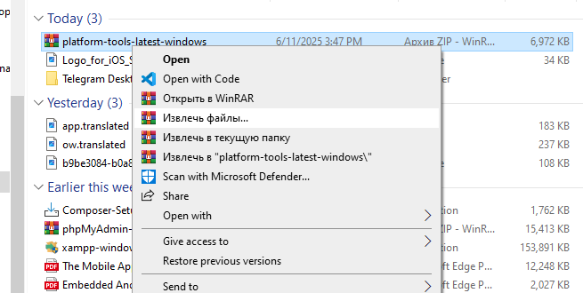
</div>


<div align="center">
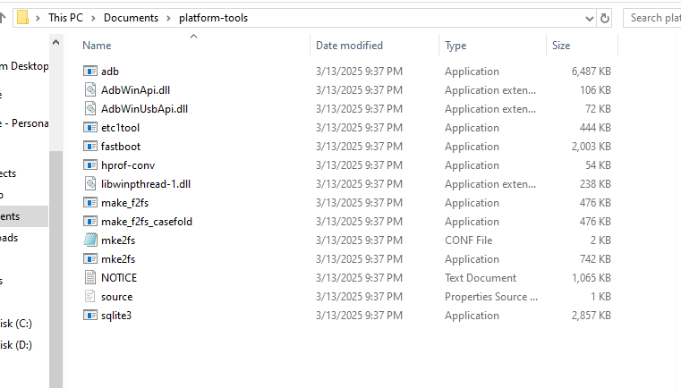
</div>

Keyin adb ni kampyuteringiz tanishi uchun uning turgan joyini pathlar
ro‘yhatiga qo‘shib qo‘yishingiz kerak bo‘ladi.


<div align="center">
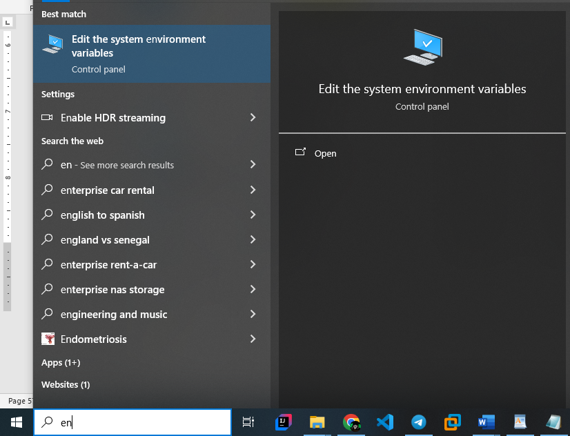
</div>

Kampyuteringiz qidiruv bo‘limiga shunday yozing va “*Edit the system
environment variables*” ni ustiga bosing. Keyin sizda ham quydagicha
oyna ochiladi.

<div align="center">
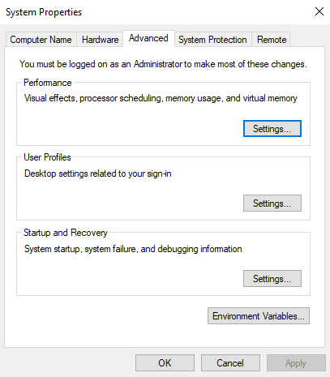
</div>

Siz bu yerdan “*Environment Variables*” ni ustiga bosing va yana bir
oyna ochiladi.


<div align="center">
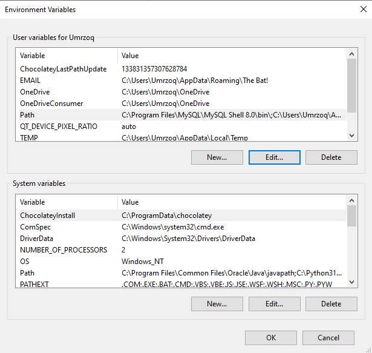
</div>

Shunday ochilgandan keyin siz path qismiga adb turgan joyni yozib
qo‘yishingiz kerak bo‘ladi, va unga qo’shib bo‘lganingizdan keyin barcha
oynalarga OK ni bosib chiqib keting. Cmdni oching va rasmdagi kabi adb
buyrug‘ini yozib adb o‘rnatilganini tekshirib oling agar rasmdagi kabi
chiqsa kampyuteringizga adb dasturi o‘rnatilgan bo‘ladi va uning
imkoniyatlaridan foydalanishingiz mumkin.

<div align="center">
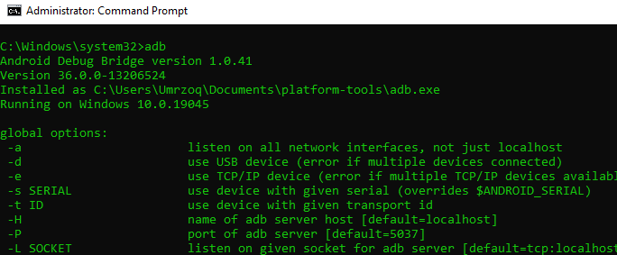
</div>

### **Qurulmaga ulanish**

ADB orqali fizik qurilmaga ulanishingiz uchun USB-Debugging (USB
nosozlikni tuzatish) opsiyasini yoqish muhimdir. Google Nexus 5
qurilmasida bu sozlamani quyidagicha topishingiz mumkin.

*Sozlamalar (Settings) → Dasturchi parametrlar (Developer options).*
Quyidagi ekranda bu ko‘rsatilgan. Agar *Dasturchi parametrlar (Developer
options)* menyusi ko‘rinmasa, demak u yashiringan. Uni yoqish uchun
quyidagi amallarni bajaring:

*Sozlamalar (Settings) → Qurilma haqida (About device) → Build number*
bo‘limiga kirib, *Build number* ustiga *7 marta ketma-ket bosing.*

Shundan so‘ng, *Dasturchi parametrlar* menyusi faollashadi va u orqali
*USB-Debugging* ni yoqishingiz mumkin bo‘ladi.


<div align="center">
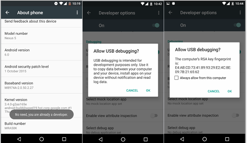
</div>

### **Qurilmaga ilova o‘rnatish**

Birinchi navbatda siz qurulmangiz yoki emulator kampyuterga to‘g‘ri
ulanganligini tekshirib olishingiz kerak bo‘ladi buning uchun *adb
devices* kamandasini terminalga yozing.


<div align="center">
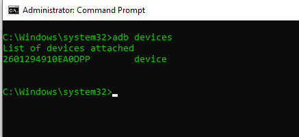
</div>

Rasmdagi kabi sizda chiqgan bo‘lsa qurulmangiz va kampyuteringiz ulangan
bo‘ladi. Qurulmaga to‘g‘ridan to‘g‘ri ulanish uchun siz terminalga
rasmdagi kabi *adb shell* kommandasini yozib ulanishingiz mumkin
bo‘ladi.

<div align="center">
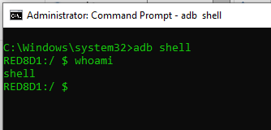
</div>

Agar siz qurulmangizga o‘rnatilgan barcha ilovalar ro‘yhatini ko‘rmoqchi
bo‘lsangiz quydagicha kamandani terminalga yozing.


<div align="center">
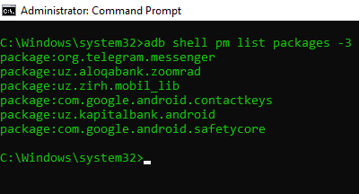
</div>

Bu yerda foydalanuvchi o‘zi o‘rnatgan ilovalarni package nemelar
ro‘yxati chiqadi. Agar siz ilova haqida batafsil ma’lumot (masalan,
joylashuvi, versiyasi) ko‘rmoqchi bo‘lsangiz, bu buyruqdan foydalaning:

<div align="center">
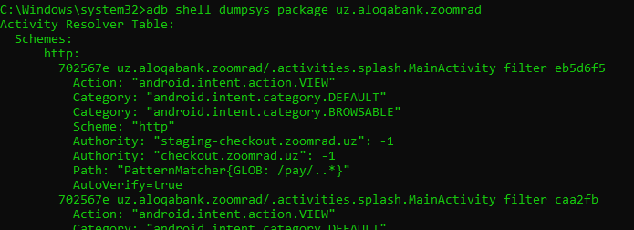
</div>

### **Qurilmadan fayllarni olish**

Agar siz qurulmadan fayl olishingiz kerak bo‘lsa quydagicha kamandani
yozasiz.


<div align="center">
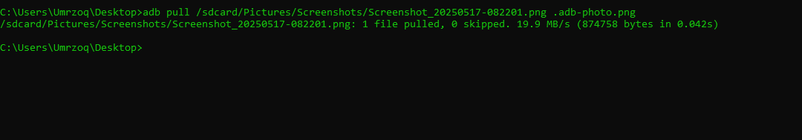
</div>

Bu rasmda biz qurulmadagi rasmni yuklab olibganmiz. Agar siz biror bir
ilovani yuklab olmoqchi bo‘lsangiz ham xuddi shunday yuklab olishingiz
mumkin bo‘ladi buning uchun ilova turgan manzilni topishingiz kerak
bo‘ladi.

### **Fayllarni qurilmaga saqlash**

Agar siz kampyuteringizdagi biror faylni qurulmaga saqlamoqchi
bo‘lsangiz *adb push fayl_manzili
faylni_qurulmaga_joylashtirish_manzili* shu kamanda orqali
joylashtirishingiz mumkin bo‘ladi.

```bash 
adb push ./Android.docx /sdcard/Documents
```

<div align="center">
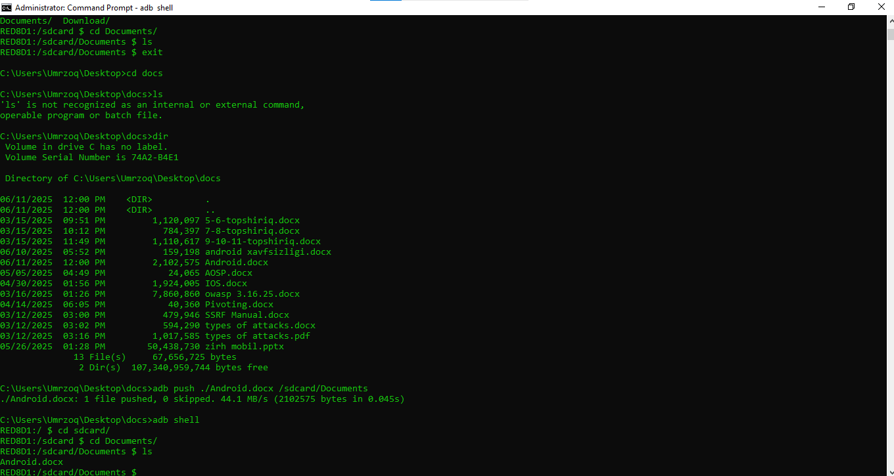
</div>

### **Log ma’lumotlarini ko‘rish**

Android qurilmaning log ma’lumotlari (logcat) — bu qurilmadagi ilovalar,
tizim servislar va boshqa komponentlar tomonidan yozilayotgan
xatoliklar, ogohlantirishlar va izohlar hisoblanadi. Qurilmadagi barcha
log yozuvlarini ko‘rish uchun terminalga adb logcat buyrug‘ini kiritish
kifoya. Ushbu buyruq orqali tizimda sodir bo‘layotgan barcha jarayonlar,
xatoliklar va bildirishnomalar real vaqt rejimida aks etadi.

```bash 
adb logcat
```

<div align="center">
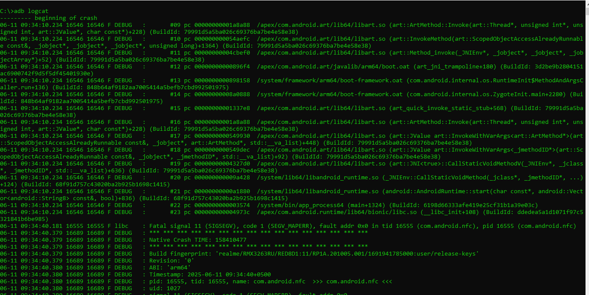
</div>

Agar siz faqatgina ma’lum bir ilovaga tegishli log yozuvlarini
ko‘rmoqchi bo‘lsangiz, quyidagi buyruqdan foydalanishingiz mumkin.

```bash 
adb logcat \| grep uz.anormobile.retail
```

<div align="center">
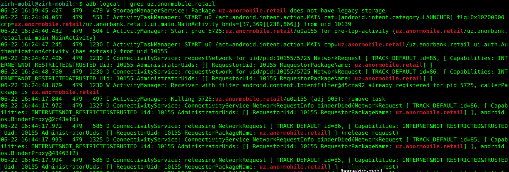
</div>

Agar siz emulatorni asosiy operatsion tizimingizdan alohida muhitda,
masalan, Windows tizimida VMware orqali ishga tushirilgan Ubuntu ichida
foydalansangiz, adb buyruqlarini yuborishdan avval emulator bilan
bog‘lanishingiz kerak bo‘ladi. Buning uchun birinchi navbatda
qurilmaning IP manzilini aniqlab, so‘ngra quyidagi buyruq yordamida
ulanishni amalga oshirasiz.

```bash 
adb connect 192.168.160.125:5555
```


<div align="center">
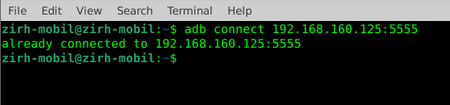
</div>

Ushbu amaldan so‘ng, siz virtual muhit orqali qurilmaga adb buyruqlarini
bemalol yuborishingiz mumkin bo‘ladi.

Agar siz qurilmadan ma’lum bir ilovani butunlay o‘chirib tashlamoqchi
bo‘lsangiz, quyidagi buyruqdan foydalanishingiz mumkin.

```bash 
adb shell pm list packages -3
```

<div align="center">
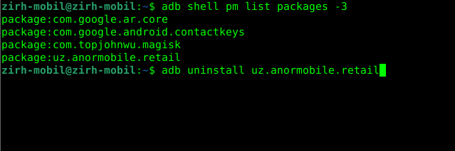
</div>

Agar siz qurilmaga biror bir .apk faylini o‘rnatmoqchi bo‘lsangiz,
quyidagi buyruq orqali bu jarayonni amalga oshirishingiz mumkin.

```bash 
adb install Android01.apk
```

<div align="center">
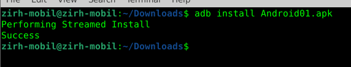
</div>

Agar sizda ilova bir nechta .apk fayllardan iborat bo‘lsa, masalan,
base.apk va arxitekturaga mos qo‘shimcha modullar (masalan,
arm64_v8a.apk, x86.apk va boshqalar) ko‘rinishida bo‘lsa, u holda bu
ilovani quyidagi buyruq orqali to‘g‘ri tarzda o‘rnatishingiz mumkin.

```bash
adb install-multiple base.apk split_config.arm64_v8a.apk split_config.xhdpi.apk
```


<div align="center">
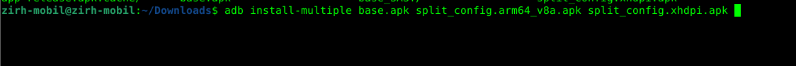
</div>


Agar siz qurilmada allaqachon o‘rnatilgan ilovaning yangilangan (yoki
yangi) versiyasini o‘rnatmoqchi bo‘lsangiz, ilovani butunlay o‘chirib
yubormasdan, quyidagi buyruq orqali uni qayta o‘rnatishingiz mumkin.

```bash 
adb install -r Android01.apk
```


<div align="center">
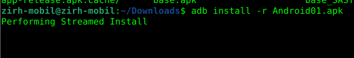
</div>

Agar siz qurilmadagi mavjud ilovani ishga tushirmoqchi bo‘lsangiz,
terminalga quyidagi buyruqni kiriting va Enter tugmasini bosing.

```bash 
adb shell monkey -p uz.anormobile.retail -v 1
```


<div align="center">

</div>

Agar siz qurilmada Google ilovasini ishga tushirib, unda biror matn
yozmoqchi bo‘lsangiz, bu jarayonni quyidagi ketma-ket buyruqlar orqali
amalga oshirishingiz mumkin.

``` 
bash adb shell input text "Salom Google"
```


<div align="center">
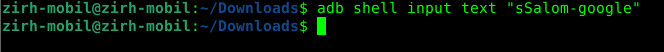
</div>

### **Adb buyruqlari**

ADB (Android Debug Bridge) ning eng ko‘p ishlatiladigan va foydali
barcha asosiy buyruqlari (komandalar) kategoriyalar bo‘yicha
tartiblangan holda taqdim etilgan.

*1. Qurilma bilan aloqa va holatini tekshirish*

| **Buyruq**                  | **Tavsifi**                                   |
|-----------------------------|-----------------------------------------------|
| adb devices                 | Qurilmalar ro‘yxatini ko‘rsatadi              |
| adb get-serialno            | Qurilmaning serial raqamini chiqaradi         |
| adb get-state               | Qurilma holatini ko‘rsatadi (device, offline) |
| adb connect \<ip\>:\<port\> | Wi-Fi orqali qurilmaga ulanadi                |
| adb disconnect              | Wi-Fi orqali ulanishni uzadi                  |

*2. Ilova bilan ishlash*

| **Buyruq**                           | **Tavsifi**                                                  |
|--------------------------------------|--------------------------------------------------------------|
| adb install \<app.apk\>              | APK faylni o‘rnatadi                                         |
| adb install -r \<app.apk\>           | APK’ni mavjud versiyasini ustiga qayta o‘rnatadi (reinstall) |
| adb uninstall \<package\>            | Ilovani o‘chiradi                                            |
| adb shell pm list packages           | Ilovalar (package) ro‘yxati                                  |
| adb shell pm path \<package\>        | Ilova APK joylashuvini ko‘rsatadi                            |
| adb shell monkey -p \<package\> -v 1 | Ilovani ishga tushiradi (test uchun)                         |

*3. Fayl uzatish*

| **Buyruq**                    | **Tavsifi**                               |
|-------------------------------|-------------------------------------------|
| adb push \<local\> \<remote\> | Faylni kompyuterdan qurilmaga yuboradi    |
| adb pull \<remote\> \<local\> | Faylni qurilmadan kompyuterga yuklaydi    |
| adb shell ls \<path\>         | Qurilmadagi fayl va papkalarni ko‘rsatadi |

*4. Qurilma nazorati*

| **Buyruq**            | **Tavsifi**                                 |
|-----------------------|---------------------------------------------|
| adb reboot            | Qurilmani qayta ishga tushiradi             |
| adb reboot bootloader | Qurilmani bootloader holatiga o‘tkazadi     |
| adb reboot recovery   | Qurilmani recovery rejimiga o‘tkazadi       |
| adb root              | Qurilmani root huquqi bilan ishga tushiradi |
| adb shell             | Qurilmada terminal sessiyasini ochadi       |

*5. Tizim va loglar bilan ishlash*

| **Buyruq**                                | **Tavsifi**                                 |
|-------------------------------------------|---------------------------------------------|
| adb logcat                                | Qurilmadagi loglarni ko‘rsatadi (real-time) |
| adb logcat -d \> log.txt                  | Loglarni faylga yozadi                      |
| adb shell dumpsys                         | Tizim servislarining ma’lumotlari           |
| adb shell top                             | CPU ishlash statistikasi                    |
| adb shell screencap /sdcard/screen.png    | Ekran rasmi olish                           |
| adb shell screenrecord /sdcard/record.mp4 | Ekran yozuvi qilish                         |

*6. Port forwarding va Networking*

| **Buyruq**                       | **Tavsifi**                       |
|----------------------------------|-----------------------------------|
| adb forward \<local\> \<remote\> | Port forwarding qiladi            |
| adb reverse \<remote\> \<local\> | Qurilmadan kompyuterga port ulash |
| adb shell netstat                | Tarmoq ulanishlarini ko‘rsatadi   |

*7. Foydalanuvchi ma’lumotlar*

| **Buyruq**                                     | **Tavsifi**                                                         |
|------------------------------------------------|---------------------------------------------------------------------|
| adb shell settings list system                 | Tizim sozlamalarini ko‘rsatadi                                      |
| adb shell am start -n \<package\>/\<activity\> | Belgilangan activity ni ishga tushiradi                             |
| adb shell input text “Hello”                   | Qurilmaga matn yuboradi                                             |
| adb shell input keyevent 26                    | Qurilmaning tugmalarini emulyatsiya qiladi (masalan, Power tugmasi) |

*8. Developer va debugging uchun*

| **Buyruq**        | **Tavsifi**                                         |
|-------------------|-----------------------------------------------------|
| adb bugreport     | Qurilma xatoliklari haqida batafsil hisobot         |
| adb shell getprop | Qurilma xususiyatlari (build info, model va h.k.)   |
| adb tcpip 5555    | Qurilmani Wi-Fi orqali ulanadigan holatga o‘tkazadi |

### **APKAnalyser**

ApkAnalyzer — bu Android ilovalarini (APK fayllarini) tahlil qilish
uchun mo‘ljallangan vosita bo‘lib, u Android Studio ichida mavjud
bo‘lgan grafik interfeysli qulay vositadir. ApkAnalyzer yordamida APK
faylning tuzilmasini, resurslarini, kodlarini, ruxsatlarini, foydalangan
kutubxonalarini va boshqa ko‘plab muhim jihatlarini chuqur tahlil qilish
mumkin. Bu vosita ilovaning hajmini optimallashtirish, xavfsizlikni
baholash va muhim texnik tafsilotlarni o‘rganish uchun foydalidir.
ApkAnalyzerning asosiy imkoniyatlari quyidagilardan iborat: APK fayl
tuzilmasini ko‘rish va undagi barcha papka va fayllarni analiz qilish
mumkin. Masalan, *classes.dex, res/, lib/,* AndroidManifest.xml va
boshqalar. Aynan *classes.dex* fayli ichida ilovaning
kompilyatsiyalangan bytecodelari saqlanadi, ya’ni bu ilovaning
logikasini tushunishga yordam beradi. AndroidManifest.xml fayli orqali
ilova qanday ruxsatlar (permissions), faoliyatlar (activities),
xizmatlar (services) va intent-filtrlar ishlatganini aniqlash mumkin. Bu
esa xavfsizlik tahlilida juda muhim.

Shuningdek, ApkAnalyzer ilovaning umumiy hajmini tahlil qilib beradi.
Har bir modul, kutubxona yoki resurs qancha joy egallayotganini grafik
ko‘rinishda ko‘rsatadi. Bu esa ilovani optimallashtirish uchun juda
qulay. Undan tashqari, ilovada ishlatilgan tashqi kutubxonalarni
ko‘rish, ular versiyalarini aniqlash va ilova qaysi SDKlar yoki ishlab
chiquvchi vositalar bilan yig‘ilganini bilish imkonini beradi.

ApkAnalyzer yordamida ilovadagi dex fayllarni ko‘rib chiqib, unda nechta
klass, metod va maydonlar borligini aniqlash mumkin. Bu esa ilovaning
murakkablik darajasini baholashga yordam beradi. Ayrim hollarda, ilovada
ortiqcha yoki foydalanilmayotgan resurslar mavjud bo‘lishi mumkin
ApkAnalyzer bularni aniqlashda ham qo‘l keladi.

ApkAnalyzerni ishlatish uchun Android Studioni ochib, Build menyusidan
Analyze APK bo‘limini tanlash kerak bo‘ladi. Ochilgan oynada kerakli
.apk faylni tanlaysiz va ilova tahliliga kirishasiz. Bu vosita Android
Studio bilan birga o‘rnatiladi, alohida yuklab olishga ehtiyoj yo‘q.

Xulosa qilib aytganda, ApkAnalyzer bu — Android ilovalari ustida
ishlayotgan dasturchilar va xavfsizlik tahlilchilari uchun muhim vosita
bo‘lib, APK faylni dekompilyatsiya qilmasdan turib, muhim ma’lumotlarni
tahlil qilish imkonini beradi. Ayniqsa ilovaning ruxsatlari, resurslari
va hajmiga oid chuqur tahlillarni samarali amalga oshirish uchun juda
qulay. APKAnalyser – bu Sony Mobile Communications tomonidan ishlab
chiqilgan va u ochiq manba sifatida quyidagi
[havola](https://github.com/sonyxperiadev/apkanalyzer)da mavjud.
ApkAnalyserni Android Studio orqali ishlatsa ham bo’ladi ishlatish uchun
Android studioni ochasiz ba Build/Apk Analyser ni tanlab tekshirmoqchi
bo‘lgan ilovani tanlab olasiz natija quydagicha chiqishi kerak.

<div align="center">
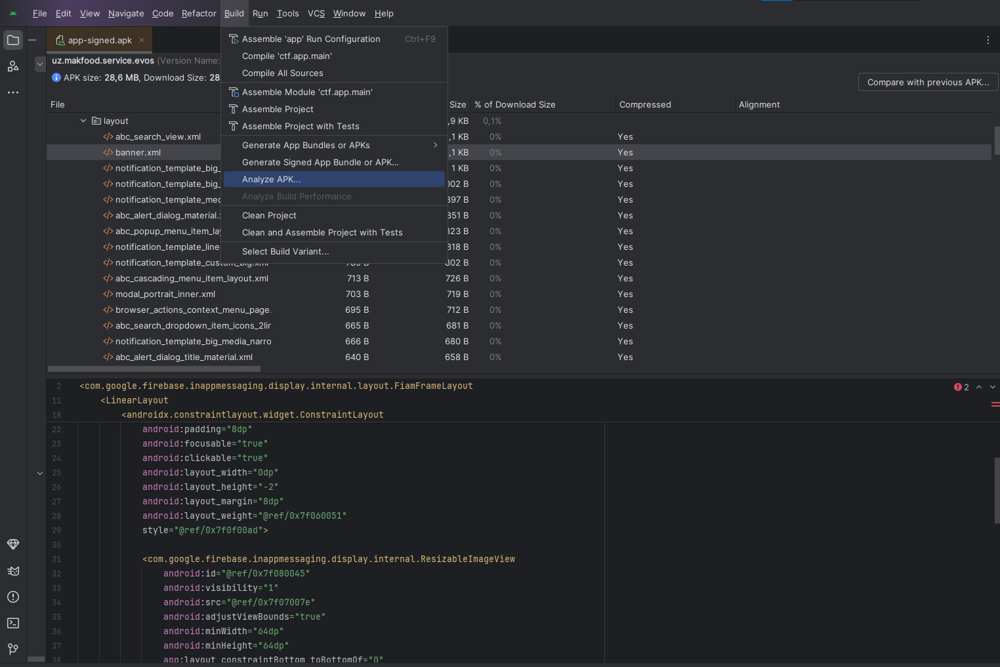
</div>

### **APKTool**

APKTool — bu Android ilovalarini (APK fayllarini) teskari muhandislik
qilish (reverse engineering) uchun ishlatiladigan kuchli va mashhur
konsol (komanda qatori) vositasidir. U orqali APK faylni dekompilyatsiya
qilish, ya’ni ilova ichidagi resurslar, AndroidManifest.xml, smali
kodlar va boshqa muhim tarkibiy qismlarni ochish mumkin. Bu vosita
Android ilovalari xavfsizligini tahlil qilishda, modifikatsiya qilishda
yoki resurslarni o‘rganishda keng qo‘llaniladi.

APKTool vositasi yordamida APK faylni ikki asosiy bosqichda tahlil
qilish mumkin: dekompilyatsiya (ya’ni .apk faylni ochish) va qayta
yig‘ish (recompile). Dekompilyatsiya jarayonida APKTool ilovani alohida
papkalarga ajratadi: bunda resurslar (masalan, res/, assets/,
drawable/), AndroidManifest.xml, va eng muhimi, ilovaning asosiy
logikasi yozilgan .smali fayllar olinadi. .smali fayllar bu —
Androidning dex bytecodeining o‘qiladigan shaklidir. Bu orqali dasturchi
Java kodining qanday ishlayotganini tushunishi mumkin bo‘ladi.

APKTool yordamida tahlil qilinayotgan ilova ichidagi matnlar, interfeys
elementlari, ruxsatlar, ekranlar (activities), xizmatlar (services) va
boshqa ko‘plab konfiguratsiyalarni ko‘rish mumkin. Ayniqsa
AndroidManifest.xml fayl to‘liq o‘qiladigan formatda olinadi, bu esa
ilovaning xavfsizlik modelini, foydalanuvchi ruxsatlarini va tashqi
qurulmalar bilan aloqasini tushunishga yordam beradi.

Ilova tahlil qilinganidan so‘ng, agar kerak bo‘lsa, .smali fayllarda
yoki resurslarda o‘zgartirishlar kiritib, APKTool yordamida ilovani
qaytadan yig‘ish (recompile) mumkin. Bu qayta yig‘ilgan faylni imzolash
orqali yana Android qurilmaga o‘rnatish mumkin bo‘ladi. Shu jihati bilan
APKTool, masalan, ilovani test maqsadida modifikatsiya qilish yoki
xavfsizlik testlarini o‘tkazishda juda foydalidir. APKToolni ishlatish
uchun komanda satrida quyidagi kabi buyruqlardan foydalaniladi.

```bash
 apktool d app.apk yoki apktool d app.apk -o my_app
```

Bu ilovani dekompilyatsiya qiladi.

```bash
apktool b app_folder -o modifed.apk yoki apktool b app_folder
```

Bu kod teskari muhandislik qilingan papkani yana APK faylga yig‘adi.
APKTool Javada yozilgan bo‘lib, kross-platformalidir — ya’ni Windows,
Linux va macOS tizimlarida ishlaydi. Uni rasmiy sayt yoki GitHub
sahifasi orqali yuklab olish mumkin. Ko‘pincha APKTooldan boshqa
vositalar bilan birga, masalan keytool, jarsigner, uber-apk-signer,
Frida, yoki Dex2Jar kabi vositalar bilan birgalikda foydalaniladi.

Xulosa qilib aytganda, APKTool — bu Android APK fayllarini tahlil
qilish, o‘zgartirish va qayta yig‘ish imkonini beruvchi kuchli teskari
muhandislik vositasidir. Bu vosita yordamida dasturchilar va xavfsizlik
tahlilchilari ilovaning tuzilmasi, ishlash mexanizmi va zaif joylarini
chuqur o‘rganish imkoniga ega bo‘ladilar.

### **Androguard**

Androguard — bu Android ilovalari (APK fayllari) ustida teskari
muhandislik va xavfsizlik tahlilini avtomatlashtirilgan tarzda amalga
oshirish imkonini beruvchi kuchli va moslashuvchan Python kutubxonasi va
vositalar to‘plamidir. U yordamida APK, DEX va Java class fayllarini
o‘qish, tahlil qilish, va ularning ichki tuzilmasini chuqur o‘rganish
mumkin. Androguard ayniqsa avtomatik va statik tahlil (ya’ni ilovani
ishga tushirmasdan turib kodni o‘rganish) uchun ishlatiladi va
xavfsizlik tadqiqotchilari, mobil dastur tahlilchilari orasida keng
tarqalgan.

Androguard vositasi yordamida APK faylni ochish va u tarkibidagi .dex
fayllarni tahlil qilish mumkin. DEX fayllar Android ilovaning asosiy
logikasini o‘z ichiga oladi va ularni Androguard vositasi smali emas,
balki Python orqali to‘g‘ridan-to‘g‘ri o‘qiladigan obyektlarga
aylantirib beradi. Bu esa tahlilchini katta hajmdagi kodlar orasida
avtomatik tarzda qidiruv, filtr, analiz ishlari olib borishga imkon
yaratadi. Misol uchun, siz Androguard yordamida ilova qaysi ruxsatlar
(permissions) so‘rayotganini, qaysi API chaqiruvlari ishlatilayotganini
yoki qanday kutubxonalar ishlatilayotganini aniqlay olasiz.

<div align="center">

</div>

Androguardda agar ilova ma’lumotlarni olish uchun *androguard apkid
ilova_nomi.apk* kamandasi orqali ko’rishimiz mumkin bo‘ladi. Agar
ilovaning AndroidManifest.xml faylni ko‘rimoqchi bo‘lsangiz *androguard
axml ilova_nomi.apk* kamandasi orqali AndroidManifest.xml faylni
ichidagi barcha ma’lumotlarni ko‘rish imkoni mavjud bo‘ladi. Androguard
ko‘pincha boshqa vositalar bilan birgalikda ishlatiladi. Masalan, siz
apktool bilan APK faylni dekompilyatsiya qilib, so‘ng Androguard bilan
kodni analiz qilishingiz mumkin. Bundan tashqari, Androguardni o‘z
skriptlaringizga qo‘shib, yuzlab ilovalarni avtomatik tarzda tahlil
qilish uchun ham foydalanishingiz mumkin.

Xulosa qilib aytganda, Androguard — bu kuchli va script asosida
boshqariladigan vosita bo‘lib, u orqali APK fayllarni chuqur statik
tahlil qilish, xavfsizlik zaifliklarini aniqlash va ilovaning ichki
tuzilmasini to‘liq o‘rganish mumkin. Python dasturchilar uchun bu vosita
yuqori darajada moslashuvchanlik va kengaytma imkoniyatlarini taqdim
etadi. Yuklab olish uchun
havola:([*https://github.com/maaaaz/androwarn*](https://github.com/maaaaz/androwarn))

### **MobSF**

MobSF (Mobile Security Framework) — bu Android, iOS va Windows mobil
ilovalari uchun statik, dinamik va zararli dastur (malware) tahlilini
avtomatlashtirilgan tarzda bajaradigan kuchli va ochiq manbali
xavfsizlik tahlil vositasidir. U mobil ilovalarning xavfsizlik
darajasini aniqlashda, zaif joylarni topishda, ruxsatlar va API
chaqiruvlarini tekshirishda keng qo‘llaniladi. MobSF tajribali
xavfsizlik mutaxassislari bilan bir qatorda, yangi o‘rganuvchilar uchun
ham qulay va tushunarli interfeysga ega. MobSF ikki asosiy tahlil turini
qo‘llab-quvvatlaydi.

Statik tahlil — ilovani ishga tushirmasdan turib, APK yoki IPA fayl
ichidagi resurslar, kodlar, AndroidManifest.xml, ruxsatlar,
komponentlar, smali yoki java kodlar, URL manzillar, tokenlar,
kriptografik xatoliklar va boshqa xavfsizlik zaifliklarini avtomatik
tarzda tahlil qiladi. Bu bosqichda ilovaning ichki logikasi va
xavfsizlik siyosati chuqur o‘rganiladi.

Dinamik tahlil — ilovani real vaqt rejimida virtual Android emulyatorda
ishga tushiradi va ilovaning tarmoq trafigi, API so‘rovlari, sistemaga
murojaatlari, fayl tizimi bilan ishlashi va boshqa faoliyatlarini yozib
boradi. Dinamik tahlilda siz Frida bilan integratsiya qilib, SSL
Pinning, Root detection, anti-debugging, va boshqa mudofaa
mexanizmlarini avtomatik aniqlashingiz mumkin.

MobSFning yana bir kuchli jihati malware tahlili. Agar ilovada zararli
xatti-harakatlar (masalan, SMS yuborish, ruxsatsiz audio yozish,
kontaktlarni o‘g‘irlash, reklama kodlari) bo‘lsa, ularni ham tahlil
qiladi va xavflilik darajasini baholaydi.

MobSFni kali linuxga o‘rnatish uchun quydagi ketma-ketlikni bajarish
lozim. Birinchi navbatda kali linux Ichida git o‘rnatilganiga ishon
hosil qilib oling agar o‘rnatilmagan bo‘lsa uni quydagicha yuklab
olishingiz mumkin.

```bash
sudo apt-get install git
```

Keyin quydagi buyruqlar orqali kerakli barcha vositalarni o‘rnatib
olishingiz mumkin.

```bash
sudo apt install python3-dev python3-venv python3-pip build-essential
libffi-dev libssl-dev libxml2-dev libxslt1-dev libjpeg62-turbo-dev
zlib1g-dev wkhtmltopdf
```

Quyida keltirilgan buyruq yordamida MobSF ni yuklab oling.


<div align="center">
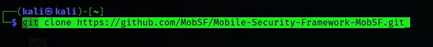
</div>


<div align="center">
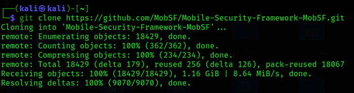
</div>

Github repozitoryni yuklab olganingizdan keyin *cd
Mobile-Security-Framework-MobSF* katologiga kirib oling va *./setup.sh*
kamandasini terminalga yozing va Mobsf dasturi ishga tushadi. *Login
parol (mobsf:mobsf).* MobSF veb-interfeysga ega bo‘lib, unga
kirganingizda .apk, .aab, .ipa, .zip yoki .source faylni yuklash orqali
tahlilni boshlashingiz mumkin. Tahlil tugagach, sizga grafik hisobot,
JSON yoki PDF ko‘rinishida to‘liq natijalar taqdim etiladi. Xulosa qilib
aytganda, MobSF — bu mobil ilovalarning xavfsizligini tez, chuqur va
aniq tahlil qilish imkonini beruvchi zamonaviy va avtomatlashtirilgan
vositadir. U nafaqat tahlil, balki ishlab chiquvchilarga xavfsizlikni
qanday yaxshilash bo‘yicha aniq tavsiyalar ham beradi. Shu sababli, u
pentesterlar, mobil xavfsizlik tahlilchilari, va ishlab chiquvchilar
orasida juda mashhur hisoblanadi.

### **APKleaks**

APKLeaks — bu Android ilovalari (APK fayllari) ichidan maxfiy
ma’lumotlar va potensial xavfsizlik zaifliklarini aniqlab beruvchi ochiq
manbali, avtomatlashtirilgan statik tahlil vositasi hisoblanadi. Asosan
APK faylni dekompilyatsiya qilib, undan qatiq kodlangan ma’lumotlar
ya’ni APK ichida qattiq kodlangan holda saqlangan API kalitlari,
tokenlar, parollar, server URL manzillari, yashirin fayllar yo‘llari va
boshqa nozik ma’lumotlarni qidirib topadi. APKLeaks Python tilida
yozilgan bo‘lib, apktool va grep kabi vositalardan foydalanadi. U APK
faylni avval apktool yordamida dekompilyatsiya qiladi, so‘ngra .smali,
.xml, va boshqa matnli fayllar ichida oldindan belgilangan regex
(muntazam ifodalar) asosida ma’lumot izlaydi. Shu tariqa ilovadagi
ehtimoliy zaif joylarni avtomatik aniqlaydi. Masalan, APKLeaks yordamida
quyidagi narsalarni topish mumkin.

- Firebase URLlari va API kalitlari

- Google Maps yoki Stripe API kalitlari

- JWT tokenlar

- Base64 kodlangan ma’lumotlar

- AWS kalitlari

- OAuth tokenlar

- Shaxsiy server manzillari (IP, endpointlar)

- Qattiq kodlangan foydalanuvchi ma’lumotlari yoki login-parollar

APKLeaksni ishlatish juda oddiy. Masalan, quyidagicha buyruq orqali
tahlilni boshlash mumkin:

```bash 
apkleaks -f app.apk -o result.txt
```


<div align="center">

</div>

Bu yerda ***-f*** tahlil qilinadigan APK fayl, ***-o*** natijani yozib
olinadigan fayl. Shuningdek, foydalanuvchi o‘zining maxsus regex
qoidalarini .json fayl ko‘rinishida sozlashi va APKLeaksga qo‘shib
tahlilni kengaytirishi mumkin. APKLeaks asosan statik tahlil vositasi
hisoblanadi, ya’ni u ilovani ishga tushirmasdan tahlil qiladi. Ammo u
ilova ishlab chiquvchilari xavfsizlik nuqtai nazaridan qattiq kodlangan
ma’lumotlarni APK ichida qoldirib ketmaganini tekshirish uchun juda
foydali. Chunki APK fayl foydalanuvchiga yetib borganidan so‘ng, har
qanday tajribali kishi uni ochib, bu ma’lumotlarni osongina ko‘rib
olishi mumkin. Xulosa qilib aytganda, APKLeaks bu Android ilovalarda
maxfiy ma’lumotlar sizib chiqish xavfini aniqlashda eng yengil,
avtomatlashtirilgan va tezkor vositalardan biridir. U xavfsizlik
tahlilchilari, pentesterlar va mobil ilova ishlab chiquvchilar
tomonidan, ayniqsa CI/CD jarayonlariga avtomatik tahlil vositasi
sifatida keng foydalaniladi.

### **Frida**

Frida bu *dynamic instrumentation toolkit*, ya’ni harakatdagi (real
vaqtli) ilova ichida kodlarni tahlil qilish, o‘zgartirish, kuzatish
uchun ishlatiladi. Frida yordamida mobil ilovalarga teskari muhandislik
qilish, xavfsizlik testlari, hook qilish, API chaqiruvlarini ko‘rish,
SSL Pinning bypass, va boshqalar amalga oshiriladi. Fridani yuklab olish
uchun rasmiy sayt *<https://frida.re>* yoki python orqali yuklab
olsangiz bo‘ladi.

```bash 
pip install frida-tools
```

```bash 
pip install frida
```

Frida serverni <https://github.com/frida/frida/releases> oraqali yuklab
olishingiz mumkin. Frida serverni yuklab olayotganda qurulma masalan
emulatorni arxitekturasiga mos va fridani versiyasiga mos qilib yuklab
olish kerak aks holda
ishlamaydi(masalan:frida-server-16.1.4-android-arm64.xz). Frida
quydagicha qism- lardan tashkil topgan.

- frida-server — Android qurilmada ishlaydigan server, bu orqali
  ilovalarni tahlil qilamiz.

- frida-tools (CLI) — Komandalarni terminal orqali bajarishga yordam
  beradi.

- frida-python API — Pythonda Frida skriptlar yozish uchun.

- Frida Gadget — Ilova ichiga joylashtiriladigan kutubxona (root kerak
  emas).

- Frida Repl (Interactive Console) — Dinamik kod injeksiya qilish uchun
  interaktiv muhit.

Fridani o‘rnatib olganingizdan keyin uni to‘g‘ri ishlayotgani va
versiyasini tekshirish uchun quydagi buyruqni terminalda bajarib
ko‘ring.


<div align="center">
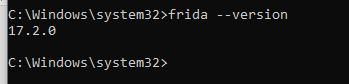
</div>

Android qurilmangiz arxitekturasiga mos keladigan Frida serverini yuklab
olishingiz kerak. Masalan, qurilmangiz *arm, arm64, x86* yoki *x86_64*
bo‘lishi mumkin. Frida serverini rasmiy GitHub sahifasidan yuklab olish
tavsiya etiladi(<https://github.com/frida/frida/releases>). Bu yerda
yana siz etibor qaratadigan joyingiz bu kampyuteringizdagi Frida
versiyasi bilan siz yuklab olmoqchi bo‘lgan Frida server versiyasi bir
xil bo‘lishi kerak. Frida serverni quydagicha qilib o‘z qurulmangizga
o‘rnatib ishga tushursangiz bo‘ladi.

```bash 
adb push frida-server /data/local/tmp/
```

```bash 
adb shell
```

```bash 
su
```

```bash
chmod 755 /data/local/tmp/frida-server
```

```bash
./data/local/tmp/frida-server
```

Bazi bir ilovalarda Frida-serverni anilashga kod yozilgan bo‘ladi va
Frida serverni siz ishga tushurganingizda ilova ishdan chiqadi bu paytda
siz Frida script orqali buni chetlab o‘tsangiz bo‘ladi. Lekin bazi
ilovalarda bu o‘xshamasligi mumkin masalan Frida serverni porti orqali
aniqlanganda bu qancha Frida script yozishingizdan qatiy nazar baribir
foydasiz bo‘lib qolaveradi buni chetlab o‘tish uchun Frida serverni
standard ***27042*** portini o‘zgartirish kerak bo‘ladi buni
o‘zgartirish uchun quydagicha amallarni bajarishingiz kerak. Adb orqali
qurulmaga ulanib oling va Frida server joylashgan joyga borib quydagicha
yozing.

<div align="center">
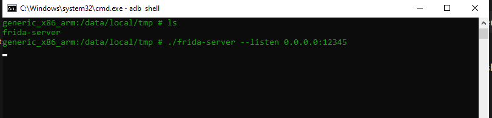
</div>

Endi sizning Frida serveringiz ***27042*** portdan emas balki
***12345*** portdan malumot chiqaradi va qabul qiladi bu orqali siz
Frida serverga qo’yilgan cheklovni aylanib o‘tishingiz mumkin. Agar siz
qurulmadagi barcha ilovalar idlarni ko‘rmoqchi bo‘lsangiz terminalga
quydagicha buyruq yozing va enter tugmasini bosing.

<div align="center">
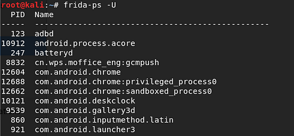
</div>

Quyidagi buyruqlar yordamida biz tashqi skriptlarni (JavaScript
fayllarini) ilovaga yuklay olamiz. Buning uchun ***-l*** opsiyasi orqali
JavaScript faylini ko‘rsatamiz. ***-f*** opsiyasi esa ilovani topish va
unga *hook* qilish (ya’ni ulanib, nazorat qilish) uchun ishlatiladi.

<div align="center">
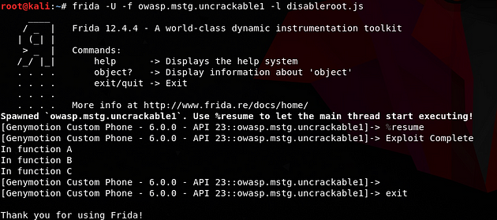
</div>

Diqqat bu ishlashi uchun siz Frida serverni o‘z qurulmangizni masalan
emulatoringizni *data/local/tmp* fayliga joylashirgan bo‘lishingiz va
adb orqali Frida serverni ishlatib qo‘yishingiz kerak bo‘ladi.


<div align="center">
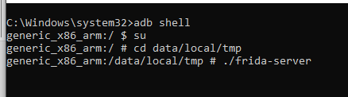
</div>

Frida vositasining eng yaxshi jihatlari shundaki, u bepul va ochiq
manbali, hamda Windows, Linux va macOS kabi turli platformalarni
qo‘llab-quvvatlaydi. Frida skript yozishni qo‘llab-quvvatlaydi, ya’ni
biz o‘z skriptlarimizni ilovaga kiritib (inject qilib), har qanday
funksiyalarni, hatto ilova manba kodi bo‘lmasa ham, API darajasida hook
qilishimiz mumkin. Sizning kampyuteringizga ulangan barcha qurulmalar
ro‘yhatini olish uchun quydagi buyruqni terminalga yozing.

<div align="center">
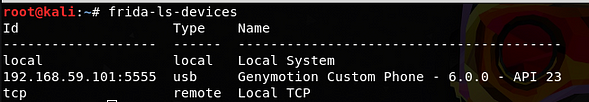
</div>

Ushbu buyruq barcha ishlaydigan jarayonlarni qaytaradigan jarayonlarni
ro‘yxatga olish uchun ishlatiladi. USB orqali ulangan qurilmadan
jarayonni qaytarish uchun *-U* opsiyasini qo‘shing.


<div align="center">

</div>

| **Buyruq**                           | **Izoh**                                     |
|--------------------------------------|----------------------------------------------|
| frida-ps                             | Ishlayotgan processlar ro‘yxati              |
| frida-ps -U                          | USB qurilmadagi processlar ro‘yxati          |
| frida-ps -R                          | Remote qurilma (TCP orqali)                  |
| frida-trace                          | API yoki function’ni kuzatish (hook qilish)  |
| frida-trace -n \<package\>           | Muayyan ilova ichidagi function hook         |
| frida-trace -n com.example -m “ssl”  | SSL bilan bog‘liq barcha metodlarni kuzatish |
| frida -U -n \<package\>              | Interaktiv muhitda ilovaga ulanish           |
| frida -U -f \<package\>              | Ilovani ishga tushirib ulanish               |
| frida -U -n \<package\> -l script.js | JavaScript faylni hook sifatida yuklash      |

### **MAVS**

MAVS bu Mobile Application Vulnerability Scanner so‘zining qisqartmasi
bo‘lib, mobil ilovalarni xavfsizlik nuqtai nazaridan statik va
yarim-avtomatik tarzda tahlil qilish uchun mo‘ljallangan ochiq manbali
vositadir. MAVS, ayniqsa Android ilovalarini tahlil qilishda foydalidir
va ishlab chiquvchilarga hamda xavfsizlik tadqiqotchilariga APK fayl
ichidagi zaifliklar, noto‘g‘ri ruxsatlar, xavfsiz bo‘lmagan amaliyotlar
va boshqa potentsial muammolarni aniqlashda yordam beradi.

MAVS odatda APKTool, MobSF, Qark, Androguard kabi boshqa vositalar bilan
birga ishlatiladi yoki ularning ustiga qurilgan. Ya’ni u mustaqil skaner
bo‘lishi mumkin, yoki mavjud tahlil vositalaridan natijalarni yig‘ib,
ularni boshqaruvli va aniq formatda birlashtiradi. MAVS avtomatik tarzda
ilova ichidagi ma’lumotlarni ajratadi, masalan:

- AndroidManifest.xml faylni o‘qiydi va undagi ruxsatlarni tahlil
  qiladi.

- smali yoki .dex kodlarda ishlatilayotgan API chaqiruvlar, xavfli
  funksiyalar (masalan, WebView, JavaScriptInterface) mavjudligini
  aniqlaydi.

- Kriptografik xatoliklar (masalan, noto‘g‘ri ishlatilgan Cipher,
  MessageDigest), tokenlar, URL manzillar va boshqa nozik ma’lumotlarni
  qidiradi.

- Ruxsatlar (permissions) noto‘g‘ri belgilangan holatlarni aniqlaydi
  (masalan, READ_SMS, WRITE_EXTERNAL_STORAGE ruxsatlari kerakligidan
  ortiq bo‘lsa)

MAVS natijalarni hisobot shaklida taqdim etadi, odatda HTML yoki JSON
formatda, va bu hisobotlar ichida aniqlangan har bir zaiflik haqida
izoh, tavsiya, hamda xavflilik darajasi (kritik, o‘rtacha, past)
ko‘rsatiladi. Bu esa ishlab chiquvchilarga zaiflikni nafaqat topish,
balki uni tuzatish yo‘llarini ham tushunishga yordam beradi.

MAVS vositasi juda yengil va soddalashtirilgan CLI (komanda qatori
interfeysi) orqali ishlaydi. Asosan Linux yoki macOS tizimlarida
ishlatiladi. Quyidagi buyruq orqali oddiy tahlil boshlab yuboriladi.

```bash
python3 mavs.py -f path/to/app.apk -o output/
```

Bu yerda *-f* tahlil qilinadigan APK fayl, *-o* hisobot saqlanadigan
papka.

MAVS ba’zida mobil ilovalar uchun CI/CD xavfsizlik testingi ga qo‘shib
qo‘yiladi, ya’ni har bir build jarayonidan keyin avtomatik xavfsizlik
tekshiruvi o‘tkaziladi. Bu dasturchilarni APK ichidagi noxush
xatoliklarni dastlabki bosqichdayoq aniqlashga majbur qiladi. Xulosa
qilib aytganda, MAVS — bu mobil ilovalar xavfsizligini avtomatik tarzda
tahlil qilish uchun ishlatiladigan, soddalashtirilgan va foydali vosita
bo‘lib, u orqali Android ilovalardagi zaif joylar tez va samarali
aniqlanadi. U tajribali xavfsizlik mutaxassislari bilan bir qatorda,
ishlab chiquvchilar uchun ham foydali, chunki u zaiflikni ko‘rsatibgina
qolmay, uni qanday tuzatish kerakligini ham tushuntiradi. Yuklab olish
uchun
havola([***https://github.com/sho-luv/mavs***](https://github.com/sho-luv/mavs)).

### **APKHunt**

APKHunt — bu Android ilovalarini (APK fayllarini) xavfsizlik nuqtai
nazaridan statik tahlil qilishga mo‘ljallangan ochiq manbali yengil va
samarali vosita bo‘lib, u APK fayl ichidan maxfiy ma’lumotlar, tokenlar,
API kalitlari, va xavfli kod yozilishlarini avtomatik tarzda aniqlaydi.
APKHunt asosan qattiq kodlangan (hardcoded) ma’lumotlarni qidirishga
ixtisoslashgan bo‘lib, xavfsizlik tahlilchilari, pentesterlar va ishlab
chiquvchilarga ilovani tahlil qilishda qo‘l keladi. APKHunt dastlab APK
faylni apktool yordamida dekompilyatsiya qiladi, ya’ni uni ochadi va
matnli ko‘rinishga keltiradi. So‘ngra .smali, .xml, .json, .properties,
va boshqa resurs fayllar ichida oldindan belgilangan muntazam ifodalar
(regex) yordamida qidiruv amalga oshiradi. Ushbu regexlar yordamida
quyidagi turdagi ma’lumotlarni aniqlaydi:

- Firebase manzillari (.firebaseio.com)

- Google Maps, Stripe, Twitter, GitHub API kalitlari

- JWT tokenlar, OAuth tokenlar

- AWS Access/Secret kalitlari

- Base64 kodlangan satrlar

- Foydalanuvchi login-parollar

- IP manzillar, URL endpointlar

- Kriptografik funksiya nomlari (AES, MD5, SHA1 va h.k.)

APKHunt bu topilgan ma’lumotlarni kategoriya bo‘yicha ajratib, tahlil
natijalarini qulay HTML yoki JSON shaklida hisobot ko‘rinishida taqdim
etadi. Bu hisobotlar orqali siz ilova ichida nozik yoki xavfli
ma’lumotlar bor-yo‘qligini aniq ko‘ra olasiz.

APKHunt komanda satrida ishlaydi va juda oddiy buyruqlar bilan
boshqariladi.

python3 apkhunt.py -f app.apk -o results/

Bu yerda *-f* bu tahlil qilinadigan APK fayl, *-o* esa natijalar
saqlanadigan papka. Yuklab olish uchun
havola([*https://github.com/Cyber-Buddy/APKHunt*](https://github.com/Cyber-Buddy/APKHunt)).

### **Tapjacker**

Tapjacker — bu Android ilovalardagi tapjacking (ya’ni foydalanuvchini
aldash orqali noto‘g‘ri tugmalarni bosdirish) zaifligini aniqlash va
sinovdan o‘tkazish uchun ishlab chiqilgan ochiq manbali ekspluatatsiya
vositasi hisoblanadi. Uning asosiy vazifasi — boshqa ilovalarning ustiga
shaffof (invisible) yoki yarim shaffof (semi-transparent) qatlamlar
joylashtirib, foydalanuvchining xatti-harakatlarini nazorat qilishga
urinadigan holatlarni modellashtirish. Tapjacker ilova sifatida ishlaydi
va u orqali siz sinovdan o‘tkazmoqchi bo‘lgan haqiqiy ilovaning ustiga
Overlay (ustki qatlam) joylashtirasiz. Bu qatlam foydalanuvchiga
ko‘rinmasligi yoki chalg‘ituvchi interfeys orqali uni noto‘g‘ri tugmani
bosishga majburlashi mumkin. Tapjacker aynan shunday sinov uchun
ishlatiladi ya’ni u orqali.

- Ilovaning ustiga oynacha (toast, dialog, yoki SYSTEM_ALERT_WINDOW
  ruxsatli overlay) joylashtiriladi

- Tugma, ruxsat olish oynasi, yoki xavfsizlik bilan bog‘liq harakatlar
  ustiga interaktiv qoplama qo‘yiladi

- Foydalanuvchi real tugmani bosdim deb o‘ylasa ham, aslida boshqa
  yashirin amal bajariladi

Tapjacker asosan ta’limiy va xavfsizlik test maqsadlarida ishlatiladi.
Uni Android Studio orqali yig‘ib olish mumkin yoki tayyor APK shaklida
yuklab olib test qilish mumkin. Odatda quyidagi bosqichlar amalga
oshiriladi:

- Test qilinadigan ilova Android qurilmada o‘rnatiladi

- Tapjacker ilovasi ochiladi va unda “target package” tanlanadi (ya’ni
  hujum qilinadigan ilova)

- Tapjacker oynasi ustki qatlam hosil qiladi va foydalanuvchi uni
  bosgandek tuyulgan harakatni kuzatadi

Agar sinov davomida foydalanuvchi ilovaning ustiga o‘rnatilgan shaffof
qatlam orqali noto‘g‘ri amal bajarayotgan bo‘lsa, demak ilova tapjacking
zaifligiga ega. Tapjacker bu holatni fosh qilishi va sizga ilova ichida
filterTouchesWhenObscured="true" yoki onFilterTouchEventForSecurity()
kabi himoya mexanizmlari yo‘qligini ko‘rsatishi mumkin. Yuklab olish
uchun
havola([***https://github.com/dzmitry-savitski/tapjacker***](https://github.com/dzmitry-savitski/tapjacker)).

### **Logcat**

Mobil ilova xavfsizligini tahlil qilishda ishlatiladigan eng asosiy
vositalardan biri bu Logcat. Logcat bu Android tizimining real vaqtda
ishlaydigan log yozuvlarini ko‘rsatib boradigan jurnal tizimi bo‘lib,
ilova ishga tushgan vaqtdan boshlab, u qanday metodlarni bajarayotgani,
qanday xatoliklar sodir bo‘layotgani, qanday ma’lumotlar
chiqarilayotgani, hatto tizim darajasida qanday signal va xabarnomalar
uzatilayotgani haqida to‘liq ma’lumot beradi. Asosan, Logcat yordamida
ilova ichida yuz berayotgan barcha hodisalar, ya’ni Log.d, Log.e, Log.i,
Log.w, System.out.println, hatto native darajadagi xatoliklar ham tahlil
qilinadi. Ilovaning qanday so‘rov yuborayotgani, foydalanuvchidan
olingan ma’lumotlar, o‘zgartirilayotgan qiymatlar, ishga tushayotgan
komponentlar, bajarilayotgan funksiyalar va ularning ketma-ketligi,
Logcat orqali aniqlanadi.

Xavfsizlik tahlilchisi Logcat yordamida ilova qanday API endpointlarga
murojaat qilayotganini, tokenlar yoki session IDlar qanday hosil
bo‘layotganini, ularning qiymatlari va bu qiymatlar logga tushib
qolganmi-yo‘qmi, bularni kuzatadi. Chunki ko‘plab noto‘g‘ri ishlab
chiqilgan ilovalarda maxfiy ma’lumotlar, masalan parollar, JWT tokenlar
yoki OAuth kalitlar Log.d() orqali logga chiqarib yuborilgan bo‘ladi va
foydalanuvchi qurilmasidagi log fayllar orqali buni tahlil qiluvchi
kishi ko‘rib olishi mumkin. Bu esa xavfsizlikka katta tahdid tug‘diradi.
Shu sababli Logcat nafaqat ishlab chiquvchilar uchun test va debug
vositasi, balki xavfsizlik tahlilchilari uchun ham real vaqtda ilovaning
ichki ishini tahlil qiluvchi ko‘zdir.

Logcatni ishlatish uchun adb logcat buyrug‘i ishlatiladi. Bu buyruq
orqali siz qurilmaga ulanib, real vaqt rejimida loglar oqimini
kuzatishingiz mumkin. Istasangiz, loglarni filtr qilib faqat kerakli tag
bilan chiqarishingiz yoki faqat bir ilovaga tegishli loglarni
ko‘rishingiz mumkin. Misol uchun, siz ilovani ishga tushirganingizda
qanday ruxsatlar so‘rayapti, qaysi activity yoki service qanday
ketma-ketlikda ishga tushmoqda, bu ma’lumotlarning barchasini Logcat
aniq ko‘rsatadi. Shu jihatdan olganda, Logcat orqali siz ilova ichidagi
harakatlarning “ichki ovozini” eshitgandek bo‘lasiz.

Logcat yordamida dinamik tahlil ham amalga oshiriladi. Masalan, siz
foydalanuvchi login qilganida token logga chiqyaptimi yo‘qmi, API
so‘rovlar yuborilganda qanday javoblar qaytmoqda, ilova nimani yodda
saqlayapti — bularni aniq ko‘rib olasiz. Shuningdek, ba’zida ilovada
try-catch bloklar noto‘g‘ri yozilgani sababli xatoliklar logda
ochiq-oydin chiqarilgan bo‘ladi. Bu esa tajribali hujumchi yoki
xavfsizlik tahlilchisi uchun juda katta manba hisoblanadi. Chunki bu
orqali ilovaning ichki tuzilmasini, ishlash mantig‘ini va himoya
darajasini tushunib olish mumkin bo‘ladi.

### **APKDeepLens**

APKDeepLens — bu Android ilovalarini chuqur xavfsizlik tahlilidan
o‘tkazish uchun mo‘ljallangan ilg‘or statik tahlil vositasi bo‘lib,
uning asosiy vazifasi ilova ichidagi potentsial zaifliklarni avtomatik
tarzda aniqlash va ularni semantik darajada tahlil qilishdir. U
an’anaviy qidiruv vositalaridan farqli o‘laroq, faqatgina kalit so‘zlar
yoki regex asosida emas, balki kodning ishlash mantig‘i, funksiyalar
orasidagi aloqalar, chaqiruvlar ketma-ketligi, va ma’lumotlar oqimi
(data flow) orqali zaiflikni aniqlashga harakat qiladi. APKDeepLens
aynan “deep” — ya’ni chuqur analizga tayanadi. Bu esa uni boshqa yengil
vositalardan ajratib turadi.

Bu vosita ilovaning .apk faylini ochib, avval dex faylni analiz qiladi,
so‘ngra uni semantik darajada parchalab, undan ma’lumot oqimi,
ruxsatlar, API chaqiruvlar, xavfsizlikka oid anomaliyalar va noto‘g‘ri
ishlatilgan kod namunalarini aniqlaydi. Masalan, ilovada WebView
komponenti ishlatilgan bo‘lsa, APKDeepLens uni qanday sozlanganini,
setJavaScriptEnabled(true) chaqiruvlari bilan birga
addJavascriptInterface ishlatilganmi-yo‘qmi, foydalanuvchi ma’lumotlari
shifrlanmasdan tarmoqqa yuborilayotganmi, yoki ilovada noto‘g‘ri
ishlatilgan Cipher, MD5, SHA1 kabi kriptografik funksiya mavjudmi,
bularni to‘liq semantik kontekstda ko‘rib chiqadi.

APKDeepLensning eng kuchli jihatlaridan biri — bu u yordamida aniqlangan
zaifliklar faqatgina sathiy ko‘rinish emas, balki mantiqiy bog‘lanish
asosida topilgan bo‘ladi. Ya’ni, oddiy string orqali topilmaydigan,
lekin kodning ishlash jarayonida sodir bo‘ladigan zaifliklarni ham
aniqlashga urinadi. Bu esa uni real xavfsizlik tahlilida juda foydali
vositaga aylantiradi. Ayniqsa korporativ darajadagi ilovalar, katta
hajmdagi APK fayllar yoki xavfsizlikka sezgir sohalarda ishlab chiqilgan
ilovalarni tekshirishda APKDeepLensdan foydalanish katta afzallik
beradi. APKDeepLens ishlashi uchun sizda Python muhiti, ba’zi kerakli
tahlil kutubxonalari va dekompilyatorlar o‘rnatilgan bo‘lishi kerak.
Ilova ishlatilgan kutubxonalarni, manba koddan qoldirilgan maxfiy
ma’lumotlarni, noto‘g‘ri sozlangan Intent, Broadcast, Service, Provider
kabi komponentlarni ham aniqlaydi. Tahlil natijalari esa ko‘pincha JSON
yoki HTML ko‘rinishida chiqariladi va bu hisobotlar ichida aniqlangan
zaifliklar, xavflilik darajasi, ta’siri va uni bartaraf etish bo‘yicha
tavsiyalar beriladi. Yuklab olish uchun
[havola](https://github.com/d78ui98/APKDeepLens) ustiga bosing.

### **Reqable**

Reqable — bu Android va iOS mobil ilovalari uchun real vaqt rejimida
yuborilayotgan barcha tarmoq so‘rovlarini to‘liq ko‘rish, tahlil qilish
va manipulyatsiya qilish imkonini beruvchi zamonaviy va qulay trafik
tahlil vositasidir. U mitmproxy (Man-In-The-Middle) texnologiyasi
asosida ishlaydi va mobil ilova bilan server o‘rtasidagi barcha HTTP va
HTTPS so‘rovlarini ushlab qoladi. Bu orqali foydalanuvchi nafaqat ilova
qanday so‘rov yuborayotganini, balki qaysi ma’lumotni yuborayotganini,
qanday javob olayotganini, qanday headerlar bilan ishlayotganini,
cookie, token, session ID kabi sezgir ma’lumotlar qanday shaklda
ketayotganini ham to‘liq kuzatishi mumkin bo‘ladi. Reqable vositasi
asosan GUI — ya’ni grafik interfeysga ega bo‘lib, o‘zining intuitiv va
qulay dizayni orqali xavfsizlik tahlilchisiga yoki dasturchiga mobil
ilova tarmoq trafigini to‘liq tahlil qilish imkonini beradi. U ilovalar
tomonidan yuborilgan so‘rovlarni satrma-satr ko‘rsatadi, ularni saqlab
qo‘yadi, filtrlaydi, hamda xohlagan so‘rovni edit qilib, qayta yuborish
imkonini beradi. Bu, ayniqsa, ilovadagi autentifikatsiya jarayonlarini,
API endpoint zaifliklarini, tokenni buzish va test qilish, yoki JWT,
OAuth, va session cookie’larni sinovdan o‘tkazishda juda foydali
hisoblanadi. Reqable yordamida foydalanuvchi SSL Pinning yoki boshqa
trafikni yashirishga urinishlarga qaramay, sertifikatni import qilish
orqali HTTPS so‘rovlarni ham to‘liq tahlil qilishi mumkin. Bu holat
ko‘plab xavfsizlik testlarida muhim ahamiyat kasb etadi. Masalan, siz
ilova login qilayotganda qanday token olayotgani, bu token JSON Web
Token (JWT) bo‘lsa, uning payloadi qanday shaklda ekanini, u
o‘zgaruvchanmi yoki doimiymi, qanday xatolik javob qaytaryapti —
bularning barchasini Reqable oynasi orqali ko‘rib, tahlil qilishingiz
mumkin bo‘ladi.

Bundan tashqari, Reqable vositasi orqali foydalanuvchi so‘rovni o‘z
xohishiga ko‘ra buzib ko‘rishi, ya’ni POSTni GETga aylantirishi,
Authorization headerga noto‘g‘ri token qo‘yib yuborishi yoki mavjud
tokenni boshqa foydalanuvchi tokeni bilan almashtirib yuborishi mumkin.
Agar server bunga ham javob qaytaraversa yoki autentifikatsiya mexanizmi
bu farqni sezmasa — demak ilovada authorization bypass yoki session
hijacking xavfi mavjud bo‘lishi mumkin. Reqable mobil qurilmaga ulanish
uchun kompyuterdagi Reqable dasturi va telefonni bir tarmoqda bog‘lash
orqali ishlaydi. Telefonda maxsus foydalanuvchi tomonidan o‘rnatilgan CA
Certificate yordamida qurilma Reqable’ni ishonchli server deb qabul
qiladi va barcha trafik Reqable orqali o‘tadi. Shundan so‘ng siz
telefoningizdagi istalgan ilovani ishga tushirishingiz bilan uning
barcha tarmoq so‘rovlari Reqable oynasida paydo bo‘ladi. Shuningdek,
Reqable tarmoq trafigini .har fayl ko‘rinishida eksport qilish, uni JSON
formatda saqlash, yoki qidiruv, saralash, statistik tahlil qilish kabi
funksiyalarni ham taklif etadi.

### **Objection**

Objection — bu mobil ilovalarni, xususan Android va iOS ilovalarini
teskari muhandislik va xavfsizlik tahlili nuqtai nazaridan tezkor va
interaktiv tarzda sinash imkonini beradigan zamonaviy, ochiq manbali
vositadir. Bu vosita Frida dinamika instrumentatsiya kutubxonasiga
tayanadi va xavfsizlik tahlilchisiga ilovaning ish jarayonida ichki
obyektlar, funksiyalar, kontekstlar va ruxsatlar ustidan real vaqtda
to‘liq nazorat o‘rnatish imkonini beradi. Objection vositasining eng
katta afzalligi shundaki, siz ilovani oldindan teskari muhandislik
qilmasdan, ya’ni uni dekompilyatsiya qilmasdan turib ham, uni
ishlayotgan holatida ichkarisiga “kirib”, u yerdagi ma’lumotlarni
o‘rganishingiz, o‘zgartirishingiz va tahlil qilishingiz mumkin.

Objection ko‘pincha “ilovaga root huquqisiz penetration test qilish”
vositasi deb ataladi. Chunki u sizga ilovaning ish faoliyatini ko‘rib
chiqish, xavfsizlik cheklovlarini chetlab o‘tish, masalan, SSL Pinning,
root detection, debug detection, biometric check bypass, yoki
flag_secure kabi himoyalarni real vaqt rejimida bekor qilish imkonini
beradi. Ilova ichidagi funksiyalar qanday chaqirilayotganini,
ma’lumotlar qanday shaklda saqlanayotganini, qanday ruxsatlar
ishlatilayotganini, qanday foydalanuvchi ma’lumotlari uzatilayotganini —
bularning barchasini Objection yordamida aniq ko‘rish va tahlil qilish
mumkin.

Objection’ni ishlatish juda oddiy. Siz ilovani Frida yordamida ishga
tushirasiz, so‘ngra Objection orqali terminal oynasida interaktiv
buyruqlar yordamida unga ulanib, ilovani “hujum ostida” sinab ko‘rasiz.
Masalan, quyidagi buyruq bilan siz ilovani ishga tushirishingiz va unga
ulanishingiz mumkin:

```bash
objection -g com.example.app explore
```

Bu buyruqdan so‘ng sizga qulay CLI interfeys ochiladi va u orqali
quyidagilarni amalga oshirishingiz mumkin. env — ilova ichki muhitidagi
o‘zgaruvchilarni ko‘rish.  
memory search — ilova xotirasida maxfiy ma’lumotlarni (token, parol, API
key) qidirish. android sslpinning disable — SSL Pinning himoyasini real
vaqt rejimida o‘chirib tashlash. android root disable — ilova ichida
root tekshiruvini bekor qilish.  
android intent launch — istalgan Intentni sun’iy ravishda ishga
tushirish.  
android hooking watch — ma’lum funksiyani kuzatib borish yoki logga
yozib borish. android heap search — xotirada saqlanayotgan obyektlar va
ularning qiymatlarini qidirish.

Bu imkoniyatlar yordamida siz ilova qanday ma’lumotni qayerga
yuborayotganini, qayerda qanday funksiya chaqirayotganini, qanday
SharedPreferences, SQLite, KeyStore, yoki boshqa joylarda ma’lumot
saqlayotganini aniqlab, xavfsizlik nuqtai nazaridan ularni chuqur tahlil
qilishingiz mumkin.

Shuningdek, Objection yordamida siz ilovaning UI elementlariga ham
ta’sir o‘tkazishingiz, faoliyatdagi Activity, Service, yoki
BroadcastReceiver obyektlarini aniqlashingiz va ularga xabar
jo‘natishingiz mumkin. Bu esa ilovaning ichki tuzilmasini sinchiklab
o‘rganish, noto‘g‘ri konfiguratsiya qilingan komponentlarni topish, yoki
ilovaning mantiqiy xatolarini fosh qilish uchun ayni muddao.

### **HTTP Toolkit**

HTTP Toolkit — bu mobil va veb ilovalarning yuborayotgan tarmoq
so‘rovlarini real vaqt rejimida tahlil qilish, interaktiv tarzda
o‘zgartirish va trafigini manipulyatsiya qilish imkonini beruvchi
kuchli, zamonaviy va ochiq manbali vositadir. Bu vosita, ayniqsa,
Android ilovalari bilan ishlaganda, ulardan yuborilayotgan HTTP va HTTPS
so‘rovlarni to‘liq ushlab qoladi, ularni ko‘rsatadi, tahlil qiladi va
kerak bo‘lsa, istalgan joyini o‘zgartirib, serverga yuboradi. Bu esa
ilova bilan server o‘rtasida qanday axborot almashilayotganini to‘liq
tushunish, foydalanuvchidan yuborilayotgan ma’lumotlar, tokenlar,
cookie’lar, session ID’lar va boshqa sezgir qiymatlarni aniqlash uchun
juda muhim imkoniyat hisoblanadi. HTTP Toolkit klassik intercepting
proxy vositalarining zamonaviy, yengil va interaktiv shaklidir. U
foydalanuvchi uchun maxsus, intuitiv grafik interfeys taqdim etadi. Bu
interfeysda ilova yuborgan har bir so‘rov va serverdan olingan har bir
javob satrma-satr, strukturaviy ko‘rinishda ko‘rsatiladi. Siz bu
so‘rovlarning method, URL, headers, body qismlarini osongina
tahrirlashingiz, so‘rovni to‘xtatib turishingiz, uni xohlagancha
o‘zgartirishingiz, yoki qayta yuborishingiz mumkin. Bu ayniqsa
autentifikatsiya, ruxsat, token almashinuvi, API zaifliklarini aniqlash
va test qilishda juda foydali bo‘ladi.

HTTP Toolkit vositasi HTTPS so‘rovlarni ham bemalol ochib tahlil qila
oladi. Buning uchun foydalanuvchi qurilmasiga HTTP Toolkit’ning CA
sertifikati o‘rnatiladi. Shu tariqa, foydalanuvchi ilovadan yuborilgan
HTTPS so‘rovlarni ham shifrlanmagan holda ko‘ra oladi. Bu imkoniyat SSL
Pinning mavjud bo‘lmagan ilovalarda to‘liq trafikni kuzatish imkonini
beradi. Agar ilovada SSL Pinning bo‘lsa, HTTP Toolkit u bilan kurasha
olmaydi, ammo siz Frida yoki Objection yordamida pinningni o‘chirib,
trafikni HTTP Toolkit orqali ko‘ra olasiz.

HTTP Toolkit o‘zining kuchli “auto-interception” funksiyasi orqali sizga
telefoningizda o‘rnatilgan barcha ilovalar trafigini tarmoq orqali
ushlab olishni taklif etadi. Sizga faqat mobil qurilmangizni HTTP
Toolkit o‘rnatilgan kompyuter bilan bir Wi-Fi tarmog‘iga ulash kifoya.
HTTP Toolkit qurilmangizni aniqlaydi, unga kerakli proksi va
sertifikatni o‘rnatadi, so‘ngra har bir ilova yuborgan so‘rov oynada
ko‘rina boshlaydi. Har bir so‘rov bo‘yicha siz statistik ma’lumotlar,
so‘rovning o‘rtacha kechikishi, javobning o‘lchami, status kodi kabi
metrikalarni ham kuzatishingiz mumkin.

Shuningdek, HTTP Toolkit orqali siz tarmoq qoidalari o‘rnatishingiz
mumkin: masalan, har doim Authorization headerni o‘zgartirish, ma’lum
URL’ni bloklash, yoki biror ma’lumotni avtomatik tarzda almashtirib
yuborish. Bu tahlil jarayonini avtomatlashtirish imkonini beradi va
sizga zaifliklarni tezroq aniqlashga yordam beradi.

### **Burpsuite**

Burp Suite — bu veb va mobil ilovalarning tarmoq xavfsizligini chuqur
tahlil qilish, zaifliklarni aniqlash va ekspluatatsiya qilish uchun
dunyo miqyosida keng qo‘llaniladigan, kuchli va professional xavfsizlik
test vositasi hisoblanadi. U ayniqsa pentesterlar, xavfsizlik
tahlilchilari va teskari muhandislar tomonidan HTTP/HTTPS trafikni
ushlash, manipulyatsiya qilish, va unga chuqur tahlil o‘tkazish uchun
ishlatiladi. Burp Suite aynan shu sohadagi sanoat standarti bo‘lib, unda
barcha zaruriy vositalar: proxy, repeater, intruder, scanner, decoder,
va boshqa ko‘plab modul va funksiyalar birlashtirilgan.

Burp Suite yordamida siz ilovadan yuborilgan har bir HTTP yoki HTTPS
so‘rovni real vaqt rejimida to‘xtatishingiz, uni istagancha
o‘zgartirishingiz va qayta yuborishingiz mumkin. Bu jarayon orqali siz
ilovada yuborilayotgan tokenlar, cookie’lar, foydalanuvchi
identifikatorlari, API endpointlar, va boshqa sezgir ma’lumotlarni
sinchiklab tahlil qilishingiz mumkin. Ayniqsa mobil ilovalarda
ishlatilayotgan serverlar bilan aloqani to‘liq ochib, ilovaning ichki
muloqot mexanizmini anglashda Burp Suite vositasi juda foydali
hisoblanadi.

Burp Suite — bu oddiy intercepting proxy vositasi emas. U o‘zining
kuchli modullari yordamida sizga tarmoqdagi zaifliklarni avtomatik
ravishda aniqlash (Scanner), aniq parametrlar asosida brutforce yoki
fuzzing hujumlarini tashkil etish (Intruder), va JWT yoki boshqa
murakkab tokenlarni tahlil qilish (Decoder) imkonini beradi. Masalan,
siz ilovadan yuborilgan JWT tokenni Decoder oynasiga olib o‘tasiz va u
sizga uning header, payload, va signature qismlarini ochib beradi. Siz
uni o‘zgartirib, so‘ngra Repeater oynasi orqali yangi token bilan qayta
so‘rov yuborishingiz mumkin. Agar server bunga ham javob bersa — bu imzo
tekshirilmayotganidan dalolat beradi va zaiflik mavjudligini bildiradi.

Burp Suite, mobil ilovalarda ham xuddi shu printsipda ishlaydi. Siz
telefoningizni Burp Suite o‘rnatilgan kompyuter bilan bir Wi-Fi
tarmog‘iga ulangach, telefoningizdagi proksi sozlamalariga Burp’ning IP
manzili va portini kiritasiz. So‘ngra Burp sertifikatini telefoningizga
o‘rnatib qo‘yasiz. Bu orqali siz mobil ilovadan yuborilgan HTTPS
so‘rovlarni ham to‘liq ochiq holda ko‘ra olasiz. SSL Pinning bo‘lsa — bu
himoyani Frida, Objection, yoki boshqa bypass vositalari orqali
o‘chirib, yana Burp orqali trafikni tahlil qilish mumkin.

Burp Suite yordamida siz quyidagi holatlarni sinab ko‘rishingiz mumkin:
noto‘g‘ri sozlangan autentifikatsiya, zaif tokenlar, cookie-based
sessiyalar, authorizatsiya zaifliklari, IDOR (Insecure Direct Object
Reference), CSRF (Cross Site Request Forgery), XSS, SSRF, va boshqa
ko‘plab tarmoq asosidagi xavflar. Ayniqsa, Intruder modulida siz
foydalanuvchining login formasi ustida brutforce sinovini
o‘tkazishingiz, yoki biror API parametrga fuzzing yuborib server qanday
javob berishini kuzatishingiz mumkin.

Burp Suite’ning Professional versiyasi pullik, va u avtomatik
skanerlash, kengaytirilgan reporting, hamda ko‘plab boshqa ilg‘or
imkoniyatlarni taklif etadi. Biroq uning Community versiyasi ham asosiy
tahlil va intercept vazifalarini to‘liq bajaradi. Shuningdek, Burp Suite
extensible ya’ni siz unga qo‘shimcha modullar, ssenariylar (BApp Store
orqali), Python yoki Java’da yozilgan plaginlar ulab, uni o‘zingizga
moslashtirishingiz mumkin.

### **Drozer**

Drozer — bu Android ilovalari va ularning tizimdagi komponentlarini
xavfsizlik nuqtai nazaridan chuqur tahlil qilish uchun ishlab chiqilgan,
professional darajadagi, kuchli va interaktiv ekspluatatsiya ramkasi
hisoblanadi. U mobil xavfsizlik tahlilchilari uchun ayniqsa foydali
bo‘lib, ilovaning ichki komponentlari masalan, Activity, Service,
BroadcastReceiver, va ContentProvider kabi qismlar ustida sinovlar
o‘tkazish, zaifliklarni aniqlash va ularni ekspluatatsiya qilish
imkonini beradi. Drozer — bu Android ilova muhitining ichkarisiga kirib,
u yerdagi har bir ochiq yoki noto‘g‘ri sozlangan interfeysni chuqur
o‘rganish uchun yaratilgan vosita.

Drozer ikki asosiy qismdan iborat: agent (ya’ni Android qurilmaga
o‘rnatiladigan drozer agent.apk) va desktop client (kompyuterda
ishlovchi terminal interfeys). Siz qurilmada agentni ishga tushirasiz,
kompyuter orqali unga ulanib, istalgan buyruqlarni yuborasiz. Bu orqali
siz ilovaning ichki tuzilmasini, ruxsatlarini, foydalanuvchidan
yashirilgan komponentlarini, va ularning qanday funksiyalarni
bajarishini aniq tahlil qilishingiz mumkin.

Misol uchun, siz app.activity.info buyrug‘i yordamida ilovaning barcha
faoliyatdagi Activity komponentlarini ko‘rishingiz, app.provider.query
buyrug‘i orqali ContentProvider orqali o‘qilishi mumkin bo‘lgan maxfiy
ma’lumotlarni chiqarishingiz, yoki app.broadcast.send orqali ilovaga
sun’iy Broadcast yuborib, uning qanday javob berishini tahlil
qilishingiz mumkin. Bu sizga ilovada komponentlararo kommunikatsiya
(Inter-Component Communication) qanday ishlayotganini tushunishga yordam
beradi.

Drozer ayniqsa, ilovada mavjud bo‘lgan komponentlar himoyasizligiga
asoslangan zaifliklarni aniqlashda juda foydali hisoblanadi. Ko‘plab
mobil ilovalarda Activity, Service yoki Provider komponentlari noto‘g‘ri
sozlangan bo‘ladi — ya’ni ular exported=true holatda, lekin hech qanday
ruxsat bilan himoyalanmagan. Bu holatda boshqa ilovalar (yoki Drozer
orqali yuborilgan buyruq) bu komponentlarga kirish huquqiga ega bo‘lib
qoladi. Shu orqali siz maxfiy ma’lumotlarni o‘qib olishingiz, noto‘g‘ri
funksiyalarni ishga tushirishingiz yoki ilovani buzishingiz mumkin.

Drozer tomonidan taklif etiladigan buyruqlar soni ko‘p va ular modullar
orqali taqdim etiladi. Siz o‘zingizga kerakli modulni chaqirasiz,
masalan scanner.provider.finduris yordamida ochiq ContentProvider
manzillarini aniqlaysiz, yoki scanner.misc.native yordamida native
kutubxonalarda zaifliklar mavjudmi, shuni tekshirasiz. Bundan tashqari,
siz o‘z Drozer modullaringizni yozishingiz ham mumkin, bu esa tahlilni
chuqurroq, avtomatiklashtirilgan va moslashtirilgan shaklga keltirishga
imkon beradi.

Drozer’ni ishlatish uchun qurilmada adb orqali ulanish, drozer agent
ilovasini o‘rnatish va unga tegishli ruxsatlarni berish talab etiladi.
Agent ishga tushgach, siz kompyuterdagi terminal orqali drozer console
connect buyrug‘i bilan ulanasiz va undan keyin interaktiv sessiya
ochiladi. Shu sessiya davomida siz ilovaga test buyruqlar yuborasiz,
javoblarni kuzatasiz, va aniqlangan zaifliklar ustida ishlaysiz.

### **Genymotion**

Genymotion — bu Android tizimiga ega qurilmalarni virtual muhitda
yaratish, sinovdan o‘tkazish va ularda turli xil ilovalarni ishga
tushirib, tahlil qilish imkonini beruvchi kuchli, tezkor va
kengaytirilgan imkoniyatlarga ega emulyator platformasidir. U ayniqsa
dasturchilar, testchilar va xavfsizlik tahlilchilari tomonidan keng
qo‘llaniladi. Genymotion yordamida foydalanuvchi Android operatsion
tizimining istalgan versiyasida, turli xil ekran o‘lchamlariga ega
bo‘lgan telefon yoki planshet modellarini bir necha soniyada yaratib,
ularda real qurilmadek ishlovchi muhitda testlar o‘tkazishi mumkin.

Genymotion — bu oddiy emulyator emas. U zamonaviy virtualizatsiya
texnologiyalariga, xususan VirtualBox asosida qurilgan bo‘lib, undan
foydalanish orqali Android qurilmaning to‘liq holatini — GPS, kamera,
sensorlar, internet ulanishi, SIM karta holati, batareya darajasi va
boshqa ko‘plab tizim komponentlarini soxta tarzda sozlash mumkin. Bu
imkoniyatlar orqali siz, masalan, ilovaning faqat GPS mavjud bo‘lgan
holatda qanday ishlashini, yoki internet ulanmagan holatda qanday
xatolik berishini sinab ko‘rishingiz mumkin.

Genymotion xavfsizlik tahlilida ham juda keng foydali. Chunki real
qurilmalarda test qilish xavfli yoki vaqt talab etadigan jarayon
bo‘lishi mumkin, emulyatorda esa bu juda tez, xavfsiz va qayta-qayta
sinab ko‘rish mumkin bo‘lgan muhitda amalga oshiriladi. Masalan, siz APK
faylni Genymotion ichiga o‘rnatib, uni tarmoq vositalari — masalan, Burp
Suite, HTTP Toolkit, yoki Reqable bilan bog‘lab, ilovaning yuborayotgan
va olayotgan trafigini to‘liq tahlil qilishingiz mumkin. Shuningdek, siz
bu emulyatorga Frida, Objection, Drozer, yoki boshqa dinamika tahlil
vositalarini o‘rnatib, real vaqt rejimida ilovani sinashingiz ham mumkin
bo‘ladi.

Genymotion foydalanuvchiga Android qurilmasini to‘liq nazorat qilish
imkonini beradi. Ilova qanday ruxsatlar so‘rayapti, qanday faolliklar
ishga tushyapti, qanday komponentlar chaqirilyapti — bularning
barchasini siz Genymotion emulyatori orqali kuzatishingiz mumkin. U
engil ishlaydi, ko‘pchilik real qurilmalarga nisbatan tezroq harakat
qiladi va aynan xavfsizlik testlari uchun zaruriy sharoitni tezda
yaratadi. Yana bir katta afzalligi Genymotion bulutdagi (cloud-based)
versiyasiga ham ega. Bu degani, siz kuchli kompyuterga ega bo‘lmasangiz
ham, Genymotion Cloud orqali o‘zingiz xohlagan Android muhitini
masofaviy serverda yaratib, unga web brauzer orqali ulanishingiz va
testlar o‘tkazishingiz mumkin. Bu ayniqsa ko‘p foydalanuvchili yoki
murakkab infrastrukturali ilovalarni test qilishda qulaylik yaratadi.

### **Nmap**

Nmap (Network Mapper) — bu tarmoq infratuzilmasini skanerlash, xizmatlar
va portlarni aniqlash, hamda ularning xavfsizlik holatini tahlil qilish
uchun dunyoda eng ko‘p qo‘llaniladigan, kuchli va moslashuvchan ochiq
manbali tarmoq skanerlash vositasidir. Asosan tizim administratorlari,
xavfsizlik tahlilchilari va pentesterlar tomonidan ishlatiladi. Mobil
xavfsizlik tahlilida esa Nmap orqali mobil ilova ulanishga harakat
qilayotgan serverlar, API backendlar, va ular ishlayotgan xizmatlarning
zaifliklari aniqlanadi. Nmap vositasi TCP/IP protokollari asosida
ishlaydi. U istalgan maqsadli IP manzil yoki domen nomiga ulanib, u
yerdagi ochiq portlar, faol xizmatlar (services), ular ishlayotgan
versiyalar, va hatto operatsion tizim turlari haqida ham ma’lumot
olishga harakat qiladi. Bu ma’lumotlar orqali sizga ilova ulanayotgan
server qanday texnologiyalardan foydalanayotgani, qaysi portlar
himoyalanmagan, va qaysi xizmatlar zaif bo‘lishi mumkinligini aniqlash
imkonini beradi. Misol uchun, siz quyidagi kabi oddiy buyruq orqali
maqsadli serverda ochiq portlarni tekshirishingiz mumkin:

```bash 
nmap api.example.com
```

Agar siz xizmat versiyalarini ham aniqlamoqchi bo‘lsangiz:

```bash 
nmap -sV api.example.com
```

Bu holatda sizga API serverda ochiq bo‘lgan portlar (masalan, 80, 443,
22, 3306) va ular orqali ishlayotgan xizmatlar (Apache, nginx, SSH,
MySQL, va h.k.) haqida aniq ma’lumot chiqadi. Nmapning kuchli
tomonlaridan biri — bu skriptlash tizimi, ya’ni NSE (Nmap Scripting
Engine). Bu tizim orqali siz avtomatik tarzda zaifliklarni aniqlovchi
skriptlarni ishga tushirishingiz mumkin. Masalan, siz --script=vuln
bayrog‘i orqali serverdagi mashhur zaifliklarga (SQL injection,
Heartbleed, Shellshock, va boshqalar) tekshiruv o‘tkazishingiz mumkin:

```bash
nmap --script vuln api.example.com
```

Mobil xavfsizlik kontekstida Nmap quyidagi ishlarda qo‘l keladi. Ilova
ulanishga harakat qilayotgan API serverlar tahlili. Ichki tarmoqlarda
(masalan, Wi-Fi orqali ulanayotgan mobil qurilma) boshqa qurilmalarni
aniqlash va ularni skanerlash. Serverda noto‘g‘ri sozlangan xizmatlarni
aniqlash (masalan, himoyalanmagan MongoDB yoki Redis). VPN yoki proxy
orqali ishlayotgan trafikni tahlil qilish va orqa tarafdagi xizmatlarni
aniqlash. Nmap ko‘plab platformalarda ishlaydi (Linux, Windows, macOS),
va undan grafik interfeysda foydalanmoqchi bo‘lganlar uchun Zenmap nomli
GUI versiyasi ham mavjud. Biroq aksariyat professional foydalanuvchilar
komandali satr interfeysi orqali undan foydalanadi, chunki bu ko‘proq
moslashuvchanlik va avtomatlashtirish imkonini beradi.

Xulosa qilib aytganda, Nmap — bu tarmoq darajasidagi xavfsizlik
tahlilining yuragi bo‘lib, mobil ilovalar ulanish qilayotgan
infratuzilmaning qanday holatda ekanini, qaysi xizmatlar ochiq, qaysi
portlar zaif, va qaysi komponentlar ekspluatatsiya uchun ochiq ekanini
aniqlashda muhim rol o‘ynaydi. Shu sababli, har bir xavfsizlik
tahlilchisi yoki mobil ilova tahlilchisi o‘z ishi davomida Nmap
vositasini bilishi, undan samarali foydalanishi va uni avtomatlashtirish
ssenariylarida qo‘llashi zarur.

### **Dirb / Dirbuster / FFUF**

Dirb, DirBuster, va FFUF — bular veb ilovalar va API serverlarida
yashirin yoki noto‘g‘ri himoyalangan katalog va fayllarni aniqlash uchun
ishlatiladigan katalog brutforce va kontent aniqlash vositalaridir. Ular
xavfsizlik tahlilchilari va pentesterlar tomonidan veb-serverning ko‘zga
ko‘rinmaydigan joylarida yashiringan resurslarni ochish, foydalanuvchi
uchun mo‘ljallanmagan admin panel, zahira fayllar, API endpointlar yoki
konfiguratsiya fayllarini aniqlash uchun keng qo‘llaniladi. Dirb bu
terminalda ishlaydigan eng oddiy va eng qadimgi vositalardan biri
bo‘lib, u URL manzilga nisbatan berilgan wordlistdagi katalog nomlarini
birma-bir sinab ko‘radi. Har bir sinov so‘rov yuboradi va agar serverdan
200 OK, 301/302 redirect yoki 403 forbidden kabi ijobiy javob kelsa — bu
katalog yoki fayl mavjud degani. Dirb juda sodda ishlaydi, lekin kuchli
recursive (rekursiv) qidiruvga ega emas, shuning uchun u faqat birinchi
darajali kataloglarni yaxshi ochadi.

```bash 
dirb https://example.com /usr/share/wordlists/dirb/common.txt
```

Bu buyruq orqali Dirb common.txt faylidagi katalog nomlarini
https://example.com saytiga birma-bir so‘rov qilib sinaydi. DirBuster
esa bu Java asosidagi grafik interfeysli vosita bo‘lib, OWASP tomonidan
ishlab chiqilgan. U Dirb’ga qaraganda ancha qulayroq interfeysga ega va
ko‘proq sozlama variantlarini taklif etadi. DirBuster sizga katalog
qidiruvini depth (chuqurlik) bo‘yicha sozlash, parallel ip so‘rovlar
sonini belgilash, maxsus fayl kengaytmalarini sinash (masalan, .php,
.bak, .zip, .old) va turli javob kodlarini qanday baholashni tanlash
imkonini beradi. Bu vosita foydalanuvchiga jarayonni vizual ko‘rinishda
kuzatish imkonini beradi, shu sababli GUI foydalanuvchilari uchun ayni
muddao hisoblanadi.

DirBuster yordamida siz nafaqat kataloglar, balki .php, .html, .js,
.sql, .conf kabi potentsial xavfli fayllarni aniqlashingiz mumkin. Bu
ayniqsa noto‘g‘ri joylashtirilgan .env, .git, yoki zahira konfiguratsiya
fayllarini topishda foyda beradi.

*FFUF (Fuzz Faster U Fool)* esa zamonaviy, C-style sintaksisga ega, eng
tez ishlaydigan va ko‘p funksiyali katalog va kontent fuzzing
vositasidir. U Go tilida yozilgan va parallel ishga tushirishda juda
samarali. *FFUF* orqali siz nafaqat katalog va fayl nomlarini
qidirishingiz, balki *URL* parametrlarini, *POST* body qismlarini, yoki
hatto cookie va header’lardagi qiymatlarni ham brutforce qilishingiz
mumkin. Bu vosita ko‘proq zamonaviy tahlilchilarga mo‘ljallangan bo‘lib,
juda ko‘p sozlamalarni qo‘llab-quvvatlaydi.

```bash
ffuf -u https://example.com/FUZZ -w /usr/share/wordlists/dirbuster/directory-list-2.3-medium.txt
```

Bu yerda *FUZZ* brutforce qilinadigan joy. *FFUF* ushbu *URL*da *FUZZ*
o‘rniga so‘zlar ro‘yxatidagi har bir qiymatni qo‘yadi va javob holatini
tahlil qiladi. Siz status code bo‘yicha filtr qo‘yishingiz, javob
uzunligini yoki vaqtini nazorat qilishingiz ham mumkin. *FFUF*ning yana
bir kuchli tomoni u *JSON* formatida natijalarni saqlab qoladi va ular
ustida avtomatik tahlil yoki eksport qilish imkoniyatini beradi. Shu
sababli uni skriptlash, *CI/CD* jarayonlariga integratsiya qilish oson
bo‘ladi.

### **WAFW00F**

WAFW00F — bu veb ilovalar oldida turgan WAF (Web Application Firewall)
tizimini aniqlash va uning turini aniqlab berish uchun mo‘ljallangan
kuchli, avtomatik va ochiq manbali vositadir. U xavfsizlik
tahlilchilari, pentesterlar, va bug bounty mutaxassislari tomonidan
server oldida qanday himoya tizimi o‘rnatilganini tushunish va u orqali
qanday filtrlar ishlatilayotganini bilish uchun ishlatiladi.

WAF (Web Application Firewall) — bu veb ilovalarning trafikini himoya
qilish uchun ishlatiladigan maxsus qatlam bo‘lib, u kiruvchi
*HTTP/HTTPS* so‘rovlarni filtrlaydi, analiz qiladi va xavfli deb
topilganlarini to‘sib qo‘yadi. Masalan, SQL injection, XSS, SSRF kabi
hujumlarni avval WAF to‘sadi, keyin trafik ilovaga yetib boradi. Shuning
uchun, biron bir veb ilovani tahlil qilishdan oldin uning WAF bilan
himoyalangan yoki himoyalanmaganini aniqlab olish — bu muhim
bosqichlardan biridir. Aynan shu vazifani *WAFW00F* bajaradi.

WAFW00F foydalanuvchidan birgina veb manzilni qabul qiladi va avtomatik
tarzda WAF mavjudligini aniqlash uchun bir nechta test so‘rovlar
yuboradi. Ular orasida noto‘g‘ri so‘rovlar, zaiflikka o‘xshagan URL
parametrlar, yoki maxsus HTTP header’lar mavjud. WAF bu so‘rovlarni
qanday qabul qilishiga qarab, WAFW00F javobni tahlil qiladi va u orqali
WAF tizimi mavjudligini, uning ishlab chiqaruvchisini (vendor), va
ba’zida versiyasini ham aniqlab beradi.

Misol uchun, siz quyidagi buyruqni ishga tushirishingiz mumkin:

```bash
wafw00f https://example.com
```

Natijada WAFW00F sizga quyidagi kabi ma’lumotlarni beradi.

The site https://example.com is behind a Web Application Firewall:

Cloudflare (Cloudflare Inc.)

Yoki boshqa mashhur WAF’lar: Akamai, F5 BIG-IP, AWS WAF, Imperva
Incapsula, Barracuda, ModSecurity, DenyAll, NetScaler, Fortinet, va
boshqalar aniqlanishi mumkin. WAFW00F Python tilida yozilgan va terminal
orqali ishlaydi. U avtomatik ravishda yuboradigan test so‘rovlar
serverning WAF himoyasiga qanday javob berishini tahlil qiladi: masalan,
so‘rov bloklanadimi, 403 qaytaradimi, redirect qilinadimi yoki boshqa
maxsus header’lar paydo bo‘ladimi shular asosida WAF mavjudmi yo‘qmi
degan xulosa chiqaradi. Bu vosita ayniqsa testdan oldingi
“reconnaissance” (razvedka) bosqichida foydali bo‘ladi. Chunki, agar siz
hujum qilishni rejalashtirayotgan sayt WAF bilan himoyalangan bo‘lsa,
siz hujum texnikangizni WAF ni chetlab o‘tishga yo‘naltirishingiz kerak
bo‘ladi. Ba’zida esa noto‘g‘ri konfiguratsiya qilingan WAF’lar orqali
zaifliklar ochiladi bu esa hujum imkoniyatini kengaytiradi. Xulosa qilib
aytganda, WAFW00F bu veb ilova oldida qanday WAF himoyasi turganini
aniqlab beruvchi, oddiy, tezkor va foydali vosita bo‘lib, siz tahlil
qilayotgan server qanday xavfsizlik tizimlari bilan himoyalanganini
bilish orqali test strategiyangizni aniqroq belgilashingiz mumkin. Shu
sababli, har bir xavfsizlik tahlilchisi yoki pentester ushbu vositani
o‘zining razvedka bosqichida ishlatishi lozim.

### **Janus Vulnerability Tester**

*Janus Vulnerability Tester* — bu Android ilovalaridagi Janus zaifligini
aniqlash uchun mo‘ljallangan maxsus test vositasidir. Janus zaifligi ilk
bor 2017-yilda Google tomonidan e’lon qilingan bo‘lib, bu zaiflik
Android 5.0 dan 7.0 gacha bo‘lgan versiyalardagi APK va DEX fayllarni
qayta tuzmasdan, asl imzo o‘zgarmagan holda ilovaga zararli kod qo‘shish
imkonini bergan juda xavfli dizayn xatoligidir. Aynan shu zaiflikni
aniqlash va undan himoyalanmagan ilovalarni test qilish uchun Janus
Vulnerability Tester ishlab chiqilgan. Janus zaifligi shundan iboratki:
APK fayl ZIP formatida saqlanadi va Android tizimi APK fayl ichidagi
fayllarning imzosini faqat DEX faylga qarab tekshiradi. Biroq ZIP
strukturasining o‘ziga xosligi sababli, zararli kiritilgan DEX yoki
soxta fayl APK oxiriga qo‘shilsa ham, tizim uni noto‘g‘ri tahlil qilib,
asl imzo o‘zgarmagan deb o‘ylaydi. Bu holatda ilovaga zararli kod
qo‘shish mumkin, va u foydalanuvchining ruxsatisiz ishlay boshlaydi bu
esa real tahdid hisoblanadi. Janus Vulnerability Tester ilovaning APK
faylini yoki qurilmaga o‘rnatilgan ilovani tekshiradi va:

- APK faylining strukturasini tahlil qiladi

- Fayl ichidagi imzo turini aniqlaydi (v1 yoki v2)

- Imzo bilan real kontent o‘rtasidagi tafovutlarni tekshiradi

- Ilovaning Janus zaifligiga ta’sirchanligini bildiradi

Bu vosita orqali siz ilovaning APK fayli noto‘g‘ri tuzilganmi, unga
zararli kod qo‘shish imkoni bormi, va tizim uni aniqlay oladimi —
bularning barchasini tahlil qilishingiz mumkin. Janus zaifligi faqat
Android 5.0–7.0 versiyalariga taalluqli bo‘lib, undan keyingi Android
versiyalarda APK Signature Scheme v2 (va v3) orqali bu zaiflik bartaraf
etilgan. Shunga qaramay, bugungi kunda ham ko‘plab foydalanuvchilar eski
Android qurilmalaridan foydalanayotgani sababli, ushbu zaiflik hali ham
aktual bo‘lib qolmoqda. Janus Vulnerability Tester yordamida siz APK
faylni offline tarzda yoki qurilmadagi ilovani to‘g‘ridan-to‘g‘ri
tekshirishingiz mumkin. Bu ayniqsa .apk fayllarni “mod” qilgan, qayta
imzolagan yoki zararli yuklama sifatida tarqatilayotgan versiyalarni
tahlil qilishda foydalidir.

Xulosa qilib aytganda, Janus Vulnerability Tester — bu APK fayl
tuzilmasi va imzo tizimi asosida Janus zaifligi mavjud yoki mavjud
emasligini aniqlashga xizmat qiladigan yengil, foydali va maxsus
vositadir. Har bir mobil xavfsizlik tahlilchisi ilovalarni
tekshirayotganida aynan shu zaiflikni ham nazardan chetda qoldirmasligi
lozim, ayniqsa agar maqsadli foydalanuvchilar eski Android
versiyalaridan foydalanayotgan bo‘lsa. Janus zaifligi — foydalanuvchi
hech narsa sezmasdan ilova yangilanishi orqali zararli kodni tizimga
kiritish imkonini beruvchi xavfli mexanizm bo‘lgan, va buni aniqlashda
bu vosita eng aniq yechim hisoblanadi. Yuklab olish uchun
havola([***https://github.com/h0tak88r/jnx***](https://github.com/h0tak88r/jnx)).

## **iOS xavfsizlik vositalari**

### **oTool**

oTool — bu iOS ilovalari (IPA fayllari) va ularning binari fayllari
ustida statik tahlil o‘tkazish uchun mo‘ljallangan, kuchli va samarali
terminal vositasi bo‘lib, ayniqsa iOS reverse engineering, binary
inspection, va xavfsizlik tahlilida keng qo‘llaniladi. U Apple'ning
o‘zining otool nomli sistemaviy vositasi bo‘lib, Mach-O formatidagi
fayllarni (ya’ni iOS va macOS ilovalarining binarilari) chuqur tahlil
qilishga mo‘ljallangan. Android dunyosida qanday qilib readelf yoki
objdump muhim rol o‘ynasa, iOS ekotizimida ham oTool xuddi shunday
darajadagi asosiy vositadir. oTool yordamida siz quyidagi ma’lumotlarni
ko‘rishingiz mumkin:

- Binari fayl ishlatadigan kutubxonalar (libraries)

- Ilova qanday arxitekturani qo‘llab-quvvatlaydi (arm64, armv7, h.k.)

- Binarida qanday segmentlar va seksiyalar mavjud

- Class, selector, symbol va method lar

- Ilovaning entitlements, ya’ni tizim ruxsatnomalari

- Binarida ASLR, PIE, stack canary, va boshqa himoya mexanizmlari
  mavjudmi

Misol uchun, siz quyidagi buyruq orqali biror ilovaning binarida
ishlatilayotgan kutubxonalarni ko‘rishingiz mumkin.

```bash
otool -L MyApp
```

Bu sizga ilova ishlatayotgan barcha .dylib (Dynamic Library) fayllarni
ro‘yxat qilib beradi. Bu juda muhim, chunki ba’zida zararli yoki nojo‘ya
kutubxonalar orqali ilovaga ekspluatatsiya yo‘llari ochilishi mumkin.

```bash
otool -Vt MyApp
```

Bu orqali siz ilovadagi barcha function symbol va ularning xotira
manzillarini ko‘rishingiz mumkin, ya’ni bu kodni disassembling
darajasida tahlil qilish imkonini beradi. Shuningdek, quyidagilar ham
tahlil qilish mumkin.

```bash
otool -arch arm64 -Iv MyApp
```

Bu esa ilovaning Info.plist ichidagi entitlements (masalan:
com.apple.security.application-groups, get-task-allow, aps-environment)
haqida ma’lumot beradi. Aynan get-task-allow qiymati true bo‘lsa, bu
ilovada debuggable (ya’ni Frida orqali bog‘lanish mumkin) ekanligini
bildiradi. iOS xavfsizlik tahlilchilari oTool vositasidan ilovaning
qanday kutubxonalar bilan bog‘langanini, qanday tizimga kirish
ruxsatlari mavjudligini va qanday arxitektura ishlatilayotganini
aniqlash uchun foydalanishadi. Ayniqsa, ilovaning PIE (Position
Independent Executable) yoki ASLR (Address Space Layout Randomization)
kabi himoyaga ega yoki yo‘qligini tekshirish orqali siz u qanchalik
ekspluatatsiyaga tayyorligini baholashingiz mumkin. oTool bu statik
tahlil vositasi bo‘lib, siz .ipa faylni ochib, uning ichidagi
Payload/MyApp.app/MyApp binar faylni alohida tahlil qilishingiz mumkin.
Bu kod darajasiga tushmasdan, lekin chuqur struktura va himoya
mexanizmlarini ko‘rish imkonini beradi.

Xulosa qilib aytganda, oTool bu iOS ilovalarning binar tuzilmasini
chuqur tahlil qilish, ularning xavfsizlik konfiguratsiyasini baholash va
ilova qanday kutubxonalarga, arxitekturaga va ruxsatlarga ega ekanini
aniqlashda ishlatiladigan muhim vosita. Har bir iOS tahlilchisi, ayniqsa
jailbreaksiz tahlil olib borayotganlar, oTool vositasini yaxshi bilishi
va undan samarali foydalana olishi kerak. Bu vosita sizga kodni
disassemble qilmasdan turib, zaifliklarni aniqlash uchun eshik ochib
beradi.

### **SSL Kill Switch**

SSL Kill Switch — bu iOS va ba’zida Android ilovalari uchun yaratilgan,
SSL Pinning mexanizmini chetlab o‘tishga mo‘ljallangan, kuchli va
samarali tahlil va bypass vositasidir. U xavfsizlik tahlilchilari,
pentesterlar, va tarmoq trafigini tahlil qiluvchilar tomonidan HTTPS
trafigini tahlil qilish imkonini berish uchun ishlatiladi. Aynan SSL
Pinning mavjud bo‘lgan ilovalarda oddiy MITM (man-in-the-middle)
vositalar, masalan, Burp Suite yoki HTTP Toolkit yordamida trafikni
kuzatishning imkoni bo‘lmaydi — chunki ilova faqat o‘zining ishonchli
sertifikatiga ishonadi. SSL Kill Switch esa bu ishonch mexanizmini yo‘q
qiladi.

SSL Kill Switch ilova ichida ishlatilayotgan SSL/TLS bog‘lanish
funksiyalarini hook qilish orqali ularni o‘zgartiradi. Bu vosita odatda
Frida, Cydia Substrate, yoki Theos kabi tizimlar yordamida iOS tizimida
dynamic library sifatida qo‘shiladi va ilova ishga tushganda SSL Pinning
kodini bekor qiladi. Ilova bu holatda endi foydalanuvchining ishonchli
sertifikatlar do‘koniga asoslanadi, ya’ni MITM proksi vositalar orqali
HTTPS trafigi tahlil qilinadigan bo‘ladi.

Masalan, ilova NSURLSession, NSURLConnection, CFNetwork, yoki
SecureTransport kabi Apple’ning rasmiy SSL kutubxonalaridan foydalansa,
SSL Kill Switch ularni aniqlab, SSL certificate validation qismini
o‘chirib qo‘yadi. Natijada ilova trafikni tahlil qilishga to‘sqinlik
qilmaydi.

SSL Kill Switch asosan quyidagi holatlarda ishlatiladi:

- Ilova HTTPS orqali ma’lumot yuborayotganini ko‘rish kerak bo‘lsa

- JWT, cookie yoki session ID kabi maxfiy tokenlarni tarmoqqa chiqarib
  olish zarur bo‘lsa

- API endpointlar qanday ishlashini aniqlash va test qilish kerak bo‘lsa

- Ilovaning real vaqtli server bilan muloqotini tahlil qilish uchun

SSL Kill Switch 2 — bu ushbu vositaning eng mashhur versiyasi bo‘lib, u
iOS 12 gacha bo‘lgan versiyalarni qo‘llab-quvvatlaydi. U Cydia Substrate
orqali ishlaydi va iOS qurilmaga jailbreak qilingan bo‘lishi kerak.
Tizimga .dylib faylni joylashtirish orqali siz ilovani qayta
imzolamasdan, uning SSL himoyasini yo‘q qilishingiz mumkin.

Qanday ishlatiladi (jailbroken iOS’da misol):

- SSL Kill Switch .dylib faylni
  /Library/MobileSubstrate/DynamicLibraries/ papkaga nusxa ko‘chirasiz

- Qurilmani qayta ishga tushirasiz yoki Substrate’ni respring qilasiz

- SSL Pinning mavjud bo‘lgan ilova endi trafikni tahlil qilishga ruxsat
  beradi

- Burp Suite yoki boshqa proksi vosita orqali HTTPS so‘rovlar
  ko‘rinadigan bo‘ladi

Shuningdek, Android versiyalari uchun Frida orqali o‘xshash hook-lar
ishlatiladi (ssl_unpinning.js, yoki Frida-ssl-pinning-bypass
skriptlari), ammo "SSL Kill Switch" nomi odatda iOS platformasi bilan
bog‘liq.

Xavfsizlik tahlilchilari uchun SSL Kill Switch shunchaki bypass vositasi
emas — u ilovaning "real dunyoda" yuborayotgan ma’lumotlarini tahlil
qilishga eshik ochuvchi vositadir. Ko‘plab bank ilovalari, sog‘liqni
saqlash ilovalari yoki shaxsiy ma’lumotlar bilan ishlovchi tizimlar
HTTPS bilan yaxshi himoyalangan bo‘lsa ham, aynan SSL Pinning mavjud
bo‘lsa, ular tahlil qilib bo‘lmaydi. Shuning uchun, SSL Kill Switch
vositasi aynan bunday holatlarni o‘rganish, zaifliklarni aniqlash va
xavfsizlikni baholashda zarur vositadir.

Xulosa qilib aytganda, SSL Kill Switch — bu iOS ilovalardagi SSL Pinning
mexanizmini avtomatik tarzda o‘chirib qo‘yishga mo‘ljallangan kuchli
bypass vositasi bo‘lib, mobil trafikni to‘liq tahlil qilishni imkonini
beradi. U Frida, jailbreak va dynamic hooking texnologiyalarini
birlashtirib, ilovani qayta tuzmasdan ichki logikani o‘zgartiradi. Har
bir mobil xavfsizlik tahlilchisi ushbu vositani bilishi va undan
ehtiyotkorlik bilan foydalanishni o‘ziga majbur deb bilishi kerak.

### **Keychain dumper**

Keychain Dumper — bu iOS ilovalarida va qurilmalarida saqlanayotgan
Keychain ma’lumotlarini ko‘rib chiqish va tahlil qilish imkonini
beruvchi ochiq manbali vositadir. iOS tizimida Keychain — bu ilovalar,
tizim xizmatlari va foydalanuvchilar uchun maxfiy ma’lumotlar (parollar,
tokenlar, sertifikatlar, Wi-Fi kalitlari) saqlanadigan xavfsiz joy
hisoblanadi. Apple ushbu Keychain’ni kuchli kriptografik asosda himoya
qiladi, ammo noto‘g‘ri konfiguratsiya yoki ruxsatlar tufayli bu
ma’lumotlarga kirish imkoni paydo bo‘lishi mumkin. Keychain Dumper aynan
shunday zaifliklarni aniqlash uchun ishlatiladi. Bu vosita jailbreak
qilingan iOS qurilmalarda ishlaydi. Uni terminal (CLI) orqali ishga
tushirasiz va u qurilmadagi barcha Keychain yozuvlarni o‘qib beradi.
Agar ilova Keychain’dan foydalanayotgan bo‘lsa, masalan:

- Kirish tokenlarini (JWT, access_token)

- Parollarni

- Sertifikat private keylarini

- VPN profillarini

- Wi-Fi parollarini

saqlayotgan bo‘lsa, Keychain Dumper ularni o‘qib berishi mumkin — agar
ular noto‘g‘ri ruxsatlar bilan saqlangan bo‘lsa. Misol uchun, ilova
Keychain yozuvini kSecAttrAccessibleAlways yoki
kSecAttrAccessibleAfterFirstUnlock sifatida saqlasa — bu yozuv boshqa
ilovalar (yoki tahlil vositalari) tomonidan o‘qilishi mumkin. Keychain
Dumper aynan shu zaifliklarni ko‘rsatadi va sizga qanday yozuvlar zaif
turibdi, ularda qanday ruxsatlar (Access Groups) borligini ko‘rsatib
beradi. Keychain Dumper foydali bo‘lgan holatlar:

- Ilova tokenlarni Keychain’da qanday ruxsat bilan saqlayotganini
  tekshirish

- Maxfiy ma’lumotlar boshqa ilovalar orqali o‘qilishi mumkinligini
  aniqlash

- Mobil ilovaning shaxsiy parollarni Keychain’da noto‘g‘ri
  saqlayotganini aniqlash

- iOS tizimidagi umumiy xavfsizlik darajasini tahlil qilish

Oddiy foydalanish:

```bash
./keychain_dumper
```

Natijada sizga quyidagilar haqida to‘liq ma’lumot chiqadi:

- Account

- Service

- Access Group

- Entitlements

- Yozuv turi (Generic password, Internet password)

- Saqlangan qiymat (agar o‘qish mumkin bo‘lsa)

Masalan, siz quyidagi yozuvni ko‘rishingiz mumkin:

Service: com.example.app.token

Account: access_token

Entitlements: \<missing\>

Group: com.example.app

Value: eyJhbGciOi...

Bu — JWT token Keychainda noto‘g‘ri ruxsat bilan saqlanayotganini
bildiradi va bu zaiflik hisoblanadi. Shuningdek, Keychain Dumper sizga
yozuvlar orasida inter-app communication orqali o‘qilishi mumkin bo‘lgan
ma’lumotlarni ham ko‘rsatadi, bu esa xavfli holat bo‘lishi mumkin
(masalan, boshqa ilova yoki zararli komponent bu ma’lumotlarni o‘g‘irlab
oladi). Xulosa qilib aytganda, Keychain Dumper — bu iOS tizimida
Keychain xavfsizligini tahlil qilish, noto‘g‘ri saqlangan maxfiy
ma’lumotlarni aniqlash va ilovaning ruxsat konfiguratsiyasini tekshirish
uchun eng muhim vositalardan biridir. Har qanday iOS xavfsizlik testida,
ayniqsa maxfiy ma’lumotlar bilan ishlaydigan ilovalarda, bu vosita
orqali Keychain yozuvlarni to‘liq tahlil qilish lozim. Dasturchilar esa
Keychain’ga yozuv qo‘yayotganda ruxsatlarni to‘g‘ri belgilaganligini
doim tekshirishlari kerak.

### **LLDB**

*LLDB* — bu iOS va macOS ilovalari uchun mo‘ljallangan kuchli va
zamonaviy debugger vositasi bo‘lib, u dastur bajarilishi jarayonida
kodni to‘xtatish, o‘zgaruvchilarni ko‘rish, xotirani tahlil qilish, va
funksiyalarni real vaqt rejimida kuzatish imkonini beradi. U Applening
rasmiy Xcode muhitiga to‘liq integratsiyalashgan va aynan iOS ilovalarni
chuqur tahlil qilishda muhim rol o‘ynaydi. LLDB yordamida ilovadagi
break pointlar qo‘yish, o‘zgaruvchilar qiymatini o‘zgartirish,
runtime’da metod chaqirish, funksiyalarni kuzatish, registrlar va stack
qiymatlarini tahlil qilish mumkin. Ayniqsa, xavfsizlik tahlilchilari uni
anti-debug texnikalarini tahlil qilish, ilova himoyasini chetlab o‘tish
yoki dinamik ekspluatatsiya qilish uchun keng qo‘llashadi. LLDB orqali
siz Ilovaga breakpoint qo‘yib to‘xtatish Funksiya ichidagi kodni real
vaqt kuzatish, Xotira (memory)dagi ma’lumotlarni o‘qish va o‘zgartirish,
Stack va registr qiymatlarini ko‘rish, Funksiya va obyektlar ustida
tahlil qilish imkoniyatiga ega bo‘lasiz. Masalan, expr buyrug‘i
yordamida runtimeda biror o‘zgaruvchining qiymatini ko‘rish yoki
o‘zgartirish mumkin:

```bash
expr myVar = 123
```

Yoki ilova ishga tushganida viewDidLoad funksiyasida to‘xtash uchun:

```bash 
breakpoint set --name viewDidLoad
```

LLDB terminal asosida ishlaydi va odatda Xcode, debugserver, yoki Frida
kabi vositalar bilan birga qo‘llaniladi. iOS ilovalarda tahlil olib
borilayotganda LLDB orqali ilovaning xavfsizlik darajasi, himoya
mexanizmlari, va zaifliklari chuqur o‘rganiladi. Shu sababli LLDB har
bir mobil xavfsizlik tahlilchisining asboblar qutisida bo‘lishi shart.

### **Clutch**

Clutch — bu jailbreak qilingan iOS qurilmalarda o‘rnatilgan ilovalarni
decrypted (shifri ochilgan) holatda olish imkonini beradigan kuchli
vosita hisoblanadi. App Store orqali yuklab olingan iOS ilovalar Apple
tomonidan FairPlay DRM bilan shifrlanadi, va bu shifrlangan .ipa fayllar
tahlilchi uchun befoyda bo‘ladi. Clutch aynan shu muammoni hal qiladi —
u ilova ishga tushgan va xotiraga decrypt bo‘lgan holatini olib, undan
toza .ipa fayl yaratadi.

Oddiy decompile yoki unpack orqali App Storedan yuklab olingan ilovaning
kodini tahlil qilib bo‘lmaydi, chunki binary fayl shifrlangan bo‘ladi.
Clutch esa ilovani ishga tushiradi, u RAMda ochiladi va shu paytda undan
to‘liq ishlaydigan, decrypted .ipa fayl hosil qiladi. Bu jarayon orqali
siz ilovani reverse engineering (teskari tahlil) qilish, kodni tahlil
qilish, class va metodlarni ko‘rish imkoniyatiga ega bo‘lasiz.

Clutch vositasidan foydalanish uchun qurilmada jailbreak bo‘lishi kerak
va undan odatda terminal orqali foydalaniladi.

Masalan, quyidagi buyruq bilan qurilmadagi barcha ilovalarni ko‘rish
mumkin:

```bash 
clutch -i
```

Va ma’lum bir ilovani decrypted qilish uchun:

```bash
clutch -d com.example.app
```

Natijada decrypted bo‘lgan .ipa fayl */var/tmp/clutch* ichida hosil
bo‘ladi va siz uni Ghidra, Hopper, class-dump, yoki oTool orqali tahlil
qilishingiz mumkin. Clutch asosan iOS tahlilchilari, xavfsizlik
mutaxassislari, va ekspluatatsiya tahlilchilari tomonidan quyidagi
maqsadlarda qo‘llaniladi. App Storedagi ilovaning ichki logikasini
tushunish. Obfuskatsiyalangan kodlarni tahlil qilish. Ilova qanday
kutubxonalar va APIlardan foydalanayotganini aniqlash. Parollar,
tokenlar, API endpointlar yoki zaifliklarni aniqlash.

Clutch 2.x va undan keyingi versiyalari iOS 11–14 versiyalargacha
ishlaydi, lekin ba’zi holatlarda yangi DRM mexanizmlari qo‘llangan
bo‘lsa, qo‘shimcha bypass usullari talab qilinishi mumkin. Xulosa qilib
aytganda, Clutch — bu iOS ilovalarning shifrlangan binari fayllarini
ochib, ular ustida to‘liq tahlil qilish imkonini beradigan muhim vosita.
U dasturchilar yoki xavfsizlik mutaxassislari uchun iOS ilova
xavfsizligini chuqur o‘rganishda zaruriy vositalardan biridir.

### **Class-dump-z**

class-dump-z — bu iOS ilovalarning binar fayllaridan Objective-C’da
yozilgan class, method, protocol, property kabi ma’lumotlarni ajratib
olishga mo‘ljallangan kuchli teskari muhandislik (reverse engineering)
vositasidir. U ayniqsa decrypted (shifri ochilgan) ilovalar ustida
ishlaydi va sizga ilovaning ichki tuzilmasini to‘liq tushunishga yordam
beradi. class-dump-z — bu mashhur class-dump vositasining
takomillashtirilgan va optimallashtirilgan varianti bo‘lib, u yangi iOS
versiyalarida, ASLR bilan, va obfuskatsiyalangan ilovalarda ham samarali
ishlaydi. Ilova .ipa faylidagi asosiy binari fayl (odatda MyApp) aslida
Mach-O formatda bo‘ladi. class-dump-z ushbu binarni tahlil qiladi va
ilova ichida ishlatilgan barcha class va method imzolarini .h fayl
ko‘rinishida chiqarib beradi. Bu tahlilchi uchun ilova qanday
tuzilganini, qaysi funksiya nimaga xizmat qilishini va nimani hook
qilish yoki kuzatish kerakligini tushunishga yordam beradi. Masalan,
quyidagi buyruq orqali siz ilovaning barcha classlarini chiqarib
olishingiz mumkin:

```bash
class-dump-z -H MyApp -o headers
```

Natijada siz headers/ papkasida ilovadagi barcha .h fayllarni olasiz. Bu
fayllar ilovaning interface qismini ko‘rsatadi va siz kodni aslida
ko‘rmagan bo‘lsangiz ham, u qanday tuzilganini bilib olasiz.
class-dump-z orqali siz quyidagi ma’lumotlarni ko‘rishingiz mumkin.

- Objective-C klass nomlari

- Klasslar qanday superclassdan meros olgan

- Har bir klassdagi metodlar va propertylar

- Protocollar va ularning implementatsiyalari

- Kutilayotgan method parametrlari va turlari

Bu vosita ayniqsa Frida, LLDB, Ghidra, yoki Hopper bilan birgalikda
ishlatilganda kuchli natija beradi. Siz ilova ichida
-\[LoginViewController submitPressed:\] degan method borligini bilib
olasiz va Frida orqali uni hook qilasiz yoki LLDB orqali breakpoint
qo‘yishingiz mumkin. class-dump-z odatda quyidagi holatlarda
ishlatiladi. Ilovaning qanday klass va metodlardan iboratligini
aniqlash. Frida script yozishdan oldin kerakli method nomlarini toppish.
Ilovadagi obfuskatsiyalangan kod tuzilmasini tahlil qilish. Sensitive
funksiyalar joylashgan joylarni aniqlash. API endpointlar, auth, token,
login kabi funksiyalarni ajratib olish. Shuni unutmaslik kerakki,
class-dump-z faqat decrypted binari fayllarda ishlaydi. Ya’ni, App
Storedan yuklab olingan original .ipa faylda ishlamaydi siz avval uni
Clutch yoki Frida orqali decrypt qilib olishingiz kerak bo‘ladi.

Xulosa qilib aytganda, class-dump-z bu iOS ilovaning ichki
arxitekturasini chuqur o‘rganish, uning class va method tuzilmasini
ochib berish, va xavfsizlik tahlilida foydali joylarni tezda aniqlash
uchun muhim vositadir. Har bir mobil xavfsizlik tahlilchisi va teskari
muhandislik bilan shug‘ullanuvchi mutaxassis uchun bu vosita zaruriy
hisoblanadi.

### **radare2**

Radare2 — bu iOS ilovalari (IPA fayllari) va ularning binari fayllari
ustida statik tahlil o‘tkazish uchun mo‘ljallangan, kuchli va samarali
terminal vositasi bo‘lib, ayniqsa iOS reverse engineering, binary
inspection, va xavfsizlik tahlilida keng qo‘llaniladi. Bu dasturiy
vosita orqali biz iOS ekotizimiga tegishli bo‘lgan dasturiy vositalarni
teskari muhandislik uslubi orqali zaif funksiyalarni, xavfsizlik himoya
kodlarini, eskirgan kutubxonalarni va disassembeling qilish uchun qulay
vosita. radare2 yordamida siz quyidagi ma’lumotlarni ko‘rishingiz
mumkin:

> ̶ Binari fayl ishlatadigan kutubxonalar (libraries)
>
> ̶ Ilova qanday arxitekturani qo‘llab-quvvatlaydi (arm64, armv7, h.k.)
>
> ̶ Binarida qanday segmentlar va seksiyalar mavjud
>
> ̶ Class, selector, symbol va method lar
>
> ̶ Ilovaning entitlements, ya‘ni tizim ruxsatnomalari
>
> ̶ Binarida ASLR, PIE, stack canary, va boshqa himoya mexanizmlari.

Ishlatish buyruqlariga o‘tadigan bo‘lsak, quyidagi buyruq orqali biz
avtomatik analiz qilishimiz mumkin:

```bash 
r2 -A Runner.app
```

```bash
otool -L MyApp
```

Keyin esa biz kutubxonalarni quyidagicha aniqlashimiz mumkin bo‘ladi.

```bash
il
```

Bu sizga ilova ishlatayotgan barcha .dylib (Dynamic Library) fayllarni
ro‘yxat qilib beradi. Bu juda muhim, chunki ba’zida zararli yoki nojo‘ya
kutubxonalar orqali ilovaga ekspluatatsiya yo‘llari ochilishi mumkin.
Quyidagi bu buyruq orqali esa import qilingan funksiyalarni ko‘rishimiz
mumkin bo‘ladi:

```bash
ii
```

*ii*~*objc_msgSend* funksiyasi ilovada dynamic metod chaqiruvlar
mavjudligini bildiradi. Bu turdagi chaqiruvlar kompilyatsiya vaqtida
aniq emas, shuning uchun runtime manipulyatsiya qilish oson
bo‘ladi.Frida yoki debugger orqali hook qilib metodni o‘zgartirish yoki
ma’lumotni o‘g‘irlash mumkin. Quyidagi buyruq orqali esa eksport
qilingan funksiyalarni aniqlashimiz mumkin bo‘ladi:

```bash
ie
```

*ie* buyrug‘i ilovadan tashqi tomonga eksport qilinadigan funksiyalarni
ko‘rsatadi. Agar bu ro‘yxatda xavfsizlikka oid funksiyalar (system,
strcpy, gets, execve) bo‘lsa — ularga hujum qilish mumkin bo‘ladi.
Eksport qilingan funksiyalar hook qilish yoki ekspluatatsiya qilish
uchun ochiq nuqtalar hisoblanadi. Shuning uchun ie orqali zaif joylarni
topish va eksploit yozish uchun muhim ma’lumotlar olinadi. Quyidagi
buyruq orqali esa biz stringlar ro‘yhatini olishimiz mumkin bo‘ladi.

```bash
iz
```

*iz* buyrug‘i binar ichidagi matn (string) ma’lumotlarni ko‘rsatadi. Bu
orqali login parollar, API kalitlari, URL, token, debugging ma’lumotlar
topilishi mumkin.Agar ilovada stringlar shifrlanmagan bo‘lsa ma’lumot
sizishga (information leakage) olib keladi. Shuning uchun *iz*
zaifliklarni topishning eng tez va samarali usullaridan biri
hisoblanadi. iOS xavfsizlik tahlilchilari radare2 vositasidan ilovaning
tarkibiy tuzilmasi, kutubxonalar bilan bog‘lanishi, arxitekturasi va
xavfsizlik himoyalarini tahlil qilish uchun foydalanishadi. Aynan Mach-O
fayldagi PIE (Position Independent Executable), ASLR (Address Space
Layout Randomization), NX va Stack Canary kabi himoyalar mavjud yoki
yo‘qligini tekshirish orqali ilovaning ekspluatatsiyaga qanchalik tayyor
ekani aniqlanadi. radare2 — bu statik va dinamik tahlilni
birlashtiruvchi kuchli vosita bo‘lib, siz .ipa faylni ochib, uning
ichidagi Payload/MyApp.app/MyApp binarini bevosita tahlil qilishingiz
mumkin. Bunda kod darajasiga tushmasdan turib segmentlar, funksiyalar,
selectorlar, syscall lar va himoya mexanizmlarini chuqur ko‘rish
imkoniyati mavjud. Quyida barcha buyruqlarini jadval ko’rishida
ko’rishimiz mumkin bo’ladi.

| *Buyruq*        | *Tavsifi*                                        |
|-----------------|--------------------------------------------------|
| *r2 \<file\>*   | Faylni radare2 ga yuklash                        |
| *aaa*           | Automatic analysis (to‘liq tahlil)               |
| *aa*            | Function analysis (funksiyalarni aniqlash)       |
| *afl*           | Funksiyalar ro‘yxatini ko‘rsatish                |
| *af*            | Yangi funksiya yaratish yoki tahlil qilish       |
| *pdf*           | Funksiya disassembly (to‘liq funksiya)           |
| *pd \<n\>*      | \<n\> ta instruction disassembly                 |
| *px \<n\>*      | \<n\> bayt hex dump                              |
| *i*             | Info – fayl haqida umumiy ma’lumot               |
| *iI*            | Imported functions (import qilingan funksiyalar) |
| *iL*            | Linked libraries (kutubxonalar)                  |
| *is*            | Strings ro‘yxati                                 |
| *izz*           | Xizmatlar va strings indekslarini ko‘rsatish     |
| *V*             | Visual mode (CLI interaktiv rejim)               |
| *VV*            | Visual graph mode (grafik ko‘rinish)             |
| *s \<addr\>*    | Manzilga (address) o‘tish                        |
| *pd @ \<addr\>* | Muayyan manzildan disassembly                    |
| *afvd*          | Funksiya ustida detallangan tahlil               |
| *dm*            | Memory maps (xotira xaritasi)                    |
| *dr*            | Registers qiymatlarini ko‘rsatish                |
| *drr*           | Barcha registrlarni ko‘rsatish                   |
| *wx \<hex\>*    | Hex kodni yozish / patch qilish                  |
| *oo+*           | Faylni writeable qilish (o‘zgartirish uchun)     |
| *q*             | Chiqish                                          |

Xulosa qilib aytganda, radare2 — bu iOS ilovalarning binar tuzilmasini
tahlil qilish, xavfsizlik konfiguratsiyasini baholash, zaif
funksiyalarni topish va ekspluatatsiya tayyorgarligini tekshirish uchun
eng muhim vositalardan biridir. Har bir iOS tahlilchisi, ayniqsa
jailbreaksiz tahlil olib borayotganlar, radare2 vositasini yaxshi
bilishi va undan samarali foydalana olishi shart. Bu vosita sizga statik
tahlildan tashqari dinamik debugging va exploit yozish uchun ham eshik
ochib beradi.

### **objdump**

objdump — bu Unix va Linux tizimlarida ishlatiladigan kuchli statik
tahlil vositasi bo‘lib, u binar fayllar (masalan, ELF, Mach-O, PE)
haqida turli ma’lumotlarni ko‘rsatadi.

```bash
objdump -d MyApp.app
```

Quyida objdump dasturiy vositasini barcha buyruqlarini ko\`rishimiz
mumkin.

| *Buyruq*                             | *Tavsif*                                                         |
|--------------------------------------|------------------------------------------------------------------|
| *--adjust-vma=offset*                | Ko‘rsatilgan manzilga offset qo‘shadi                            |
| *--all-headers / -x*                 | Barcha header, relocatsiya va symbol ma’lumotlarini ko‘rsatadi   |
| *--arch-name=\<value\>*              | Maqsad arxitekturasini tanlash                                   |
| *--archive-headers / -a*             | Archive fayllarining headerlarini ko‘rsatadi                     |
| *--build-id=\<hex\>*                 | Faylning build ID sini qidiradi va qo‘shadi                      |
| *--demangle / -C*                    | Mangled nomlarni o‘qilishi oson shaklga keltiradi                |
| *--disassemble / -d*                 | Barcha executable bo‘limlarni disassembly qiladi                 |
| *--disassemble-all / -D*             | Barcha bo‘limlarni disassembly qiladi                            |
| *--disassemble-symbols=\<value\>*    | Belgilangan symbolni disassemble qiladi                          |
| *--disassemble-zeroes / -z*          | Zero bloklarni ham disassemble qiladi                            |
| *--disassembler-color=mode*          | Disassembler output rangini yoqadi/o‘chirish (on, off, terminal) |
| *--file-headers / -f*                | Umumiy fayl headerlarini ko‘rsatadi                              |
| *--full-contents / -s*               | Har bir bo‘limni to‘liq ko‘rsatadi                               |
| *--line-numbers / -l*                | Disassembly bilan source line raqamlarini ko‘rsatadi             |
| *--reloc / -r*                       | Relokatsiya kirishlarini ko‘rsatadi                              |
| *--dynamic-reloc / -R*               | Dinamik relocatsiyalarni ko‘rsatadi                              |
| *--syms / -t*                        | Symbol table ni ko‘rsatadi                                       |
| *--dynamic-syms / -T*                | Dinamik symbol table ni ko‘rsatadi                               |
| *--source / -S*                      | Disassembly bilan source kodini ko‘rsatadi                       |
| *--unwind-info / -u*                 | Unwind (stack unwinding) ma’lumotlarini ko‘rsatadi               |
| *--version / -v*                     | Dastur versiyasini ko‘rsatadi                                    |
| *--x86-asm-syntax=att/intel*         | AT&T yoki Intel assembler sintaksisi                             |
| *--section-headers / -h*             | Bo‘lim headerlarini ko‘rsatadi                                   |
| *--section=\<value\> / -j \<value\>* | Faqat ko‘rsatilgan bo‘limlar ustida ishlaydi                     |
| *--no-leading-addr*                  | Disassemblyda manzillarni ko‘rsatmaydi                           |
| *--macho / -m*                       | Mach-O fayllarini parsing qilish                                 |


| *Buyruq*                      | *Tavsif*                                                        |
|-------------------------------|-----------------------------------------------------------------|
| *--arch=\<value\>*            | Mach-O arxitekturasini tanlash                                  |
| *--bind*                      | Mach-O binding ma’lumotlarini ko‘rsatadi                        |
| *--chained-fixups*            | Chained fixup ma’lumotlarini chiqaradi                          |
| *--data-in-code*              | Data-in-code jadvalini chiqaradi                                |
| *--dyld-info*                 | dyld resolve qilish uchun bind va rebase ma’lumotini ko‘rsatadi |
| *--dylib-id*                  | Shared library ID ni ko‘rsatadi                                 |
| --dylibs-used                 | Linked Mach-O fayllarda ishlatilgan dyliblarni ko‘rsatadi       |
| --exports-trie                | Export qilingan symbollarni ko‘rsatadi                          |
| *--function-starts=\<value\>* | Mach-O funksiyalar boshlanishini ko‘rsatadi                     |
| *--indirect-symbols*          | Indirect symbol table ni chiqaradi                              |
| *--info-plist*                | Info.plist bo‘limini string sifatida chiqaradi                  |
| *--lazy-bind*                 | Lazy binding ma’lumotini ko‘rsatadi                             |
| *--objc-meta-data*            | Objective-C runtime meta ma’lumotlarini ko‘rsatadi              |
| *--rebase*                    | Mach-O rebasing ma’lumotini ko‘rsatadi                          |
| *--rpaths*                    | Runtime search path larini ko‘rsatadi                           |
| *--weak-bind*                 | Weak binding ma’lumotlarini chiqaradi                           |
| *--universal-headers*         | Mach-O universal headerlarini ko‘rsatadi                        |


### **Cycript**

Cycript bu Objective-C + JavaScript sintaksisini birlashtirgan powerful
scripting shell bo‘lib, iOS ilovalari ustida real vaqtda dinamik tahlil
qilish imkoniyatini beradi. U ayniqsa jailbreak qilingan iPhone/iPad da
ishlatiladi. Ilovani PIDni toppish.

```bash
ps aux \| grep \<ilova_nomi\>
```

Cycript orqali ulanish:

```bash
cycript -p \<ilova_nomi_yoki_ilova_PID_raqami\>
```

Ulanganingizdan so‘ng *cy#* ko‘rinishi chiqsa — Cycript shell ochilgan
bo‘ladi.

| *Vazifa*                         | *Buyruq*                                          |
|----------------------------------|---------------------------------------------------|
| *UI elementlarni ko‘rish*        | UIApp.keyWindow.recursiveDescription().toString() |
| *Klasslar ro‘yxatini ko‘rish*    | cy# objc_getClassList()                           |
| *Klassdagi metodlarni ko‘rish*   | cy# CYClassDump("ViewController")                 |
| *Metodni chaqirish*              | cy# \[Obj funcName\]                              |
| *O'zgaruvchini o‘zgartirish*     | cy# \[Obj setValue:@"test"\]                      |
| *JavaScript API dan foydalanish* | cy# var x = 5; x \* 2                             |
| *Funksiya hook qilish*           | cy# function test() { console.log("hooked") }     |

Misol uchun UI tahlilini ko\`rib chiqaylik bunda quyidagicha boladi:

```bash
cy# UIApp.keyWindow.recursiveDescription().toString()
```

Barcha classlarni chiqarish.

```bash
cy# objc_getClassList()
```

Classdagi metodlar uchun quyidagi buyruqni qo\`llaymiz.

```bash
cy# CYClassDump("LoginViewController")
```

Login / parol bypass qilish.

```bash 
cy# \[LoginManager isLoggedIn\] false
```

```bash
cy# \[LoginManager setLoggedIn:true\]
```

```bash
cy# \[LoginManager isLoggedIn\] true
```

Misol uchun JailBreak Detectionni ochirish bunda quyidagicha yondashuv
qilsak bo‘ladi.

```bash
cy# \[AntiJailbreakManager isDeviceJailbroken\] true
```

```bash
cy# \[AntiJailbreakManager setDeviceJailbroken:false\]
```

```bash
cy# \[AntiJailbreakManager isDeviceJailbroken\] false
```

Cycript — iOS ilovalari ustida dynamic analysis qilish uchun
ishlatiladigan kuchli pentesting vositasidir. U ilovaning ishlayotgan
jarayoniga ulanish va runtimeda kodni tahlil qilish yoki o‘zgartirish
imkonini beradi. Cycript yordamida UI elementlar, API chaqiruvlar,
metodlar va klasslarni ko‘rib chiqish, ularni hook qilish mumkin.
Ko‘pincha authentication bypass**,** jailbreak detection bypass va
private API larni aniqlash uchun qo‘llaniladi. U Objective-C va
JavaScript sintaksisini birlashtirib, ilovaga zarar yetkazmasdan real
vaqt tahlil qilishga yordam beradi. Shu sababli u iOS pentestingda
reverse engineering uchun muhim vositalardan biri hisoblanadi.

# **V-BOB. Mobil Ilovalar Pentesting Bosqichlari**

Android ilovasini pentest qilish bu ilovaning zaifliklarini aniqlash va
tuzatish orqali xavfsizlikni mustahkamlash jarayonidir. Uning maqsadi
yomon niyatli hujumlardan oldin zaifliklarni topib, ularni bartaraf
etishdan iborat. Pentest ilovaning kodini, konfiguratsiyasini va ish
jarayonini sinovdan o‘tkazib, ma’lumotlar, ruxsatnomalar va tarmoq
muloqotidagi xatoliklarni aniqlashga yordam beradi.

## **Statik tahlil**

Statik tahlil — bu mobil ilovaning ishga tushirilmasdan turib, uning kod
tuzilmasi, konfiguratsiyasi va xavfsizlik jihatlarini tahlil qilish
jarayonidir. Ushbu bosqichni amalga oshirish uchun eng avvalo tahlil
qilinadigan ilovaning o‘zi kerak bo‘ladi. Ilova bizga uni ishlab chiqqan
tashkilot tomonidan taqdim etiladi. Android ilovalari odatda ikkita
shaklda taqdim etiladi:

- .apk (Android Package) fayli ko‘rinishida

- yoki Play Market havolasi orqali

Agar ilova Play Market havolasi orqali berilgan bo‘lsa, bu holatda u
test rejimidagi ilova bo‘lib, uni yuklab olish uchun tahlilchini test
foydalanuvchi sifatida ro‘yxatga olish talab etiladi. Buning uchun biz
o‘zimizning Gmail manzilimizni ishlab chiquvchi tashkilotga taqdim
etamiz. Tashkilot esa mazkur Gmail manzilni o‘zlarining Google Play
Developer Console tizimiga test foydalanuvchi sifatida qo‘shadi. Shundan
so‘ng, biz ushbu test ilovani Google Play orqali yuklab olish
imkoniyatiga ega bo‘lamiz.

Ilovani to‘liq tahlil qilish uchun, odatda, test foydalanuvchi akkaunti
va, agar zarur bo‘lsa, admin huquqiga ega akkaunt ham taqdim etilishi
lozim. Bu akkauntlar orqali ilovaning barcha funksiyalarini ko‘rib
chiqish va ularni xavfsizlik nuqtai nazaridan baholash mumkin bo‘ladi.

iOS ilovalari esa odatda .ipa (iOS App Store Package) fayli shaklida
beriladi. Ba'zida esa ilova yuklab olinadigan maxsus havola taqdim
etiladi. Bunday holatda, ilovani o‘rnatish va ishga tushirish uchun
Apple Developer hisobiga ega bo‘lish talab etiladi. Tahlilchi ushbu
hisob orqali test rejimidagi ilovani o‘z qurilmasiga o‘rnatadi.

Statik tahlil davomida ilova ishga tushirilmasdan, uning ichki tarkibi —
ya'ni kodlar, konfiguratsiya fayllari, ruxsatnomalar, tashqi
kutubxonalar, va boshqa komponentlar o‘rganiladi. Dastlabki tahlil
bosqichlaridan biri sifatida, ilova faylida zararli kod yoki virus
mavjud emasligini aniqlash maqsadida uni bir nechta (kamida uchta) turli
antivirus skaner vositalari orqali tekshirib chiqish tavsiya etiladi. Bu
vositalar ilovadagi zararli faoliyat yoki nomaqbul kutubxonalarni
aniqlashda yordam beradi.

### **Ilovani virustotal orqali tekshirish**

Statik tahlilni VirusTotal servisidan boshlash tavsiya qilinadi. Bu
orqali ilovada zararli dasturlar yoki kodlar bor yoki yo‘qligini
aniqlash mumkin. VirusTotal havolasi:
<https://www.virustotal.com/gui/home/upload>


<div align="center">

</div>


Ilovani tekshirish uchun ilovani kampyuterga ko‘chirib oling va
virustotal saytiga .apk faylni yuboring bir necha soniyadan keyin sizga
rasmdagi kabi natija qaytarish kerak bo‘ladi.

<div align="center">
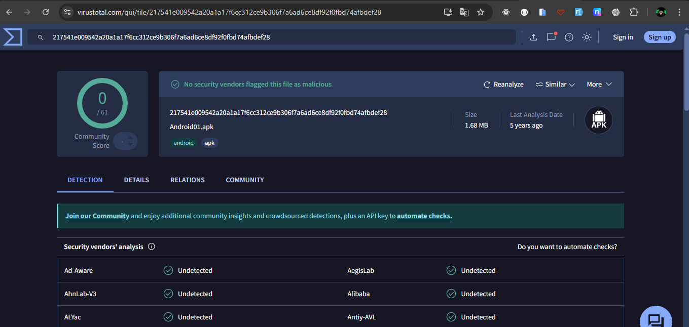
</div>

Ilovada hech qanday zararli kod aniqlanmaganligini chiqardi. Sizda buni
aksi bo‘lishi ham mumkin.

### **Ilovani dekompilyatsiya qilish (apktool, jadx-gui)**

Ilovani (APK faylini) dekompilyatsiya qilish bu Android dasturining
ichki tuzilmasi va kodini tahlil qilish jarayonidir. Quyida apktool va
jadx vositalaridan foydalanib ilovani dekompilyatsiya qilish bo‘yicha
asosiy ma’lumot va amaliy ko‘rsatmalar berilgan. Jadx dasturi orqali siz
bilan ilovani dekompliyatsiya qilish ni ko‘rib chiqamiz. Dastlab siz
jadx dasturini o‘rnatib oling jadx dasturini quydagi manzildan yuklab
oling(<https://github.com/skylot/jadx/releases>). Jadx dasturini
o’zingizni operatsion tizimingizga mos versiyasini yuklab oling windows
uchun windows.zip farmatdagisini yuklab oling va uni zipdan chiqarib
ichidagi .exe faylni ishga tushuring. Jadx dasturi sizda dastlab ishga
tushganda quydagicha oyna ochiladi.


<div align="center">
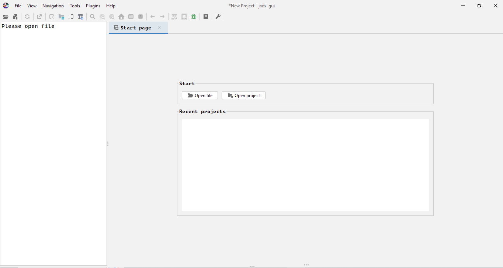
</div>

Ushbu oynadan Open file qilib apk faylni tanlab oling, rasmdagi kabi apk
faylni tanlab oling.

<div align="center">
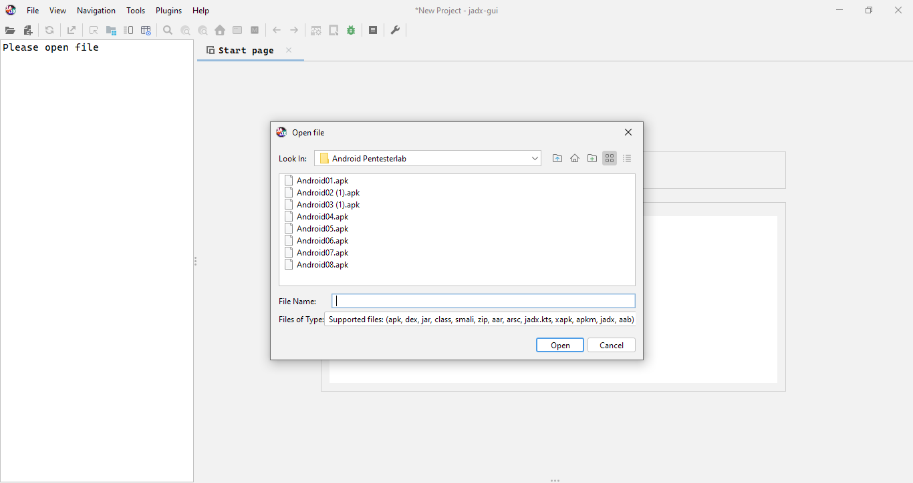
</div>

Ilova apk faylni tanlab olganingizda sizda rasmdagi kabi bu faylni
dekomplatsiya qilib beriladi.

<div align="center">
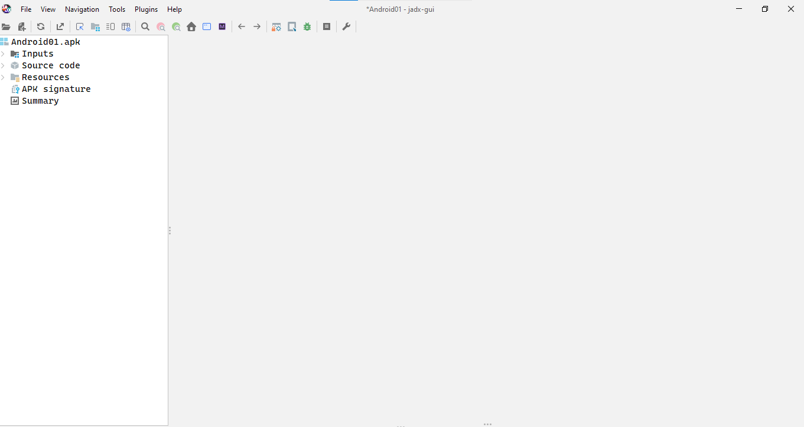
</div>

Jadx-gui dasturida .apk fayl ochilgach, chap tomonda quyidagi asosiy
bo‘limlar (katta menyular) ko‘rinadi. Ularning har biri APK fayl
tarkibini turli tomondan tahlil qilishga yordam beradi. Quyida ularning
har biri nima vazifa bajarishini tushuntirib beraman:

**Inputs -** bu bo‘limda siz yuklagan .apk fayllari ko‘rsatiladi.

- Bir nechta .apk fayl ochgan bo‘lsangiz, barchasi shu yerda ro‘yxat
  bo‘lib chiqadi.

- Har bir faylga tegishli tarkibiy qismlar (kod, resurslar, imzo va
  h.k.) shu fayl ostida guruhlanadi.

**Source code** - bu dekompilyatsiya qilingan Java kod joylashgan
bo‘lim.

- APK ichidagi .dex fayllar dekompilyatsiya qilinib, o‘qiladigan
  shakldagi Java kodga aylantirilgan bo‘ladi.

- Har bir package (paket) va klasslar (classlar) struktura holatida
  ko‘rsatiladi.

- Bu yerda MainActivity.java, LoginActivity.java kabi asosiy faoliyat
  fayllarni ko‘rib chiqasiz.

<div align="center">
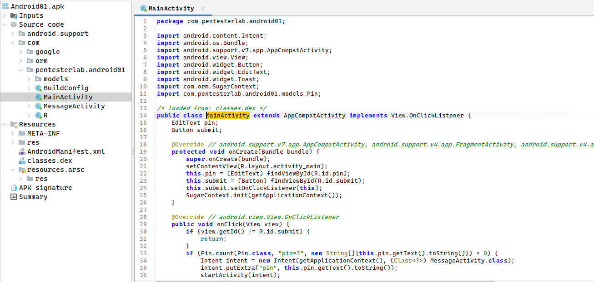
</div>

Asosiy joy dasturchining logikasi, API chaqiriqlari, tokenlar, kalitlar
shu yerda bo‘ladi.

**Resources -** bu bo‘lim APK ichidagi resurs fayllarini o‘z ichiga
oladi:

- res/ papkasidagi layout, drawable, values, strings.xml, colors.xml,
  styles.xml va boshqa XML fayllar shu yerda bo‘ladi.

- Dastur interfeysining qanday ko‘rinishini, ranglar, matnlar, tasvirlar
  qayerda ishlatilganini shu yerda bilib olish mumkin.


<div align="center">
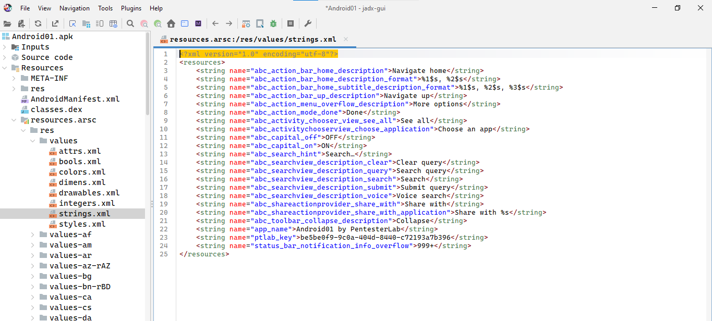
</div>

UI dizayn va interfeysga oid ma’lumotlar bu yerda bo‘ladi.

**APK signature -** bu bo‘lim APK faylning imzosi (digital signature)
haqida ma’lumot beradi:

- APK fayl kim tomonidan imzolangan (certifikat ma’lumotlari).

- RSA, SHA algoritmlari orqali tekshirilgan imzo haqida tafsilotlar.

- Agar siz modifikatsiya qilgan bo‘lsangiz, bu yerda imzo noto‘g‘ri yoki
  “Signed: No” ko‘rsatiladi.


<div align="center">
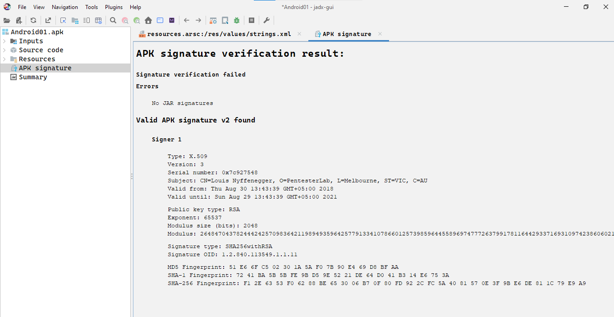
</div>

Bu yer APK originalmi yoki yo‘qligini tekshirish uchun muhim.

**Summary -** bu bo‘lim APK fayl haqida umumiy xulosa va texnik
ma’lumotlarni beradi:

- Package name (com.example.app)

- Min SDK, Target SDK

- Versiya raqami

- Dex fayllar soni

- Permissiyalar (INTERNET, CAMERA, READ_SMS va h.k.)

Tez tahlil uchun foydali bo‘lim. Dastur nima qiladi, qaysi ruxsatlarni
so‘raydi – shularni ko‘rsatadi.


<div align="center">
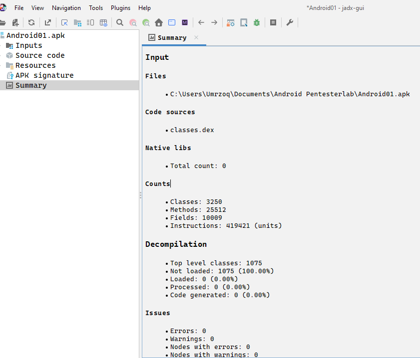
</div>

Apktool

Apktool – bu .apk fayllarni dekompilyatsiya va qayta yig‘ish uchun
ishlatiladigan ochiq manbali Java vosita. Apktool dasturini siz quydagi
havola orqali yuklab olishingiz mumkin
bo‘ladi(<https://github.com/iBotPeaches/Apktool/releases>). Apktoolni
o‘rnatib olganingizdan keyin terminalni ochib apk faylingizi turgan
manzilga borib oling va terminalga apktool d your_apk_name.apk
kamandasini yozing bu kod bajarilishi natijasida sizning apk faylingiz
yonida apk fayl nomi bilan bir xil papka paydo bo‘ladi, bu papka ichida
rasmdagi kabi fayllar paydo bo‘ladi bua pk faylingizni dekomplatsiya
ko‘rinishidir.


<div align="center">
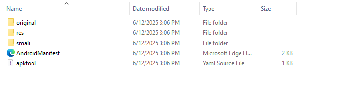
</div>

### **Obfusikatsiya**

Ilova kodi obfuskatsiya qilinganligini aniqlash bu tahlil jarayonida
dasturchilar tomonidan dastur kodi ongli ravishda chalkashtirilganini
ko‘rsatib beruvchi belgilarning mavjudligini aniqlashdir. Bunday
holatlarda koddagi klass, metod va o‘zgaruvchilar nomlari odatda
ma’nosiz yoki juda qisqa (masalan, a, b, c1, d2) bo‘lib, ularning asl
vazifasini tushunish qiyinlashadi. Dastur tuzilmasi murakkab va
tushunarsiz shaklga keltiriladi, smali fayllarda esa izohlar bo‘lmaydi
yoki juda kam bo‘ladi, nomlar esa aniq semantik ma’noga ega emas.

Shuningdek, strings.xml yoki boshqa resurs fayllarda noto‘g‘ri
tartiblangan, chalkash yoki hatto shifrlangan matnlar uchraydi.
Ma’lumotlar bazasi jadval nomlari, API endpoint manzillari ham ko‘pincha
yashirilgan yoki be’mani nomlar bilan almashtirilgan bo‘ladi. Bularning
barchasi dastur kodining tahlildan, ya’ni teskari muhandislik (reverse
engineering)dan himoyalanganini bildiradi.

Obfuskatsiya texnikasi ko‘pincha ilovaning funksional jihatlarini yovuz
niyatli shaxslar tomonidan o‘rganilishining oldini olish, foydalanuvchi
xavfsizligini ta’minlash, intellektual mulkni muhofaza qilish maqsadida
qo‘llaniladi.

Keling endi, obfuskatsiya qilinmagan dastur kodi bilan obfuskatsiya
qilingan kod o‘rtasidagi farqlarni solishtirib, bu jarayonning dastur
tuzilmasiga qanday ta’sir qilganini ko‘rib chiqamiz.

<div align="center">
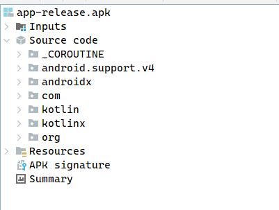
</div>

JADX dasturi orqali obfuskatsiya qilinmagan ilovani tahlil qilganimizda,
kod tuzilmasi aniq, tartibli va o‘qilishi oson holatda bo‘ladi.
Ilovaning har bir komponenti o‘z nomi bilan ochiq-oydin ajratilgan
bo‘lib, klasslar, metodlar va o‘zgaruvchilar semantik ma’noga ega nomlar
bilan nomlangan.


<div align="center">
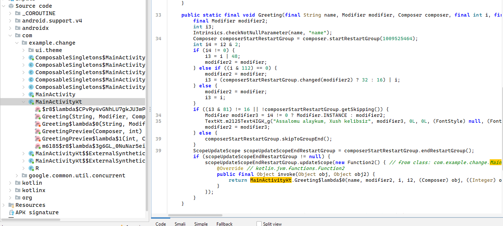
</div>

Yuqoridagi rasmda biz obfuskatsiya qilinmagan ilovaning kodi bilan
tanishdik. Unda hamma narsa aniq, tartibli va tushunarli ko‘rinishda
bo‘lib, kodni o‘qish hamda tahlil qilish juda oson edi. Klass nomlari,
metodlar va o‘zgaruvchilar o‘z vazifasini ochiq-oydin ifodalab turibdi.
Ilova arxitekturasi mantiqiy tarzda tuzilgan bo‘lib, uni tushunish
mutaxassis uchun hech qanday murakkablik tug‘dirmaydi.

Endi esa, shu ilovani obfuskatsiya qilamiz va uni qayta build qilib,
hosil bo‘lgan APK faylni yana JADX dasturi orqali tahlil qilamiz.
Obfuskatsiyadan so‘ng ilovaning ko‘rinishi keskin o‘zgaradi. Klass va
metod nomlari ma’nosiz yoki qisqa belgilarga aylangan (a, b1, x3 va
hokazo), o‘zgaruvchilar chalkash va kontekstdan uzilgan holatda bo‘ladi.
Kodlar o‘zaro qanday bog‘langanini anglash qiyinlashadi. Ko‘plab
joylarda funksiyalar o‘z vazifasini yashirish uchun murakkab tuzilmaga
aylantirilgan bo‘ladi.

<div align="center">
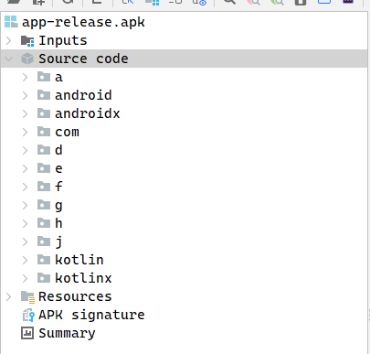
</div>


<div align="center">
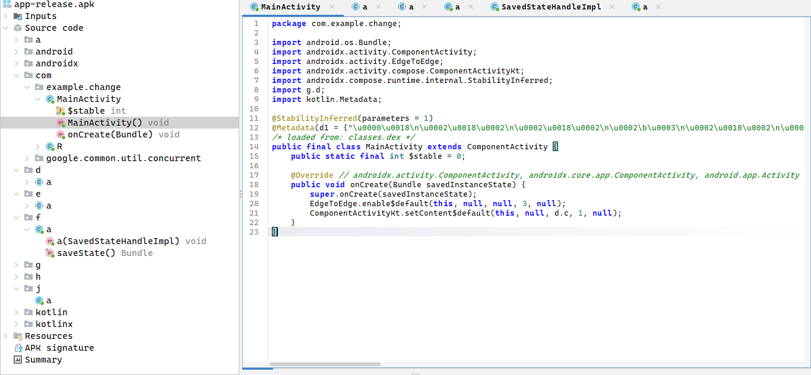
</div>

Rasmda ko‘rib turganingizdek, obfuskatsiya jarayonidan so‘ng ilova kodi
mutlaqo tushunarsiz holga keltirilgan. Klass va metod nomlari endi hech
qanday semantik ma’noga ega emas, o‘zgaruvchilar esa qisqa va chalkash
belgilar bilan ifodalangan. Dastur tuzilmasi sun’iy murakkablik bilan
to‘ldirilgan va kod bloklari o‘zaro qanday bog‘langanini anglash ancha
qiyinlashgan.

Ayniqsa, ilovada foydalanuvchiga ko‘rsatiladigan matnlarni aniqlash
ya’ni strings.xml faylidagi yozuvlar yoki kod ichidagi satrlarni topish
endi ancha murakkab vazifaga aylangan. Matnlar shifrlangan, obfuskatsiya
qilingan yoki ba'zida fragmentlarga bo‘lingan holda berilgan bo‘lishi
mumkin. Ba’zi hollarda esa ular butunlay resurslardan chiqarilib, kod
ichiga ko‘milib qo‘yiladi, bu esa avtomatik analiz vositalari orqali
ularni aniqlashni deyarli imkonsiz qiladi.

Bu holat ilovaning tahlildan himoyalanganini yana bir bor tasdiqlaydi.
Obfuskatsiya faqat kod nomlarini emas, balki ilovaning matnli
interfeysini ham yashirish orqali teskari muhandislikning oldini oladi.

Xulosa qilib aytganda, obfuskatsiyadan so‘ng nafaqat kodni o‘qish, balki
oddiy foydalanuvchi matnlarini topish ham professional tahlilchini ko‘p
vaqt va kuch sarflashga majbur qiladi. Bu esa ilova xavfsizligini ancha
yuqori darajaga olib chiqadi.

### **Ilova imzosini tekshirish.**

Ilovaning imzo yaxlitligini tekshirish va xavfsizligini ta’minlash
maqsadida, Janus zaifligi (Janus Vulnerability) bo‘yicha tahlil
o‘tkazish tavsiya etiladi. Buning uchun Janus zaiflik skaneri yoki
Mobile Security Framework (MobSF) kabi zamonaviy xavfsizlik
vositalaridan foydalanish lozim. Ushbu dasturlar ilova faylining raqamli
imzosi buzilgan-buzilmaganini aniqlash, zararli o‘zgarishlar
kiritilganini tekshirish va umumiy xavfsizlik darajasini baholash
imkonini beradi.


<div align="center">
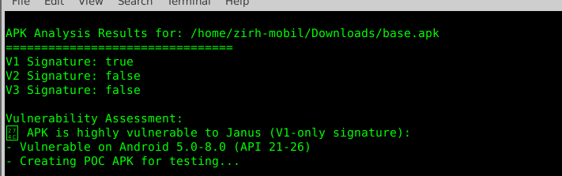
</div>

Agar ilova faqat V1 imzo sxemasi asosida imzolangan bo‘lsa, bu katta
xavfsizlik zaifligi hisoblanadi. Chunki bunday imzolangan ilovalar
Android 5 (Lollipop) va Android 6 (Marshmallow) versiyalarida ham to‘liq
ishlay oladi. Mazkur operatsion tizim versiyalarida esa bir qator jiddiy
zaifliklar mavjud. Ayniqsa, “Janus” zaifligi orqali, hujumchi APK
fayliga zararli kodlar kiritgan taqdirda ham, ilovaning raqamli imzosi
o‘zgarmaydi. Bu esa foydalanuvchi yoki tizim tomonidan ilova xavfsiz deb
qabul qilinishiga olib keladi. Natijada, modifikatsiyalangan va zararli
kod bilan boyitilgan ilova hech qanday ogohlantirishsiz ishga tushishi
mumkin.

### **Ilova kodini tahlil qilish va o‘zgartirish**

Ilova kodini tahlil qilish orqali biz uning ichki logikasini, xavfsizlik
darajasini hamda ishlash mexanizmlarini chuqur anglab yetamiz. Bunday
tahlil nafaqat zaifliklarni aniqlash, balki ilovani pentest qilish,
modifikatsiyalash yoki uning funksiyalarini chuqur o‘rganish imkonini
beradi. Bu borada Apktool va Jadx kabi vositalar ayniqsa samarali
sanaladi. To‘g‘ri yondashuv bilan olib borilgan dekompilyatsiya jarayoni
mobil ilovalardagi zaif joylarni ochib berib, ularga qarshi samarali
himoya choralarini ishlab chiqishda muhim ahamiyat kasb etadi.

Yuqoridagi misolda biz dekompilyatsiya qilingan ilovani tahlil qilamiz.
Bu ilova Android Pentester laboratoriyasiga tegishli APK fayl bo‘lib,
biz undan yashiringan “flag”ni topishimiz kerak. Flag’lar odatda ma’lum
bir andozaga ega bo‘ladi – bu holatda ular ptlab so‘zi bilan boshlanishi
aytilgan. Shuning uchun biz ilova kodini Jadx orqali ochamiz va kod
ichida ptlab iborasi mavjud bo‘lgan qatorni izlaymiz. Masalan,
MessageActivity sinfida rasmda ko‘rsatilgan tarzda kerakli ma’lumotlar
joylashganini ko‘rish mumkin. Bu tahlil flagni aniqlashda asosiy qadam
hisoblanadi.


<div align="center">
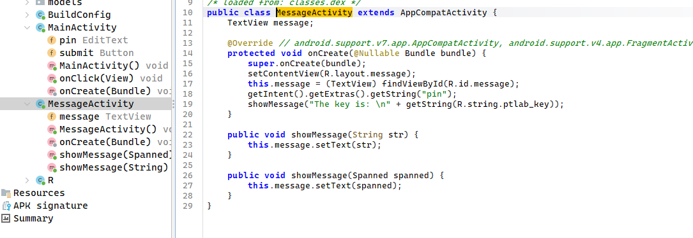
</div>

Kodni tahlil qilish jarayonida ko‘rinib turibdiki, ma’lumot ptlab_key
nomli kalit orqali ekranga chiqarilmoqda. Bu esa shuni anglatadiki,
kerakli satr ma’lumoti ilovaning resurslar qismida, aniqrog‘i
strings.xml faylida saqlangan. Shundan kelib chiqib, biz res papkasidagi
values papkasiga o‘tamiz va uning ichida joylashgan strings.xml faylini
ko‘zdan kechirishimiz zarur bo‘ladi. Faylni ochganimizda, kutilgan
natija aynan shu yerda ptlab_key ga mos yozuv shaklida joylashganini
ko‘rishimiz mumkin. Bu bosqich flagni aniqlash yo‘lida hal qiluvchi
ahamiyatga ega bo‘lib, rasmda keltirilgan ko‘rinishda aniq va ravshan
tarzda aks etgan.


<div align="center">
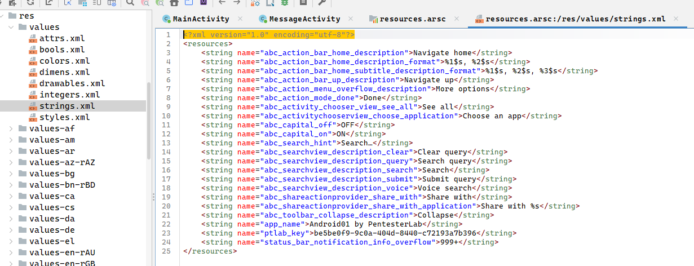
</div>

Bizga kerakli flag *be5be0f9-9c0a-404d-8440-c72193a7b396* qiymati
bo‘lib, u ilovaning strings.xml faylida ptlab_key kaliti ostida
joylashgan. Shu orqali biz ilova kodi ustida muvaffaqiyatli tahlil
o‘tkazdik va flagni aniqladik.

Endi navbat ilova kodini o‘zgartirib, uni qayta yig‘ish bosqichiga
keldi. Bu jarayonda biz apktool vositasidan foydalanamiz u Android
ilovalarini dekompilyatsiya va qayta kompilyatsiya qilishda eng
ishonchli va qulay vositalardan biridir.

```bash
apktool d original.apk -o app-release
```


<div align="center">
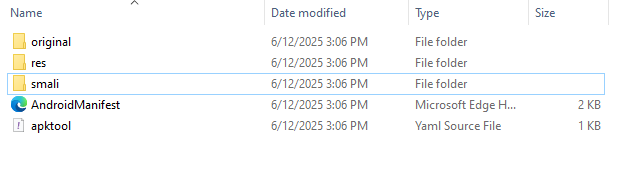
</div>

Endi esa ilovani amalda o‘zgartirish va qayta yig‘ish jarayoniga
o‘tamiz. Dastlab, .apk faylni dekompilyatsiya qilganingizdan so‘ng,
smali papkasiga o‘ting. Bu yerda ilovaning bajariluvchi logikasi smali
fayllar ko‘rinishida joylashgan bo‘ladi. Har qanday .smali faylni oching
(masalan, MainActivity.smali), so‘ng unga kichik o‘zgarish kiriting bu
matn, log yozuvi yoki shart operatori bo‘lishi mumkin.

```bash
const-string v0, "You Have Hacked Been"

const/4 v1, 0x1

invoke-static {p0, v0, v1},
Landroid/widget/Toast;-\>makeText(Landroid/content/Context;Ljava/lang/CharSequence;I)Landroid/widget/Toast;

move-result-object v0

invoke-virtual {v0}, Landroid/widget/Toast;-\>show()V
```

Masalan yuqoridagi kodni MainActivity faylga joylashtiring bu kod
Ilovada Toast chiqishini taminlaydi va o‘zgartirishni kiritgach, faylni
saqlang. Endi esa ilovani qayta kompilyatsiya qilish uchun quyidagi
buyruqdan foydalaning.

```bash
apktool b app-release -o app-modded.apk
```

Qayta kompilyatsiya jarayonida buyruq berilayotgan papka nomi, ya’ni
app-release, bu ilgari apktool vositasi orqali dekompilyatsiya qilingan
APK faylining papka nomi bo‘lishi kerak.

Ilovani o‘zgartirgach, ya’ni app-modded.apk faylini yaratganimizdan
so‘ng, uni Android tizimida o‘rnatishdan avval imzolab olish zarur
bo‘ladi. Aks holda, tizim ilovani “noma’lum yoki buzilgan” deb topib,
o‘rnatishga ruxsat bermaydi.

Imzolash jarayoni uchun bizga .jks (Java KeyStore) formatidagi imzo
sertifikati kerak bo‘ladi. Agar sizda mavjud bo‘lmasa, uni yaratish
uchun keytool vositasidan foydalanamiz. Quyidagi buyruq orqali yangi
sertifikat yaratishingiz mumkin.

```bash
keytool -genkey -v -keystore my-key.jks -alias myalias -keyalg RSA
-keysize 2048 -validity 10000
```

<div align="center">
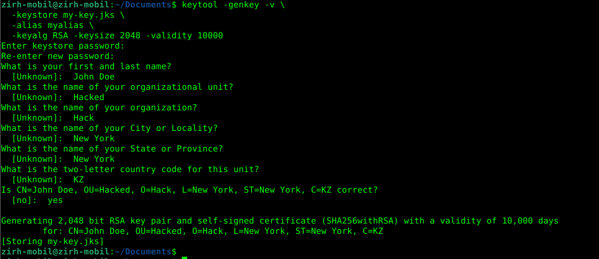
</div>

Siz yaratgan my-key.jks sertifikati yordamida endi ilovani imzolash
mumkin bo‘ladi. Biroq imzolashdan oldin muhim bosqichlardan biri
zipalign vositasi orqali APK faylni optimallashtirishdir.

zipalign Android SDK tarkibidagi vosita bo‘lib, u APK fayldagi barcha
ma’lumotlarni 4 baytli chegaralarga to‘g‘rilab joylashtiradi. Bu esa
ilovaning samarali ishlashini ta’minlaydi va Google Play kabi
platformalarda tekshiruvdan muammosiz o‘tishiga yordam beradi. Quyidagi
buyruq orqali app-modded.apk faylni zipalign qilamiz.

```bash
zipalign -p -f 4 app-modded.apk app-aligned.apk
```

<div align="center">
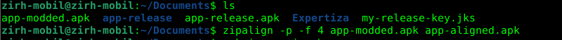
</div>

Zipalign jarayoni muvaffaqiyatli yakunlangach, endi biz ilovani imzolash
bosqichiga o‘tamiz. Bu jarayon ilovaning yaxlitligini va ishonchliligini
kafolatlaydi hamda Android tizimi tomonidan tan olinishi uchun zarur
hisoblanadi.

Imzolash uchun biz apksigner vositasidan foydalanamiz. Quyidagi buyruq
orqali siz app-aligned.apk faylni avval yaratgan my-key.jks sertifikati
yordamida imzolab olishingiz mumkin.

```bash
apksigner sign --ks my-release-key.jks --ks-key-alias myalias --out
app-signed.apk app-aligned.apk
```


<div align="center">
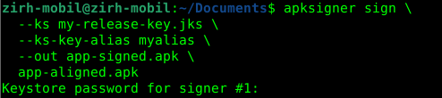
</div>

Yuqorida bayon etilgan barcha bosqichlar dekompilyatsiya, o‘zgartirish,
zipalign va imzolash muvaffaqiyatli yakunlangach, endi ilovaning to‘g‘ri
va haqiqiy tarzda imzolanganligini tekshirib ko‘rishimiz mumkin. Bu
ilovani tizim tomonidan ishonchli deb tan olinishi uchun muhim bosqich
hisoblanadi.

Imzo holatini tekshirish uchun terminalga quyidagi buyruqni kiritish
kifoya.

```bash
keytool -list -v -keystore my-release-key.jks
```


<div align="center">
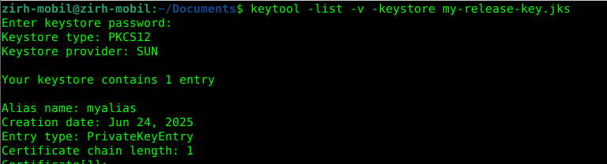
</div>


Agar sizda ham apksigner verify buyrug‘i hech qanday xatolik qaytarmasa
va terminal jim tursa bu ilovaning to‘g‘ri va muvaffaqiyatli
imzolanganligini anglatadi. Endilikda siz ushbu app-signed.apk faylni
Android qurilmaga bemalol o‘rnatib, uning funksiyalarini to‘liq sinab
ko‘rishingiz mumkin bo‘ladi.

### **Eskirgan va zaif kutubxonalarni aniqlash**

Ilovada eskirgan (deprecated yoki zaif) kutubxonalar bor-yo‘qligini
aniqlash Android ilovani statik tahlil qilishda juda muhim bosqich. Bu
kutubxonalar orqali ilovada xavfsizlikka oid zaifliklar yoki ishlamay
qolgan APIlar mavjud bo‘lishi mumkin. Qanday qilib kutubxonalar
ro‘yhatini va versiyalarini ko‘rish bo‘yicha ketma-ketligini ko‘rsatib
o‘tilgan. Eskirgan kutubxonalarni aniqlash uchun eng yaxshi va sinalgan
va tushunarli vosita bu mobsf dasturi bo‘ladi qurulmangizda mobsf
dasturini ochib oling agar sizda hali mobsf dasturi bo‘lmasa siz dastlab
bu dasturni o‘rnatib oling. Mobsf dasturini o’rnatib bo’lganingizdan
keyin uni ochib ichiga .apk faylni yuboring va bir necha Soniya kuting
va natija quydagicha bo’ladi.


<div align="center">
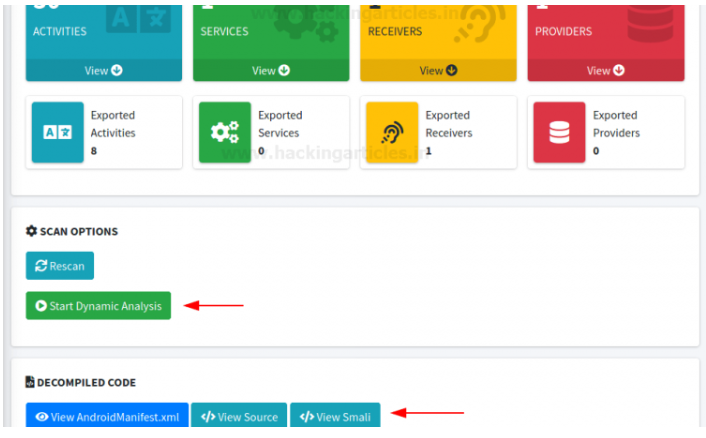
</div>

### **AndroidManifest.xml faylini tahlil qilish**

AndroidManifest.xml bu har bir Android ilovada mavjud bo‘lgan asosiy
konfiguratsiya fayli bo‘lib, quyidagilarni belgilaydi:

- Ilovaning paket nomi

- Komponentlar: activity, service, broadcast receiver, content provider

- Ruxsatlar (permissions)

- Intent-filterlar (ya’ni tashqi chaqirishlar)

- Minimal SDK, target SDK versiyasi

- Ilovaning entry point (ya’ni MAIN activity)

Yuqoridagi barcha narsalarni statik tahlil jarayonida aniqlash kerak
bo‘ladi. Manifest faylida faqat asosiy birinchi ishga tushadigan
activity exported true bo’lishi kerak. Agar bunday bo’lmasa hujumchilar
tizim resurslaridan foydalanish imkoniyati paydo bo’lib qoladi.

### **Hard kod qilib yozilgan malumotlar**

Hard kod qilib yozilgan ma’lumotlar — bu ilova kodiga to‘g‘ridan-to‘g‘ri
yozib qo‘yilgan (o‘zgartirib bo‘lmaydigan) ma'lumotlar bo‘lib,
xavfsizlik nuqtai nazaridan jiddiy zaiflik hisoblanadi. Agar ilova
ichida quyidagi ma’lumotlar hardcode qilingan bo‘lsa, bu muammo
hisoblanadi. API kalitlari (masalan, const val API_KEY =
"sk_test_123..."). Tokenlar (masalan, Bearer token123456). Server URL
manzillari (<https://api.secretserver.com>). Parollar yoki login
ma’lumotlari. Firebase, Stripe, PayPal, Google API konfiguratsiyalari

### **Resurs fayllarni ko‘rish (res/, assets/)**

Android ilovalari tarkibida res/ va assets/ kataloglari mavjud bo‘lib,
ular ilovaning statik fayllari (matnlar, rasm, sozlamalar,
konfiguratsiya fayllari) saqlanadigan joy hisoblanadi. Ilovani statik
tahlil qilishda bu papkalarni ko‘zdan kechirish xavfsizlik zaifliklarini
aniqlash uchun muhim bosqichdir.

**res** — ilovaga biriktirilgan statik resurslar saqlanadigan joy.

| **Papka** | **Tahlil ahamiyati**                                                                          |
|-----------|-----------------------------------------------------------------------------------------------|
| layout/   | UI tuzilmalari (.xml) — maxfiy tugmalar, yashirin funksiya                                    |
| values/   | strings.xml, config.xml — API kalitlar, server URLlar bo'lishi mumkin                         |
| drawable/ | Ilovadagi rasm fayllari — phishing belgilar yoki logotiplar borligini tekshirish mumkin       |
| menu/     | Ilova menyulari — yashirin funktsiyalar mavjudligini aniqlash mumkin                          |
| xml/      | Qo‘shimcha sozlamalar, network_security_config.xml — HTTPS cheklovlari mavjudmi, tekshiriladi |

**assets** papkasi — ilovaga to‘liq kiritilgan foydalanuvchi tomonidan
belgilangan fayllar saqlanadi. Bu fayllar ilovaning o‘zida to‘liq
ko‘rinishda mavjud bo‘ladi va APK ichida bexavotir ochiladi.

| **Fayl turi** | **Xavfsizlikdagi roli**                                                     |
|---------------|-----------------------------------------------------------------------------|
| .json, .xml   | API konfiguratsiyasi, URL, port, tarmoqqa ulanish sozlamalari               |
| .js, .html    | Ilova ichida ishlatiladigan WebView hujumlari (XSS, LFI) uchun tekshiriladi |
| .db, .sqlite  | Mahalliy ma’lumotlar ombori — parollar, tokenlar, foydalanuvchi malumotlari |
| .pem, .crt    | TLS sertifikatlar — qonuniylik va amal qilish muddatini tekshirish mumkin   |

Ko‘pincha bu katalogda noto‘g‘ri joylashtirilgan API kalitlar, parollar,
serverga bog‘lanish nuqtalari bo‘ladi. Bu esa tahlilchi yoki hujumchiga
ilovaning backend tizimiga hujum qilish imkonini beradi.

### **Log malumotlarni tekshirish**

Ilovalarda statik tahlilda log ma’lumotlarni ko‘rish bu ilova ishlab
chiqish jarayonida ilova ishlab chiqaruvchilari tomonidan yozib
qoldirilgan Log malumotlar orqali maxfiy malumotlar logga yozib qolish
oqibatida ilovaga tegishli maxfiy malumotlarni ko’rish mumkin. Log
chaqiriqlarini aniqlab, u orqali ilovaning ichki ishlash mexanizmini
tushunishdir. Adb orqali ilova log malumotlarini ko’rishi mumkin.
Quydagi buyruqni o’z terminalingizga kiriting va enter buyrug’uni
bosing.

```bash
adb logcat \| grep com.exmaple.app
```


<div align="center">

</div>

### **Debug modni tekshirish**

Statik tahlilda ilovaning debug rejimda tuzilganligini tekshirish — bu
ilova xavfsizlik darajasini baholashda muhim qadamdir. Agar ilova debug
rejimda ishlab chiqilgan bo‘lsa, u holda Ilova imzolashda debug.keystore
ishlatilgan bo‘ladi. Proguard obfuskatsiyasi o‘chirilgan yoki zaif
bo‘ladi. Foydalanuvchiga mo‘ljallanmagan loglar, toastlar, debug
bayroqlari saqlanib qolgan bo‘ladi. Dasturchi tomonidan test uchun ochiq
qoldirilgan developer funksiyalar mavjud bo‘ladi.

### **Zaif WebViewdan foydalanish**

Ilovalarda zaif (xavfsizligi past) WebView ishlatilishi — bu mobil
xavfsizlik nuqtai nazaridan jiddiy zaiflik hisoblanadi. WebView — bu
ilova ichida veb sahifalarni ko‘rsatishga mo‘ljallangan Android
komponenti bo‘lib, noto‘g‘ri sozlangan taqdirda foydalanuvchi, tizim va
server xavfsizligiga tahdid tug‘diradi.

### **Zaif hashlash va shifrlash algorithmlari**

Mobil ilovalarda zaif hashlash va shifrlash algoritmlaridan foydalanish
— bu keng tarqalgan xavfsizlik zaifliklaridan biri bo‘lib, maxfiy
ma’lumotlar (parollar, tokenlar, sozlamalar) osonlik bilan buzilishiga
olib keladi. Bunday algoritmlar kriptoanalizga bardosh bera olmaydi va
ilova foydalanuvchilari uchun jiddiy xavf tug‘diradi.

### **Backup olishga ruxsat berish oqibatida**

Ilovadagi /data/data/com.example.app katalogidagi.

- Kirish tokenlari

- Foydalanuvchi parollari

- Session IDlar

- Caching/qurilmaga yozilgan maxfiy fayllar

- Sozlamalar (SharedPreferences)

hammasi .ab faylga shifrlanmagan holatda saqlanadi va bu malumotlarni
ko‘rish mumkin:

Agar siz SharedPreferences yoki SQLite bazada quyidagilarni plaintext
(ochiq) saqlagan bo‘lsa:

- Kirish tokeni

- Email/parol

- API kalitlari

- Mahfiy sozlamalar

ular ham backupga kiradi va ochiladi.

Zararli foydalanuvchi yoki tester backup faylni tahrirlab, keyin uni
tiklasa:

- Ilova noto‘g‘ri ishlaydi

- Token spoofing sodir bo‘ladi

- Login bypass bo‘lishi mumkin

### **Statik zaifliklar**

Mobil ilovalarni tahlil qilishda statik tahlil (Static Analysis) dastur
kodini ishga tushirmasdan turib xavfsizlik zaifliklarini aniqlash
imkonini beradi. Quyida mobil ilovalarda eng ko‘p uchraydigan statik
zaifliklar sanab o‘tilgan.

**Hard kodlangan maxfiy ma’lumotlar (Hardcoded Secrets)**

Ko‘plab dasturchilar test vaqtida API kalitlari, parollar yoki
tokenlarni bevosita kod ichida yozib qo‘yishadi. Bu esa ilovani
dekompilyatsiya qilgan har qanday hujumchiga ushbu ma’lumotlarga erkin
kirish imkonini beradi. Maxfiy ma’lumotlarni hech qachon kod ichida
saqlamang. Ularni xavfsiz saqlash uchun \`KeyStore\`, \`Secure Enclave\`
yoki server tomonli saqlashni qo‘llang.

**Zaif fayl saqlash (Insecure Data Storage)**

Statik tahlil orqali ilovaning foydalanuvchi ma’lumotlarini (parollar,
tokenlar, shaxsiy ma’lumotlar) shifrlanmagan holda saqlayotgani
aniqlanishi mumkin. Ayniqsa, *SharedPreferences,* *SQLite,* *Log*
fayllarida bu tez-tez uchraydi. Ma’lumotlarni har doim shifrlab saqlang
va iloji boricha minimal darajada mahalliy saqlashdan foydalaning.

**Noto‘g‘ri ruxsatlar (Improper Permissions)**

Ilova ortiqcha tizim ruxsatlarini talab qilishi yoki noto‘g‘ri sozlangan
ruxsatlar orqali boshqa ilovalar bilan ma’lumot almashishini ta’minlashi
mumkin.

Foydalanuvchidan faqat kerakli ruxsatlarni so‘rang va manifest faylini
doimiy tekshirib boring.

**Zaif kod obfuskatsiyasi (Weak Obfuscation)**

Ilova kodining to‘liq yoki yetarli darajada obfuskatsiya qilinmaganligi,
uni oson dekompilyatsiya qilish va tahlil qilishga olib keladi. Android
uchun ProGuard yoki R8, iOS uchun Bitcode va boshqa obfuskatsiya
vositalaridan foydalaning.

**Insecureniya uchinchi tomon kutubxonalari**

Ilovada ishlatilayotgan kutubxonalar va SDKlar eski yoki zaif versiyada
bo‘lishi mumkin, bu esa zaiflik manbai bo‘lib xizmat qiladi. Uchinchi
tomon kutubxonalarini doimiy yangilab boring va ularning changeloglarini
kuzatib boring.

**Zaif kriptografik algoritmlar**

Statik tahlil yordamida ilovaning zaif yoki eskirgan kriptografik
algoritmlardan (masalan, MD5, SHA-1) foydalanayotgani aniqlanishi
mumkin. Zamonaviy kriptografik standartlardan foydalaning (masalan,
SHA-256, AES-256).

**Logga maxfiy ma’lumotlarni chiqarish**

Ba’zan ishlab chiquvchilar noto‘g‘ri ravishda foydalanuvchi
ma’lumotlarini yoki so‘rov javoblarini \`Log\` ga chiqarib qo‘yishadi.
Bu esa ilovani tahlil qilayotgan hujumchi uchun katta imkoniyat
yaratadi.

Statik zaifliklar dastur ishga tushmagan holatda aniqlanishi mumkinligi
sababli, ularni erta aniqlab bartaraf etish – ilovaning umumiy
xavfsizligi uchun juda muhimdir. Har doim secure coding amaliyotlariga
amal qilish va kodni avtomatlashtirilgan tahlil vositalari (masalan,
MobSF, SonarQube, Fortify) orqali tekshirib borish tavsiya etiladi.

## **Dinamik tahlil**

Mobil ilovalarda dinamik tahlil (dynamic analysis) bu ilovani real
vaqtda ishga tushirib, uning xatti-harakatlarini kuzatish orqali
xavfsizlik va funksionallikni tekshirish jarayonidir. Dinamik tahlilda
ilova qurilmada yoki emulyatorda ishlatib ko‘riladi.

### **Ilovani qurilmaga yoki emulyatorda o‘rnatish**

Ilovani qurilmaga yoki emulyatorda o‘rnatish bu dinamik tahlilning
birinchi bosqichi hisoblanadi. Dastlab kampyuterga Genymotion dasturi
o‘rnatib olish kerak bo‘ladi. Genymotion saytiga kirib, hisob
yaratishimiz kerak. Genymotionni yuklab olish va undan foydalanish uchun
sizga ushbu hisob kerak (aniq), shuning uchun avval buni qilganingizga
ishonch hosil qiling. Buni qilganingizdan so‘ng,
quyidagi havolaga(<https://www.genymotion.com/product-desktop/download>) o'ting
va Linux (64-bit) versiyasini yuklab oling.


<div align="center">
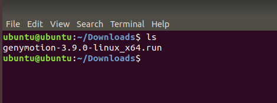
</div>

Natijada rasmdagi kabi genymotionni linux uchun versiyasi yuklanmalar
jildida chiqish kerak. Keyin esa genymotionga chmod +x
genymotion-x.y.z-linux_64.run deb bu faylga kerakli ruxsatlarni berib
olishimiz kerak.


<div align="center">
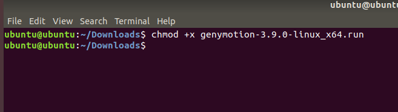
</div>

Yuqoridagi buyruq bajarilganidan keyin quydagi rasmdagi buyruqni yozib
olishimiz kerak bu orqali genymotion dasturi o‘rnatilishni boshlaydi.


<div align="center">
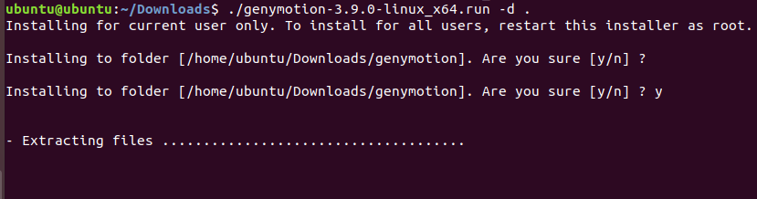
</div>

Genymotion dasturini ishga tushurish uchun siz quydagi rasmdagi kabi
qilib ./genymotion buyrug‘ni yozing va genymotion dasturi ishga tushadi.


<div align="center">
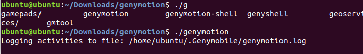
</div>

<div align="center">
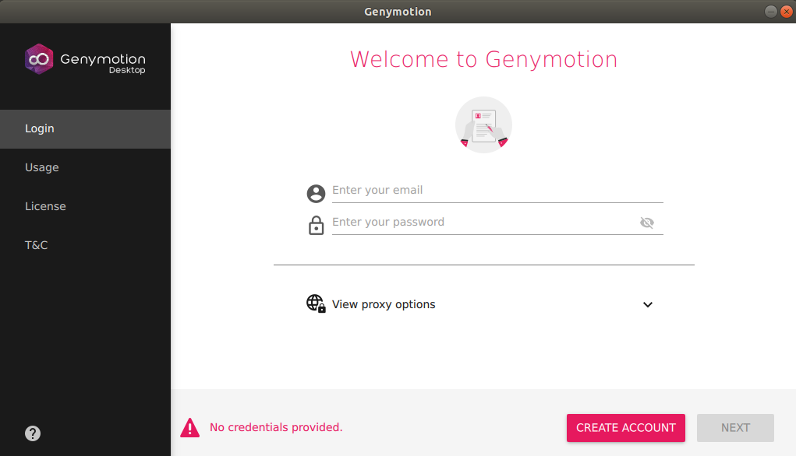
</div>


Bu yerga yuqorida ro‘yhatdan o‘tgan malumotlaringizni yozing. Keyingi
kerak bo‘ladigan vositalardan virtualboxni o‘rnatib olishingiz kerak
bo‘ladi buning uchun terminalga sudo apt install virtualbox buyrug‘ini
yozishni o‘zi yetarli.


<div align="center">
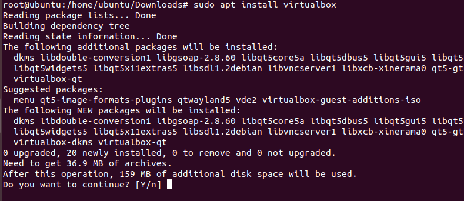
</div>

Virtualbox dasturi to‘liq o‘rnatilib olingandan keyin Genymotion
dasturiga qaytib olamiz va bu yerda create tugmasini bosib yangi device
qo‘shib olamiz.


<div align="center">
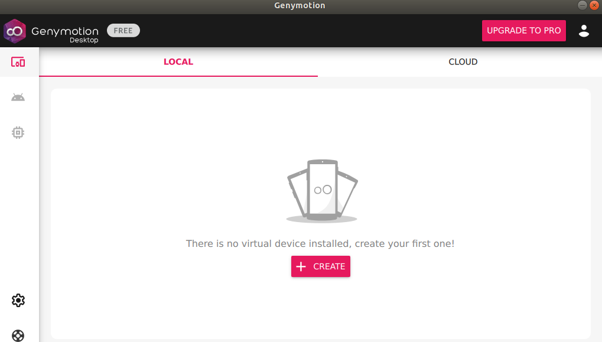
</div>


<div align="center">
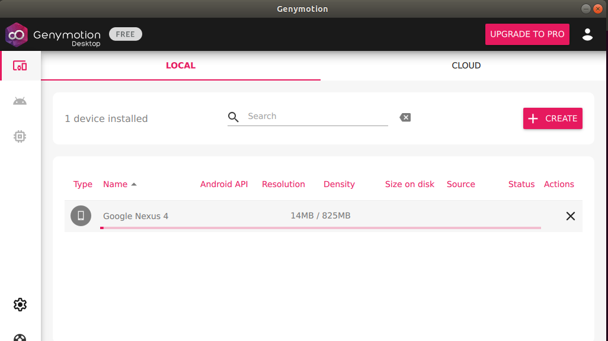
</div>

Yuklab olish to’liq tugaganidan so‘ng start kamandasini bosing va sizda
ham quydagicha bo‘lib emulator ishga tushadi.


<div align="center">

</div>


Emulatorni ishga tushgandan keyin terminalda *adb devices* buyrug‘uni
bajarib ko‘rish orqali emulator ishga tushgani va uni adb tanib olganini
ko‘rish mumkin.


<div align="center">
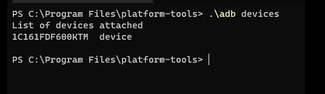
</div>

Emulatorga sinovdan o‘tkizmoqchi bo ‘lgan ilovangizni Play Marketdan
yuklash yoki *adb install your_app.apk* buyrug‘uni terminalda bajarish
orqali emulatorga o‘rnatsangiz bo‘ladi.


<div align="center">
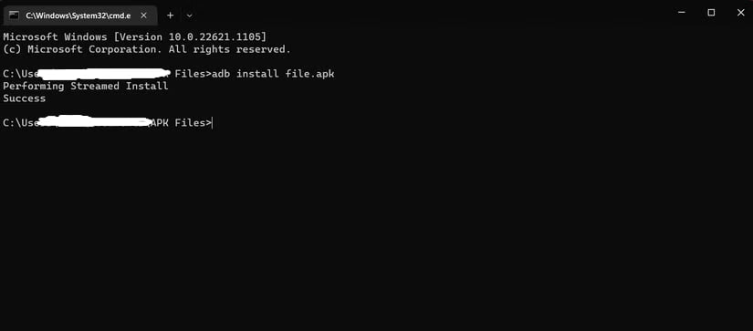
</div>

### **Tarmoq trafikni kuzatish (burp suite, mitmproxy)**

Pentesting jarayonida muhim bosqichlardan biri bu ilovaning tarmoq
orqali yuborayotgan va olayotgan ma’lumotlarini kuzatishdir. Buni amalga
oshirish uchun proxy vositalar (masalan, Burp Suite yoki mitmproxy) keng
qo‘llaniladi. Tarmoq trafikni kuzatishdan maqsad, ilova yuborayotgan
maxfiy ma’lumotlarni (token, login, parol, GPS, kiritilgan ma’lumotlar)
tahlil qilish va tarmoq orqali yuborilgan API so‘rovlarni tahlil qilish
(HTTP request yoki response). Burpsuite va Genymotiondagi emulator
orqali ilovalardan chiqayotgan tarmoq trafigini kuzatib ko‘ramiz. Buning
uchun bizga burpsuite dasturi kerak bu dasturni yuklab olish
havolasi(<https://portswigger.net/burp/communitydownload>). Quydagicha
bu yerda Community versiyani yuklab olish mumkin. Burpsuite dasturini
ishga tushuramiz.


<div align="center">

</div>

Burpsuite ilovasi ochilganda Proxy bo‘limiga o‘tib proxy sozlamalariga
8081 portni yozib All Interface bo’limini tanlab qo’yish kerak yoki
boshqa portni ham yozish mumkin va shu yerdan burpsuite ssl sertifikatni
yuklab oling yoki <https://burp> sahifasi orqali yuklab olish kerak
bo‘ladi. Bu orqali https ma’lumotlarni ko‘rishimiz mumkin bo‘ladi.


<div align="center">
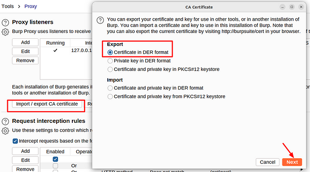
</div>

Bu muhim bosqichda biz sertifikatimiz formatini o‘zgartirib olishimiz
kerak bo‘ladi buni amalga oshirishimiz uchun OpenSSL orqali amalga
oshiramiz.

```bash
openssl x509 -inform DER -in cacert.der -out cacert.pem
```

Endi esa bizga sertifikatning issuer (beruvchi tashkilot) hash qiymatini
olish kerak bo‘ladi. Quyidagi buyruq bu ishda bizga yordam beradi.

```bash
openssl x509 -inform PEM -subject_hash_old -in cacert.pem \|head -1
```

Keling, avvalgi buyruq natijasi 9a5ba575 deb faraz qilaylik. Endi siz
sertifikat faylini aynan shu qiymatga qayta nomlashingiz va oxiriga .0
kengaytmasini qo‘shishingiz kerak bo‘ladi.

```bash
mv cacert.pem 9a5ba575.0
```

Keyin bu sertifikatni adb orqali qurulmaga o‘rnatish kerak bo‘ladi bu
qurulma root qurulma bo‘lishi kerak agar root qurulma bo‘lmasa xatolik
beradi.


<div align="center">
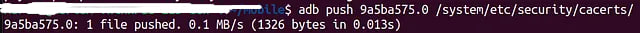
</div>

Qurulmani qayta ishga tushuring va Sertifikat o‘rnatilganligini
tekshirish uchun qurulmadan *Settings -\> Security -\>Device
Security-\>Encryption & Credentials-\>Trusted Credentials* ga kiring
quydagicha natija chiqishi kerak bo‘ladi.


<div align="center">
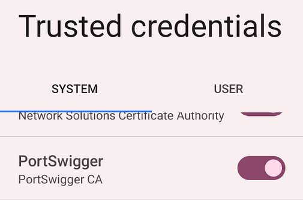
</div>

BurpSuiteda port raqamini kiriting va *bind to all interfaces* qatorini
tanlang .


<div align="center">
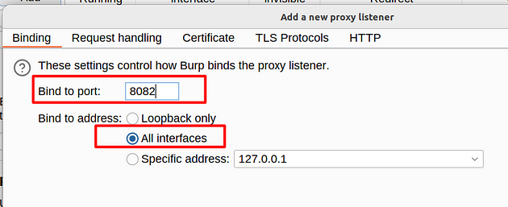
</div>
Yangi yaratgan Android qurilmangizda quyidagicha amallar ketma ketligini
bajaring: Sozlamalar (Settings) → Tarmoq va Internet (Network &
Internet) → AndroidWifi bo‘limiga o‘ting. Ulab qo‘yilgan tarmoqqa bosing
va “O‘zgartirish” (“Modify”) qatorini tanlang.


<div align="center">
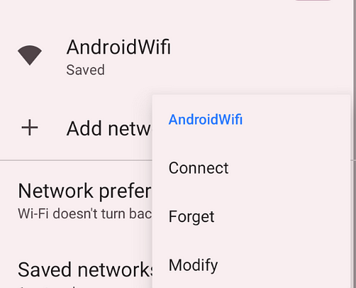
</div>

“Modify” (O‘zgartirish) qatorini bosganingizdan so‘ng bir nechta
parametrlar ko‘rinadi. IP manzilini kompyuteringizning IP manziliga,
port raqamini esa Burp Suiteda hozirgina qo‘shgan port raqamiga
o‘zgartiring.


<div align="center">
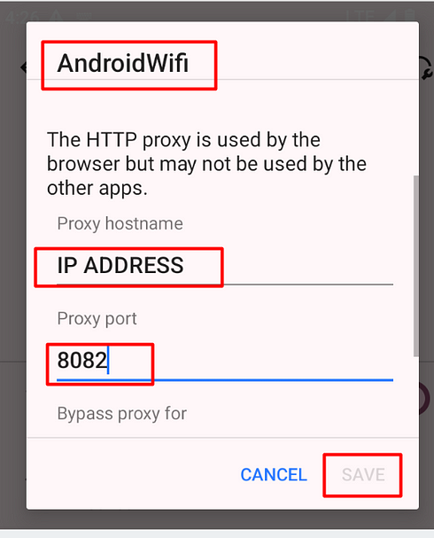
</div>

Android qurulma orqali biror bir ilovaga kiring va burpsuitedan
malumotlarni ko‘rishingiz mumkin.


<div align="center">
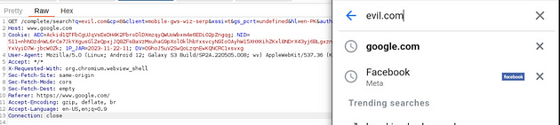
</div>

### **Xavfsizlik cheklovlarini sinash (root, emulator, vpn, zararli kod deteksiya, SSL pinning)**

Android ilovalari foydalanuvchilarning tizimni manipulyatsiya
qilishining oldini olish uchun turli xavfsizlik cheklovlarini joriy
qiladi. Pentesting jarayonida bu cheklovlarning to‘g‘ri ishlashini
sinash muhim hisoblanadi. Quyida Android ilovalarida uchraydigan asosiy
xavfsizlik cheklovlari va ularni sinash usullari keltirilgan.

*Root Aniqlash (Root Detection)*

Ilova root-huquqiga ega bo‘lgan qurilmalarda ishlamasligi yoki
xavfsizlik choralarini kuchaytirishi mumkin. Root qurulmani aniqlash
uchun.

- su binar faylining mavjudligi tekshiriladi.

- build.prop faylga yozish ruxsati aniqlanadi.

- Magisk, SuperSU kabi root vositalari aniqlanadi.

Ilovada root qurulmalarni aniqlash funksiyasi bor yuqligini tekshirish
uchun quydagi amallarni bajaring.

- Root qilingan qurilmada ilovani ishga tushiring.

- Logcat orqali kuzating yoki ilovaning xatti-harakatini tekshiring
  (masalan, ilova yopiladimi yoki xatolik beradi).

Bu funksiyani chetlab o‘tish uchun quydagi usullar keng qo‘llaniladi.

- Magisk Hide yoki Shamiko modulidan foydalanish.

- Xposed moduli: RootCloak orqali rootni yashirish.

- Frida yordamida isRooted() funksiyalarini falsega o‘zgartirish.

*Emulator Aniqlash (Emulator Detection)*

Ilova faqat real qurilmada ishlashi kerak, emulyatorda esa testdan
o‘tmasligi mumkin. Emulator qurulmalarni aniqlashda quydagilardan
foydalaniladi.

- Qurilma modeli sdk bo‘lsa.

- IMEI yoki SIM karta yo‘qligi.

- qemuga oid fayllar (/dev/qemu_pipe, ro.kernel.qemu).

Ilovada emulator qurulmalarni aniqlash funksiyasi bor yo‘qligini
tekshirish uchun quydagi amallarni bajaring.

- Android Studio emulatorida ilovani ishga tushiring.

- Ilova xatti-harakatini kuzating.

Bu funksiyani chetlab o‘tish uchun quydagi usullar keng qo‘llaniladi.

- Frida bilan isEmulator() funksiyalarini falsega o‘zgartirish.

- Emulator identifikatorlarini yashirish (build.prop o‘zgartirish).

*VPN Aniqlash (VPN Detection)*

Ilova tarmoq trafigi VPN orqali yuborilayotganini aniqlasa, uni
to‘xtatishi mumkin.

Ilova ishga tushgan qurulmada vpn aniqlashda quydagilardan
foydalaniladi.

- Ilova ConnectivityManager orqali VPN mavjudligini aniqlaydi.

- Trafikni tekshirib, proxy vositalar orqali ketayotganini sezadi.

Ilovada vpn aniqlash funksiyasi bor yo‘qligini tekshirish uchun quydagi
amallarni bajaring.

- Qurilmada VPN (masalan, Burp Suite yoki mitmproxy) yoqing.

- Ilovaning API so‘rovlariga javob berishiga qarang.

Bu funksiyani chetlab o‘tish uchun quydagi usullar keng qo‘llaniladi.

- Frida orqali isVpnActive() funksiyasini falsega o‘zgartirish.

- Tarmoq tahlil metodlarini patch qilish (dekompilyatsiya orqali).

*Zararli Kod, Debugger yoki Frida Aniqlash*

Ilova zararli kodlar, debugger yoki reverserlar ishlatilayotganini
aniqlab, o‘zini himoya qiladi. Zararli kodlarni aniqlashda quydagilardan
foydalaniladi.

- Debug rejim (android.os.Debug.isDebuggerConnected())

- Frida, Xposed, Magisk modullarining mavjudligi.

- TracerPid orqali debugging aniqlanadi.

Ilovada zararli kodlarni aniqlash funksiyasi bor yuqligini tekshirish
uchun quydagi amallarni bajaring.

- Frida, Xposed yoki debugger ishlatib, ilovani kuzating.

- Logcat orqali xatolik va ogohlantirishlarni ko‘ring.

Bu funksiyani chetlab o‘tish uchun quydagi usullar keng qo‘llaniladi.

- Frida yordamida isDebuggerConnected() yoki detectFrida()
  funksiyalarini falsega o‘zgartirish.

- Antidebug kodni ilovadan olib tashlash (smali patch).

*SSL Pinning*

Ilova faqat o‘zining ishonchli serveri bilan bog‘lanishini xohlaydi.
Burp Suite yoki mitmproxy orqali trafikni ko‘rishga ruxsat bermaydi.

- HTTPS trafikni Burp Suite orqali tutib bo‘lmaydi.

- SSLHandshakeException, TrustManager xatolari chiqadi.

Ilovada ssl pinning funksiyasi bor yo‘qligini tekshirish uchun quydagi
amallarni bajaring.

- Burp Suiteni yoqing, ilovani ishga tushiring.

- Agar trafikni ko‘ra olmasangiz, demak SSL pinning mavjud.

Bu funksiyani chetlab o‘tish uchun quydagi usullar keng qo‘llaniladi.

- Frida skript bilan:

- frida -U -n com.example.app -l frida-ssl-pinning-bypass.js

- Ilovani dekompilyatsiya qilish.

Xavfsizlik cheklovlarini tahlil qilish – Android pentestingda muhim
bosqichlardan biridir. Ilovalar bu cheklovlar orqali tahlil qilishni
qiyinlashtiradi. Shuning uchun, har bir cheklovni alohida sinab, kerak
bo‘lsa, teskari muhandislik (reverse engineering), Frida, yoki smali
patch orqali aylanib o‘tish mumkin.

### **Faoliyatlarni sinash (Activity, Service, BroadcastReceiver)**

Mobil ilovalar bir nechta asosiy komponentlardan iborat: Activity,
Service, BroadcastReceiver va Content Provider. Pentesting jarayonida
aynan Activity, Service va BroadcastReceiver orqali ilova ichki
funksiyalariga noqonuniy kirish yoki ekspluatatsiya qilish mumkin.
Quyida ularni sinash usullari va xavflari keltirilgan.

**Activity** — foydalanuvchi interfeysini taqdim etuvchi ekran. Agar
Activity noto‘g‘ri sozlangan bo‘lsa, boshqa ilovalar undan foydalana
olishi mumkin. Zaiflikni kelib chiqishi sababi quydagilar.

- exported="true" bo‘lib, hech qanday ruxsat (permission) so‘ralmasa

- Kirishda autentifikatsiya tekshirilmasa

Zaiflikdan foydalanish uchun terminalga quydagi kodni yozing.

```bash
adb shell am start -n com.example.app/.SecretActivity
```

Zaiflik oqibatida quydagi xavflar sodir bo‘ladi.

- Foydalanuvchi autentifikatsiyasini chetlab o‘tish

- Maxfiy ma’lumotlarga kirish

**Service** — orqa fonda (background) ishlovchi komponent. Agar exported
yoki intent-filter noto‘g‘ri belgilangan bo‘lsa, boshqa ilovalar u bilan
muloqot qilishi mumkin. Zaiflikni kelib chiqishi sababi Service ochiq va
hech qanday tekshiruvsiz ishlov beruvchi bo‘lsa quydagi kodni bajarib
zaiflikni tekshirish mumkin.

```bash
adb shell am startservice -n com.example.app/.MyService
```

Zayiflikdan foydalanish uchun terminalga quydagi kodni yozing.

- Ilovaning noto‘g‘ri ishlashiga sabab bo‘lish

- Noqonuniy amallarni bajarishga majbur qilish (DoS, o‘g‘irlik)

**BroadcastReceiver** — tizim yoki ilovadan kelayotgan xabarlarni qabul
qiladi. Agar noto‘g‘ri sozlangan bo‘lsa, xaker maxsus xabar yuborib uni
ekspluatatsiya qilishi mumkin. Zaiflikni kelib chiqishi sababi
quydagilar.

- Receiver exported va hech qanday tekshiruvsiz bo‘lsa

- intent-filter orqali ommaga ochiq bo‘lsa

Zaiflikdan foydalanish uchun terminalga quydagi kodni yozing.

```bash
adb shell am broadcast -a com.example.app.CUSTOM_BROADCAST
```

Agar extra parametr kerak bo‘lsa:

```bash
adb shell am broadcast -a com.example.app.CUSTOM_BROADCAST --es key
value
```

### **Ma’lumotlar oqimini kuzatish (runtime debugging)**

Ma’lumotlar oqimini kuzatish, ya’ni runtime debugging mobil ilovalarning
ish jarayonida (real vaqt rejimida) qanday ma’lumotlar
kirib-chiqayotgani, qanday funksiyalar bajarilayotgani va qanday
ob’ektlar bilan ishlanayotganini tahlil qilishdir. Bu bosqich, ayniqsa,
quyidagilarni aniqlashda muhim:

- Kirish (login) ma’lumotlari qanday ishlanmoqda?

- Auth tokenlar qayerda saqlanmoqda?

- API so‘rovlariga qanday ma’lumotlar yuborilmoqda?

- Ilova ichida qanday xavfsizlik tekshiruvlari mavjud?

Ma’lumotlar oqimini kuzatish uchun quydagi vositalar kerak bo‘ladi.

**Frida** — ilovaga injector orqali ulanib, ish jarayonida
funktsiyalarni tutib, ularning argument va natijalarini ko‘rish imkonini
beradi.

```bash
frida -U -n com.example.app -l intercept.js
```

```bash
//intercept.js

Java.perform(function () {

    var LoginClass = Java.use("com.example.app.auth.LoginManager");

    LoginClass.authenticate.implementation = function (username,
password) {

        console.log("\[+\] Username: " + username);

        console.log("\[+\] Password: " + password);

        return this.authenticate(username, password);

    };

});
```

Bu kod bajarilishi natijasida ilova ishga tushganda foydalanuvchi login
parolini real vaqt rejimida terminalda ko‘rasiz.

**Objection** – Frida ustiga qurilgan qulay CLI vosita. Interaktiv
tarzda runtime debugging va bypass qilish imkonini beradi. Root talab
qilinmaydi.

objection -g com.example.app explore

- env – muhit o‘zgaruvchilarini ko‘rish

- memory search --string "token" – xotiradan tokenlarni qidirish

- android hooking list classes – barcha class’larni ko‘rish

- android hooking watch class_method – specific metodni kuzatish

**Logcat –** Ilova ish vaqtida chiqarayotgan loglar orqali ma’lumot
oqimini passiv ravishda kuzatish.

```bash
adb logcat \| grep com.example.app
```

### **Umumiy xotira malumotlarini ko‘rish**

Mobil (Android) pentesting jarayonida umumiy xotira ma’lumotlarini
ko‘rish ilova qanday ma’lumotlarni xotirada saqlayotganini, qanday
darajadagi ma’lumotlar himoyasiz turganini aniqlashda muhim bosqich
hisoblanadi. Quyida umumiy xotira (RAM va doimiy saqlash) bilan bog‘liq
asosiy tekshiruv usullarini tartibli va tushunarli tarzda bayon qilib
o‘tilgan.

/*data/data/\<package_name\>* katalogini tekshirish. Bu katalogda
ilovaning xususiy fayllari (internal storage) saqlanadi. Faqat rootli
qurilmada kirish mumkin. Terminal orqali quydagi buyruqlar
ketma-ketligini yozish kerak bo‘ladi.

```bash
adb shell
```

```bash
su
```

```bash
cd /data/data/com.example.app/
```

```bash
ls -la
```


<div align="center">
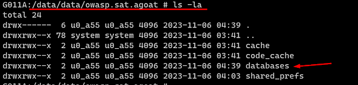
</div>
Bu buyruqlar bajarilishi natijasida quydagi kataloglarda,
*shared_prefs/* – foydalanuvchi sozlamalari (.xml fayllar), ko‘pincha
tokenlar, login, auth ma’lumotlari bo‘lishi mumkin, *databases/* –
SQLite ma’lumotlar bazalari, *files*/, *cache/, code_cache/* – boshqa
saqlangan fayllar.

Database (Ma’lumotlar bazasi) katalogi ichini tekshirib ko‘rdik. U yerda
aGoat nomli fayl mavjudligini ko‘rishimiz mumkin, biroq cat buyrug‘idan
foydalanganda hech qanday ma’lumot chiqmayapti.


<div align="center">
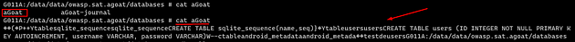
</div>

Shuning uchun biz ushbu faylni adb pull buyrug‘i yordamida qurilmadan
nusxalab olsak bo‘ladi.


<div align="center">
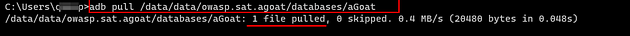
</div>

aGoat faylini SQLite Browser dasturida oching. Fayl ichida foydalanuvchi
nomi (username) va parol (password) ochiq matn (plain text) ko‘rinishida
saqlanganini ko‘rishimiz mumkin.


<div align="center">
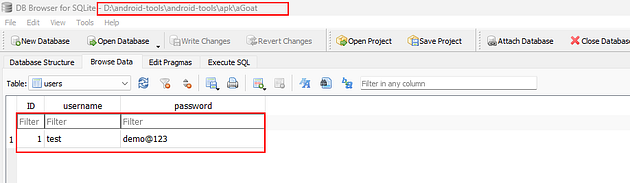
</div>

SharedPreferences API odatda kichik hajmdagi kalit-qiymat (key-value)
juftliklarini doimiy saqlash uchun ishlatiladi. SharedPreferences
obyektida saqlangan ma’lumotlar oddiy matn ko‘rinishidagi XML faylga
yoziladi. Bu obyekt barcha ilovalar uchun ochiq (world-readable) yoki
faqat shu ilovaning o‘ziga xos (private) tarzda e’lon qilinishi mumkin.
Biz sharedPreferences ichida ba’zi ma’lumotlarni saqladik.


<div align="center">
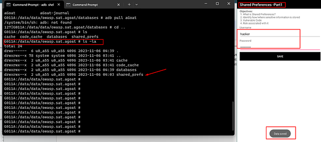
</div>

adb yordamida katalogni toping va users.xml faylini tekshiring — unda
foydalanuvchi ma’lumotlari (credentials) ko‘rinadi.


<div align="center">
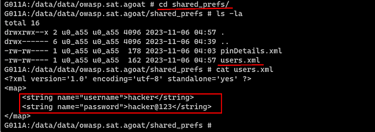
</div>


Agar ilova Android keystore yoki credential storagedan foydalansa,
ma’lumotlar tizim darajasida shifrlangan bo‘ladi. Biroq noto‘g‘ri
sozlamalarda ularga ham kirish mumkin.

```bash
adb shell
```

```bash
su
```

strings /data/misc/keystore/user_0/\*

Ba’zi ilovalar xatoliklar yoki log yozuvlar orqali sezilarli darajadagi
ma’lumotlarni ochib yuborishi mumkin.

```bash
adb logcat \| grep com.example.app
```

### **API so‘rovlarini kuzatish**

Mobil ilovalarda dinamik tahlil orqali API so‘rovlarni kuzatish – bu
ilova ishga tushirilganda u yuborayotgan yoki qabul qilayotgan HTTP yoki
HTTPS so‘rovlarni real vaqt rejimida tahlil qilish jarayonidir. Bu usul
orqali ilovaning server bilan qanday muloqot qilayotgani, qanday
ma’lumotlar uzatilayotgani aniqlanadi. Tahlil davomida ilovaning API
endpointlari, uzatilayotgan tokenlar, cookie va session IDlar,
foydalanuvchi ma’lumotlari va boshqa maxfiy axborotlarni aniqlash mumkin
bo‘ladi. Dinamik kuzatuv orqali ayniqsa xavfsizlik zaifliklarini, ya’ni
autentifikatsiya jarayonidagi kamchiliklar, ma’lumotlarning
shifrlanmagan holda uzatilishi yoki noto‘g‘ri sozlangan server
javoblarini aniqlash mumkin.

Ilova ishga tushgandan so‘ng dastlab autentifikatsiya jarayonini tahlil
qilinadi. Agar foydalanuvchi faqat login va parol kiritish orqali
tizimga kira olsa, bu bir faktorli autentifikatsiya hisoblanadi. Agar
login va paroldan so‘ng telefon raqamga yuborilgan tasdiqlash kodini
kiritish talab qilinsa, bu ikki faktorli autentifikatsiya deb ataladi.
Agarda bu jarayondan o‘tgach yana qo‘shimcha ma’lumot, masalan biometrik
identifikatsiya (barmoq izi yoki yuzni aniqlash) talab qilinsa, bu ko‘p
faktorli autentifikatsiya hisoblanadi.

Bu bosqichlar aniqlab olingandan so‘ng login formasi bruteforce hujumiga
chidamliligi tekshiriladi. Ya’ni foydalanuvchi parolini taxmin qilish
orqali tizimga kirish mumkinmi yoki yo‘qligi tahlil qilinadi. Agar ilova
ketma-ket noto‘g‘ri parollar kiritilganda ham hech qanday blokirovka,
captcha yoki kutish vaqti (rate limiting) qo‘llamasa, bu bruteforce
hujumlarga ochiqlik borligini bildiradi. Agar autentifikatsiyadan
o‘tgandan so‘ng foydalanuvchidan SMS yoki boshqa tasdiqlovchi kod
kiritish so‘raladigan bo‘lsa, bu bosqich ham bruteforce orqali
tekshiriladi. Ya’ni kodlar avtomatik ravishda sinab ko‘riladi va ilova
bunga qanday munosabat bildirayotgani o‘rganiladi.

Tizimga muvaffaqiyatli kirilgach, ilova qanday tokenlardan
foydalanayotganini aniqlash kerak bo‘ladi. Ko‘p hollarda JWT — JSON Web
Token qo‘llaniladi. JWT bu foydalanuvchi autentifikatsiyadan o‘tganidan
so‘ng server tomonidan yaratiladigan, foydalanuvchi haqidagi
ma’lumotlarni o‘z ichiga olgan raqamli imzo bilan tasdiqlangan matnli
token. U odatda uchta qismdan iborat bo‘ladi: header, payload va
signature. Tahlil davomida bu token server tomonidan qanday
tekshirilayotgani o‘rganiladi. Agar imzoni o‘zgartirib, tokenni serverga
yuborganimizda server uni hali ham qabul qilsa, bu juda jiddiy
xavfsizlik zaifligini bildiradi. Bu holatda server token imzosini
tekshirmayapti yoki noto‘g‘ri tekshirmoqda.

Agar JWT o‘rniga session tokenlar qo‘llanilayotgan bo‘lsa, bu yerda ham
xavfsizlik zaifliklari bo‘lishi mumkin. Masalan, session token URL
orqali yuborilsa yoki shifrlanmagan holatda uzatilsa, u tarmoq orqali
oson tutib olinishi mumkin. Session token muddati tugagandan keyin ham
amal qilaversa yoki boshqa foydalanuvchining session tokeni orqali
tizimga kira olsak, bu ham katta zaiflik sanaladi. Shuningdek, ilova har
bir so‘rovda session tokenni talab qilmayotgan bo‘lsa, ya’ni
foydalanuvchini noto‘g‘ri identifikatsiyalayotgan bo‘lsa, bu ham tahlil
davomida aniqlanishi kerak.

Yakuniy tahlil bosqichida butun autentifikatsiya va sesiyalarni
boshqarish jarayoni qanday ishlayotgani, server javoblari va ilova
qanday xavfsizlik choralarini ko‘rayotgani sinchiklab o‘rganiladi. Bu
ma’lumotlar asosida ilovaning umumiy xavfsizlik darajasi aniqlanadi va
zarur bo‘lsa, zaif joylar bo‘yicha tavsiyalar beriladi.


<div align="center">
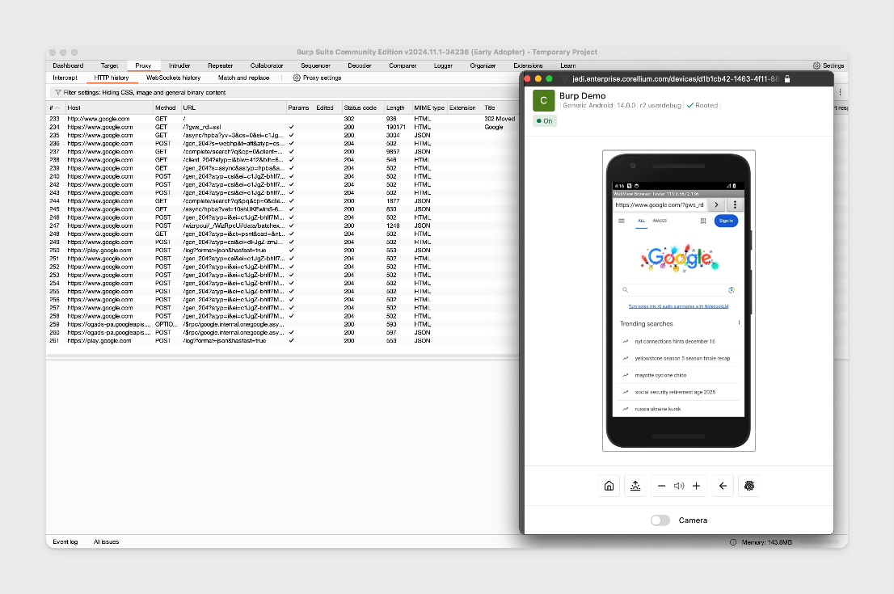
</div>

**Mitmproxy** – CLI asosida ishlaydigan, kuchli va skriptlab bo‘ladigan
intercept vosita. Kam resurs talab qiladi. Foydalanish uchun terminalga
quydagi kodni yozish kerak.

```bash
mitmproxy --mode transparent --listen-port 8080
```

- Qurilmada proksi: kompyuter_ip:8080

- Android qurilmaga mitmproxy sertifikatini o‘rnating

- So‘rovlarni real vaqt rejimida kuzating

<div align="center">
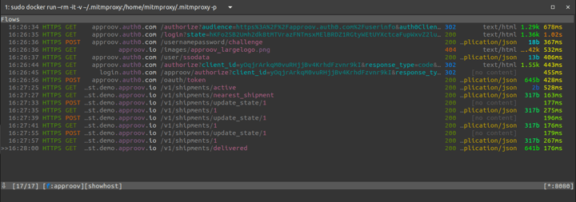
</div>


### **Tapjacking hujumiga tekshirish**

Mobil ilovalarda xavfsizlik tahlilining muhim yo‘nalishlaridan biri bu —
tapjacking hujumlariga qarshi himoya mavjudligini tekshirishdir.
Tapjacking bu foydalanuvchini aldash orqali noto‘g‘ri harakatlar
qilishga majbur qiladigan hujum turi bo‘lib, foydalanuvchi ekranidagi
haqiqiy tugmalarni ko‘rmay, ular ustida joylashgan shaffof yoki boshqa
interfeys elementlarini bosgan deb o‘ylab, aslida fon orqasida turgan
xavfli tugmaga bosishiga sabab bo‘ladi. Bunday holatda foydalanuvchi,
masalan, tasdiqlash tugmasi o‘rniga muhim ruxsatnomani tasdiqlab
qo‘yishi, o‘z ixtiyorisiz ilovaga ruxsat berishi yoki zararli amalni
faollashtirishi mumkin.

Tapjacking hujumining ishlash mexanizmi oddiy: hujumchi boshqa ilova
oynasi yoki HTML WebView orqali foydalanuvchi ko‘rayotgan interfeys
ustiga shaffof qatlam qo‘yadi va shu orqali orqa fondagi tugmalarni
"tutadi". Bu ayniqsa Android qurilmalarda sezilarli xavf tug‘diradi.
Ilova foydalanuvchidan ruxsatlar so‘raydigan sahifalarda yoki muhim amal
bajariladigan joylarda ushbu qatlamlar orqali aldashga uchrashi mumkin.

Tapjacking zaifligini tekshirish uchun odatda test dastur yaratiladi
yoki tayyor tapjacking test ilovalardan foydalaniladi. Masalan, OWASP
tomonidan tavsiya etilgan maxsus test apk fayllar mavjud bo‘lib, ular
ilovaning ustiga joylashtiriladigan shaffof tugmalar orqali
foydalanuvchini aldashga urinadi. Bundan tashqari, Android Studio orqali
sinov ilova yaratiladi, u foydalanuvchi ustida boshqa ilovalar qatlamini
yaratishga harakat qiladi va bu qatlam orqali siz tekshirmoqchi bo‘lgan
ilovaning interaktiv tugmalarini "bosishga" urinish amalga oshiriladi.

Tapjacking zaifligini aniqlashda asosiy narsa — ilovaning o‘zida bu kabi
hujumlardan himoyalovchi choralar mavjud yoki mavjud emasligini
tekshirishdir. Android ilovalarda tapjackingdan himoyalanish uchun
android:filterTouchesWhenObscured="true" atributi ishlatiladi yoki
onFilterTouchEventForSecurity() funksiyasi orqali foydalanuvchi
interfeysiga boshqa ilova tomonidan aralashuv bo‘lsa, bunday harakatlar
rad etiladi. Agar ilova ushbu choralarni ko‘rmagan bo‘lsa, foydalanuvchi
tasdiqlash sahifalarida o‘z ixtiyorisiz tugmalar bosib yuborilishi xavfi
mavjud bo‘ladi.

Tekshiruv davomida siz Frida yoki boshqa hook vositalaridan
foydalanmaysiz, chunki bu yerda gap foydalanuvchi interfeysga qanday
aralashuv bo‘lishini aniqlash haqida ketmoqda. Buning o‘rniga siz
Android qurilmada test ilovani o‘rnatib, u orqali sinov qilmoqchi
bo‘lgan asosiy ilovangiz ustiga shaffof oynani joylashtirasiz va
foydalanuvchi bu holatda muhim tugmani bosganida nimalar sodir
bo‘lishini kuzatasiz. Agar ilova bunga ruxsat bersa, ya’ni hech qanday
ogohlantirish yoki harakatni rad etmasa, bu uning tapjacking zaifligiga
ega ekanligini bildiradi.

Agar ilova ochiq ruxsat so‘rovlarini (masalan, kamera, mikrofon, fayl
tizimiga kirish) biron bir interaktiv sahifa orqali berayotgan bo‘lsa va
shu vaqtda boshqa ilova ustiga joylashishi mumkin bo‘lsa, bu holatlar
alohida e’tibor bilan tekshiriladi. Chunki aynan shu paytda tapjacking
orqali foydalanuvchini aldatish xavfi eng yuqori bo‘ladi.

Yakuniy tahlilda esa siz ilovaning foydalanuvchi tajribasini buzmasdan,
uni ekran ustida boshqa oynalar orqali boshqarish imkoniyatlari bor yoki
yo‘qligini aniqlaysiz. Agar mavjud bo‘lsa, ishlab chiquvchilarga tavsiya
qilinadi: muhim tugmalar ishlatilgan interfeyslarda yuqorida aytib
o‘tilgan filterTouchesWhenObscured kabi xavfsizlik choralarini yoqish,
shuningdek, foydalanuvchi tugmalarni bosayotganida ularning harakati
ochiq va tushunarli bo‘lishini ta’minlash.

Shunday qilib, tapjacking zaifligini aniqlash – bu foydalanuvchi ustidan
boshqaruvni o‘g‘irlab olish mumkin yoki yo‘qligini real sinov orqali
aniqlashdir. Bu tahlil mobil ilovaning haqiqiy dunyo tahdidlariga qay
darajada tayyorligini ko‘rsatadi.

### **Dinamik zaifliklar**

Dinamik zaifliklar — bu ilova ishga tushgan vaqtda, ya’ni real vaqt
rejimida yuzaga keladigan xavfsizlik kamchiliklaridir. Bu zaifliklar
odatda ma’lumotlar oqimi, autentifikatsiya, trafik yoki xotira
ishlovlari bilan bog‘liq bo‘ladi. Quyida keng uchraydigan dinamik
zaifliklar, ularning sabablari va oqibatlari keltirilgan.

*1. Ma’lumotlarning shifrlanmagan uzatilishi* ***–*** API so‘rovlarida
parol, token kabi maxfiy ma’lumotlar ochiq yuboriladi.

- Kelib chiqishi: HTTPS o‘rniga HTTP ishlatilishi yoki noto‘g‘ri
  konfiguratsiya.

- Oqibati: Trafikni tuta olgan hujumchi ma’lumotlarni o‘g‘irlashi mumkin
  (MITM).

*2. SSL pinning mavjud emas yoki chetlab o‘tish mumkin* ***–*** Ilova
server bilan aloqani haqiqiyligiga ishonmaydi.

- Kelib chiqishi: SSL sertifikat tekshiruvining yo‘qligi yoki noto‘g‘ri
  bajarilishi.

- Oqibati: Trafikni oson intercept qilib, soxta javoblar bilan
  foydalanuvchini aldash mumkin.

*3. Session hijacking (sessiyani egallab olish)* ***–*** Hujumchi
foydalanuvchining sessiyasini qo‘lga kiritadi.

- Kelib chiqishi: Session tokenlar brauzerda, loglarda yoki ochiq havoda
  yuborilishi.

- Oqibati: Hujumchi foydalanuvchi nomidan tizimga kira oladi.

*4. Ma’lumotlarni xotirada ochiq saqlash* ***–*** Parol, token, karta
raqamlari operativ yoki doimiy xotirada shifrlanmagan holda turgan
bo‘ladi.

- Kelib chiqishi: Dasturchilar xavfsiz saqlash mexanizmlaridan
  foydalanmasligi.

- Oqibati: Rootli qurilmada yoki dumplar orqali maxfiy ma’lumotlar
  o‘g‘irlanadi.

*5. Runtime bypass imkoniyatlari* ***–*** Debug, root yoki emulator
tekshiruvlari bo‘sh joy qoldirgan.

- Kelib chiqishi: Ilova tekshiruvlarni noto‘g‘ri yoki yuzaki bajaradi.

- Oqibati: Ilova himoyasiz rejimda ishlashi, zararli injektsiyalar oson
  o‘tadi.

*6. Kodning teskari muhandislikka ochiqligi* ***–*** Ilovaning ishga
tushgan kodi (runtime) ustida manipulyatsiya qilish mumkin.

- Kelib chiqishi: Obfuskatsiya yo‘qligi yoki zaif APK himoyasi.

- Oqibati: Hujumchi kodni tahrirlab, funksiyalarni o‘zgartiradi, pin
  bypass qiladi.

*7. Autentifikatsiyaning zaifligi* **–** Ilova foydalanuvchini noto‘g‘ri
yoki soddalik bilan tekshiradi.

- Kelib chiqishi: Tokenni tekshirmaslik, har bir so‘rovda user ID’ni
  o‘zi yuborish.

- Oqibati: Foydalanuvchilarning akkauntlari oson buziladi.

*8. API cheklovlarining yo‘qligi (rate limiting, auth)* ***–*** APIga
cheksiz so‘rov yuborish mumkin.

- Kelib chiqishi: So‘rovlar soni va huquqlar nazorat qilinmaydi.

- Oqibati: Brute-force, ma’lumotlar o‘g‘irlanishi, DDoS mumkin.

# 

#  **VI-BOB. Hisobot shakllantirish**

Mazkur hisobot mobil ilovalarning xavfsizlik holatini baholash, mavjud
zaifliklarni aniqlash va ularni bartaraf etish bo‘yicha tavsiyalar
berish maqsadida tuzilgan. Tahlil davomida Android va iOS
platformalaridagi ilovalar hamda ular bilan bog‘langan backend API
xizmatlari chuqur o‘rganiladi. Har bir platforma uchun tahlil alohida
keltirilib, yakunda umumiy xulosa taqdim etiladi.

## **Android**

Android ilovasi tahlili ilovaning umumiy ma’lumotlari bilan boshlanadi.
Bu yerda ilova nomi, versiyasi, paket nomi, SDK darajalari va
ishlatilgan texnologiyalar haqida ma’lumot beriladi. Statik tahlil
bosqichida APK fayli tahlil qilinib, undagi muhim xavfsizlik belgilariga
e’tibor qaratiladi. Manifest fayli orqali ilovada ruxsatlar qanday
berilganligi, debug holatining yoqligi, WebView elementlarining
xavfsizligi, shifrlash algoritmlarining to‘g‘ri qo‘llanilishi, hardcoded
ma’lumotlar mavjudligi kabi jihatlar tekshiriladi.

Dinamik tahlil bosqichida ilovaning ish holatidagi xatti-harakatlari
kuzatiladi. Logcat orqali nozik ma’lumotlar chiqayotgan-chiqmayotgani,
ilova ichidagi input maydonlar qanday ishlashi, inyeksiya hujumlariga
ochiqlik mavjudligi, hamda Frida yoki boshqa hooking vositalari bilan
cheklovlarni aylanib o‘tish mumkinmi — ana shu masalalar o‘rganiladi.
Har bir aniqlangan zaiflik OWASP Mobile Top 10 mezonlariga asoslanib
tavsiflanadi, xavf darajasi belgilanadi va aniq yechimlar bilan birga
taqdim etiladi.

## **iOS**

iOS ilovasi tahlili ham shunga o‘xshash tartibda olib boriladi.
Ilovaning nomi, versiyasi, Bundle ID, deployment target kabi texnik
ma’lumotlar ko‘rsatiladi. Statik tahlilda entitlement’lar, ATS (App
Transport Security) sozlamalari, kalitlar yoki foydalanuvchi
ma’lumotlari noto‘g‘ri joyda saqlanayotgan bo‘lsa aniqlanadi. Jailbreak
holatini aniqlash uchun qo‘llanilgan himoya choralari baholanadi.
Dinamik tahlilda esa ilovaning runtime xatti-harakatlari, foydalanuvchi
ma’lumotlarining shifrlanmasdan ishlatilishi, hooking yoki bypass qilish
imkoniyatlari chuqur tahlil qilinadi. Har bir zaiflik izchil yoritilib,
tegishli xavf darajasi va bartaraf etish bo‘yicha aniq tavsiyalar
beriladi.

## API

API tahlili esa ilovaning orqa fonidagi xizmatlar xavfsizligini
o‘rganishga qaratilgan. Hisobotda API URL manzili, autentifikatsiya va
avtorizatsiya mexanizmlari, foydalanuvchi ma’lumotlarini himoya qilish
usullari ko‘rib chiqiladi. Endpointlar input tekshiruviga ochiqligi,
noto‘g‘ri autentifikatsiya, IDOR, SQL injection, XSS, rate limiting
yo‘qligi, tokenlar noto‘g‘ri ishlatilganligi va boshqa muhim jihatlar
bo‘yicha tahlil qilinadi. Har bir zaiflik uchun isbot (proof-of-concept)
keltiriladi, xavf darajasi aniqlanadi va aniq tavsiyalar beriladi.

Hisobot yakunida umumiy xulosa beriladi. Bu qismda ilovaning xavfsizlik
darajasi umumlashtirilib, eng dolzarb zaifliklar alohida ko‘rsatib
o‘tiladi. Texnik va strategik tavsiyalar orqali ilovaning xavfsizlik
holatini qanday yaxshilash mumkinligi haqida yo‘l-yo‘riqlar beriladi.
Agar kerak bo‘lsa, qayta test o‘tkazish zarurati ham qayd etiladi.

Qo‘shimcha ilovalar sifatida esa test davomida olingan skrinshotlar,
ishlatilgan vositalar ro‘yxati, tahlil davomida yozilgan POC (isbot)
fayllar keltiriladi.
